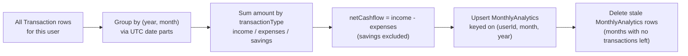
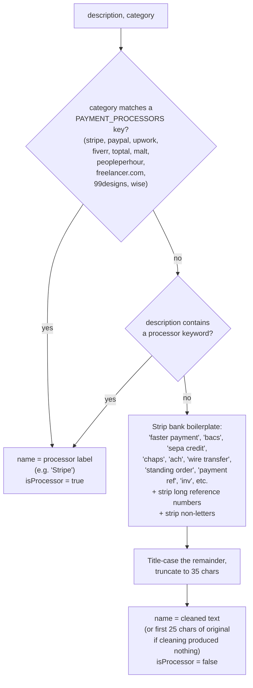

# Analytics Engine

- **What it does**: Turns the raw `Transaction` table into everything the Dashboard, Analytics, and Forecast pages display — monthly aggregates, month-over-month comparisons, category trends, client/income concentration, data coverage, and categorization health. The companion `client-risk-engine.ts` (see below) adds the Client Trust & Risk Center feature.
- **Why it exists**: Computing these numbers from scratch on every page load (especially category trends and client insights, which scan *all* of a user's transactions) would be slow and would make the Forecast engine's job harder. This module is the **single source of truth** for "what does this user's financial history look like" — every other engine (forecast, intelligence) builds on top of it rather than querying `Transaction` directly.
- **Where the code is**: `src/lib/analytics-engine.ts` (all exports are `async function`s reading via Prisma). Client risk logic lives in `src/lib/client-risk-engine.ts`.
- **How to modify it safely**: see [How to modify](#how-to-modify-safely) at the bottom.

---

## Client Trust & Risk Center (`src/lib/client-risk-engine.ts`)

Added 2026-06-22. Powers the `/clients` and `/clients/[name]` pages.

### Data source

Queries `intent IN ['freelance_income', 'salary']` — the intent-classified income transactions only. Falls back to `transactionType = 'income'` if fewer than 3 intent-classified rows exist (and sets `hasIntentData: false` to warn the UI). Never uses savings transfers, internal transfers, refunds, or expenses.

Client names are extracted via `extractClientName()` (now exported from `analytics-engine.ts`) — the same normalisation used by `getClientInsights`.

### Types

```ts
export type ReliabilityScore = "excellent" | "good" | "watch" | "risk";
```

Added to `ClientRiskProfile` alongside the existing fields:

| New field | Type | Meaning |
|---|---|---|
| `reliabilityScore` | `ReliabilityScore` | Deterministic rating from payment history — no AI scoring |
| `recentMonthlyAvg` | `number` | Average monthly revenue across indices 3–5 of the 6-month window (most recent 3 months) |
| `priorMonthlyAvg` | `number` | Average monthly revenue across indices 0–2 of the 6-month window (prior 3 months) |

### Key calculations

| Metric | Formula |
|---|---|
| Total revenue | `SUM(amount)` for all payments from this client |
| Revenue contribution | `clientRevenue / totalRevenue × 100` |
| Avg interval | Average of (n−1) day-gaps between consecutive sorted payment dates |
| Current gap | `floor((today - lastPaymentDate) / 86400s)` — uses real today, not data-anchor date |
| Status | GREEN: gap ≤ avgInterval×1.2 · YELLOW: gap ≤ avgInterval×1.5 · RED: gap > avgInterval×1.5 OR gap ≥ 90 |
| Dependency risk | LOW: 0–25% · MEDIUM: 25–50% · HIGH: 50%+ |
| Revenue trend | Last 3-month avg vs prev 3-month avg across a 6-month window ending today · >10% = Increasing · <−10% = Declining |
| Reliability score | `red status → "risk"` · `yellow → "watch"` · `green + ≥6 payments + ≥4 months active + not declining → "excellent"` · `green + ≥3 payments → "good"` · else `"watch"` |
| Recent/prior monthly avg | `recentMonthlyAvg = avg(monthlyRevenue[3..5])` · `priorMonthlyAvg = avg(monthlyRevenue[0..2])` — used on the detail page for momentum comparison |

> **Note on date anchoring**: unlike `analytics-engine.ts` which anchors to the user's last data point, `client-risk-engine.ts` uses `new Date()` (real today) for `currentGapDays` and the 6-month trend window. This is deliberate — the Client Trust feature answers real-world risk questions ("has this client paid recently?"), where anchoring to stale data would give a false sense of safety.

---

## 1. The central design principle: "anchor to the data, not the wall clock"

Every function in this file that deals with "current month", "this year", or "last 12 months" anchors to the **user's most recent data point**, never to `new Date()` (today's real-world date). This single idea explains almost every `orderBy: [{ year: "desc" }, { month: "desc" }]` and `findFirst` you'll see in this file.

**Why**: a freelancer might upload a CSV covering Jan 2023–Dec 2024 and then not log in again until mid-2026. If "this month" meant the real-world current month (mid-2026), the dashboard would show all zeros — "this month" and "last month" would both have no data, even though the user has two full years of real history to look at. By anchoring to the latest `MonthlyAnalytics` row (or latest `Transaction`, for functions that don't use `MonthlyAnalytics`), "current" always means **the most recent month the user actually has data for** — Dec 2024 in this example — so summary cards, comparisons, and insights are always populated and meaningful.

---

## 2. `recalculateMonthlyAnalytics(userId)` — the aggregation step



```ts
export async function recalculateMonthlyAnalytics(userId: string): Promise<void>
```

This is a **full rebuild**, not an incremental update:

1. Loads **every** `Transaction` for the user (`select: { transactionDate, amount, transactionType }`).
2. Groups them by `${year}-${month}` (both derived via `getUTCMonth()`/`getUTCFullYear()` — consistent with the UTC-midnight dates produced by `parseDate()`, see [CSV_IMPORT.md](./CSV_IMPORT.md)).
3. For each month, sums `amount` into `income`, `expenses`, or `savings` based on `transactionType` (`"transfer"` transactions are **not summed anywhere** — they're excluded entirely).
4. Computes `netCashflow = income - expenses`. This is the **single canonical definition of cashflow** used everywhere in the app — see [DATABASE.md §6](./DATABASE.md#6-monthlyanalytics).
5. Upserts a `MonthlyAnalytics` row per month (`@@unique([userId, month, year])`).
6. **Deletes stale rows**: any existing `MonthlyAnalytics` row for a `(year, month)` that no longer has *any* transactions (e.g. because the user deleted an import) is removed — otherwise a deleted month would keep showing old totals.

### When this runs

Called after **every** operation that changes `Transaction` rows:
- After a successful CSV import (`/api/uploads/process`)
- After a single recategorization (`/api/transactions/recategorize`)
- After bulk recategorization (`/api/transactions/recategorize-all`)
- After deleting an import (`/api/uploads/[id]` `DELETE`)

In every case, it's immediately followed by `generateForecast(userId)` (see [FORECAST_ENGINE.md](./FORECAST_ENGINE.md)) — the forecast is computed *from* `MonthlyAnalytics`, so it must be regenerated whenever the underlying aggregates change.

---

## 3. `getDashboardSummary(userId)`

```ts
{ current: MonthlyAnalytics | null, previous: MonthlyAnalytics | null, recent: Transaction[] }
```

- Finds the **latest** `MonthlyAnalytics` row (`orderBy: [{year:"desc"},{month:"desc"}]`) and treats it as `current`.
- `previous` is the calendar month immediately before it (handling year rollover: if `currMonth === 1`, previous is December of `currYear - 1`).
- `recent` is the 10 most recent transactions (by `transactionDate desc`), regardless of month — used for the "Recent transactions" widget.
- If the user has **no** `MonthlyAnalytics` rows at all (brand new user with zero transactions), returns `{ current: null, previous: null, recent: [] }` — the Dashboard page renders its empty state in this case.

Used by: `/api/dashboard` and the Dashboard page's summary cards, margin %, and risk-level calculation (see [FORECAST_ENGINE.md](./FORECAST_ENGINE.md) for the shared risk formula).

---

## 4. `getHistoricalData(userId, months)` — the chart timeline

```ts
interface MonthPoint {
  month: string;   // localized short label, e.g. "Jan '24"
  year: number;
  monthNum: number;
  income: number;
  expenses: number;
  savings: number;
  cashflow: number;
}
```

Builds the array that feeds `TrendsChart` (3m / 6m / 12m / All views on Dashboard, Analytics, and Forecast pages).

**Key behavior**: the timeline runs from `since` to `end`, where:
- `end` = the **last month that has any `MonthlyAnalytics` data** (not the current real-world month).
- `since` = `max(firstDataMonth, end - months + 1)` — i.e. either "N months before the last data point" or "the very first data point", whichever is later. Passing `months: 999` (used by the Forecast page for "All") effectively always picks `firstDataMonth`.

Every month in `[since, end]` gets an entry — **including months with zero transactions** (filled with `income/expenses/savings/cashflow: 0`). This is intentional: a gap month (e.g. a freelancer who didn't invoice anything in August) should show as a visible dip in the chart, not be silently skipped and compress the timeline.

**What it deliberately does NOT do**: extend the timeline past the last real data point. If it used `new Date()` as `end`, a user whose last upload was 8 months ago would see 8 trailing zero-months tacked onto their chart — making it look like their income "collapsed to zero" recently, when really they just haven't uploaded new data. The intelligence engine's `trajectoryInsight` logic (see [INTELLIGENCE_ENGINE.md](./INTELLIGENCE_ENGINE.md)) depends on this — it reasons about "the last N months of *data*", not "the last N calendar months".

Month labels are localized via `Intl.DateTimeFormat` using `INTL_LOCALES[locale]` (`en-IE` / `fr-FR`, from `src/i18n/locales.ts`) with `timeZone: "UTC"` — so a French user sees `"janv. 24"`-style labels without any off-by-one-day issues from timezone conversion.

---

## 5. `getMonthlyComparison(userId)` — "What changed" widget

```ts
{
  current: { totalIncome, totalExpenses, totalSavings, netCashflow },
  previous: { ... },
  currLabel: string,   // e.g. "Dec 2024"
  prevLabel: string,   // e.g. "Nov 2024"
  changes: { income, expenses, savings, cashflow }  // % change, rounded integers
}
```

Same "anchor to latest data" logic as `getDashboardSummary` — `current` is the latest `MonthlyAnalytics` row, `previous` is the calendar month before it. If either record doesn't exist, it's treated as all-zeros (`zero` object) rather than `null`, so percentage calculations always have a defined denominator behavior.

### `changePct(c, p)` — the percentage-change formula

```ts
function changePct(c: number, p: number): number {
  if (p === 0) return c > 0 ? 100 : 0;
  return Math.round(((c - p) / Math.abs(p)) * 100);
}
```

- Standard `(current - previous) / |previous| * 100`, using `Math.abs(p)` in the denominator so a sign flip (e.g. cashflow going from −€500 to +€300) produces a sensible direction rather than a nonsensical negative-divided-by-negative inversion.
- **Special case `p === 0`**: avoids division by zero. If there was nothing previously and now there's something positive, that's reported as a `+100%` change; if previous was zero and current is zero or negative, reported as `0%` (no change).

This function is the basis for `comparisonInterpretation` in the intelligence engine (see [INTELLIGENCE_ENGINE.md](./INTELLIGENCE_ENGINE.md)).

`currLabel`/`prevLabel` are human-readable month/year strings (`"Dec 2024"`/`"Nov 2024"`, localized), built via `Date.UTC(year, month-1, 1)` + `toLocaleDateString(..., { timeZone: "UTC" })` — used so the UI can say *exactly* which months are being compared, per the intelligence engine's "name exact months" philosophy (see [INTELLIGENCE_ENGINE.md](./INTELLIGENCE_ENGINE.md)).

---

## 6. `getCategoryInsights(userId)` — category trends, yearly snapshots, seasonality

Returns three things from one pass over the data:

```ts
interface CategoryInsights {
  topExpenseCategories: CategoryTrend[];   // top 10 by all-time total
  yearlySnapshots: YearlySnapshot[];       // one row per year
  seasonality: MonthlySeasonality[];       // always 12 entries, Jan-Dec
}
```

### `topExpenseCategories: CategoryTrend[]`

For every `transactionType: "expense"` transaction, grouped by `category`:

```ts
interface CategoryTrend {
  category: string;
  totalAllTime: number;
  yearlyTotals: Record<number, number>;
  currentMonthTotal: number;
  previousMonthTotal: number;
  changeAmount: number;
  changePct: number;
  yearOverYearTrend: "growing" | "declining" | "stable";
}
```

- `currentMonth`/`previousMonth` use the same anchor-to-latest-data month as the rest of the file (falls back to `new Date()` only if the user has **zero** `MonthlyAnalytics` rows at all — an edge case that only matters before the first `recalculateMonthlyAnalytics` has ever run).
- **`yearOverYearTrend`**: compares the two most recent years with data for this category. `pctYoY = (last - prev) / prev * 100`. **`> +10%` → `"growing"`, `< -10%` → `"declining"`, otherwise `"stable"`.** Categories with fewer than 2 years of data default to `"stable"`.
- Sorted by `totalAllTime` descending, top 10 only.

This feeds the Analytics page's expense breakdown (trend arrows ↑/↓) and the intelligence engine's `categoryGrew`/`categoryFell`/`categoryDoubled`/`categorySubscriptionsGrewEveryYear` insights.

### `yearlySnapshots: YearlySnapshot[]`

One entry per calendar year present in `MonthlyAnalytics`, summing `income`/`expenses`/`savings`/`cashflow` across that year's months, plus `monthCount` (how many months of that year have data — important for partial years). Sorted ascending by year. Powers the Analytics page's year-to-date comparison and the intelligence engine's multi-year `trajectoryDetails`.

### `seasonality: MonthlySeasonality[]`

```ts
interface MonthlySeasonality {
  monthOfYear: number;   // 1-12
  monthName: string;     // "Jan".."Dec"
  avgIncome: number;     // average totalIncome across all years' occurrences of this month
  avgExpenses: number;
  sampleCount: number;   // how many years contributed to this average
}
```

**Always exactly 12 entries** (Jan–Dec), even if some months have `sampleCount: 0`. For each calendar month (1–12), averages `totalIncome`/`totalExpenses` across every year that has data for that month. E.g. if a user has 3 Augusts of data, `seasonality[7].avgIncome` is the average August income across those 3 years. This is what powers "seasonal income peak" / "seasonal expense peak" / "strongest/weakest month" insights — see [INTELLIGENCE_ENGINE.md](./INTELLIGENCE_ENGINE.md) and the Forecast engine's seasonal adjustment ([FORECAST_ENGINE.md](./FORECAST_ENGINE.md)).

---

## 7. `getCategorizationHealth(userId)`

```ts
interface CategorizationHealth {
  totalCount: number;
  categorizedPct: number;       // rounded to 1 decimal
  uncategorizedPct: number;
  uncategorizedCount: number;
  topUncategorizedMerchants: { description: string; count: number }[];  // top 10
  topCorrectedMerchants: { description: string; count: number }[];      // top 10
}
```

- `categorizedPct` / `uncategorizedPct` are simple counts: `category === "uncategorized"` vs. total, rounded to 1 decimal place.
- `topUncategorizedMerchants` — `groupBy` on `Transaction.description` where `category === "uncategorized"`, ordered by count descending, top 10. This is the **per-user** view shown in-app (Analytics page "Categorization health" section, and the "Needs Review" banner data).
- `topCorrectedMerchants` — `groupBy` on `CategoryCorrection.description`, top 10. Shows which merchants this specific user has manually fixed most often.

> **Distinct from `UncategorizedMerchantReport`** (see [DATABASE.md §11](./DATABASE.md#11-uncategorizedmerchantreport---global-worklist)), which is the **cross-user, global** worklist used by maintainers — `getCategorizationHealth` is purely per-user and in-app.

---

## 8. `getIncomeConcentration(userId)`

```ts
interface IncomeConcentration {
  topSourceDesc: string | null;
  topSourcePct: number;       // % of total income from the top source
  totalSources: number;
  isHighConcentration: boolean;
}
```

**Anchored to the latest income transaction date minus 1 year** (not `new Date() - 1 year`) — same reasoning as §1: a user whose data ends in Dec 2024 should have their "last 12 months" concentration computed relative to Dec 2024, not relative to today.

- Requires at least **3** income transactions in that 1-year window; otherwise returns a "no data" shape (`topSourceDesc: null`, etc.) — too few data points to say anything meaningful about concentration.
- Groups income transactions into "sources" by a crude normalization of the description: take the first 35 characters, strip digits and non-letter characters, uppercase, collapse whitespace. Sources shorter than 3 characters after cleaning are dropped.
- `topSourcePct` = top source's share of total income, rounded to nearest integer.
- **`isHighConcentration = topSourcePct >= 50 && totalSources <= 4`** — both conditions must hold: a single source dominating *and* few sources overall. A user with 50 income transactions from 30 different clients where the top one happens to be 50% isn't "concentrated" in the risky sense if there are still many other relationships — `totalSources <= 4` filters for the genuinely risky case of "almost entirely dependent on one or two payers".

Feeds the intelligence engine's `clientConcentration` / `incomeReasonablyDiversified` insights (a simpler, transaction-description-based sibling of `getClientInsights` below).

---

## 9. `getClientInsights(userId)` — full client/revenue breakdown

The most involved function in this file. Returns `null` if the user has fewer than **3** income transactions total (not enough data to build meaningful client profiles).

### Step 1 — `extractClientName(description, category)`



This is how a raw description like `"FASTER PAYMENT FROM ACME CONSULTING LTD REF 88213764"` becomes the client name `"Acme Consulting Ltd"`.

> **Why check `category` before keywords?** The categorization engine already determined (with confidence) that this is e.g. a Stripe payout (`category: "stripe"`) — trusting that is more reliable than re-deriving it from the description, but the description-keyword fallback still catches cases where the category is more generic (e.g. `"client payment"`) but the description itself names a processor.

### Step 2 — group and profile

All income transactions are grouped by `extractClientName(...).name.toUpperCase()`. For each group, a `ClientProfile` is built:

| Field | Calculation |
|---|---|
| `totalRevenue` | sum of `amount` for this client |
| `revenueShare` | `totalRevenue / totalRevenue(all clients) * 100`, rounded |
| `firstPayment` / `lastPayment` | min/max `transactionDate`, sorted |
| `daysSinceLastPayment` | `(refDate - lastPayment) / 1 day` — **`refDate` = the user's last transaction date overall**, not today |
| `currentYearRevenue` / `previousYearRevenue` | sums filtered by `getUTCFullYear()` matching `thisYear`/`prevYear` (both derived from `refDate`) |
| `yoyGrowth` | `(curr - prev) / prev * 100`, rounded; `null` if `prevYr === 0` (no baseline to compare against) |
| `isNew` | `firstPayment`'s year === `thisYear` (derived from `refDate`) |
| `isInactive` | `paymentCount >= 3 && uniqueMonths >= 2 && lastPayment < (refDate - 90 days) && !isNew` — an *established* client (3+ payments across 2+ different months) who's gone quiet for 90+ days. A brand-new client naturally has a recent `lastPayment` and is excluded via `!isNew`. |
| `avgPaymentSize` | `totalRevenue / paymentCount`, rounded |
| `monthsActive` | `round((lastPayment - firstPayment) / 30 days) + 1`, minimum 1 |

### Step 3 — aggregate-level fields

- **`diversification`**: `"concentrated"` if there are zero non-processor clients, or the top client's share is `>= 70%`; `"moderate"` if `>= 40%`; otherwise `"diversified"`. Note this uses `topShare` (the overall top client, which could be a payment processor) but the *emptiness* check (`nonProc.length === 0`) looks only at non-processor clients — i.e. "all your income comes through Stripe/PayPal/etc. with no identifiable individual clients" also counts as `"concentrated"`.
- **`hasConcentrationRisk`**: `topClientShare >= 50`.
- **`avgClientsPerMonth`**: counts *distinct* client names per calendar month, then averages across all months that have any income — rounded to 1 decimal.
- **`newClientsThisYear`** / **`inactiveClients`**: filtered from `profiles`, excluding payment processors for "new" (a recurring Stripe payout every month isn't a "new client"), capped at top 5 for inactive.
- Returns only the **top 10** clients by `totalRevenue` in `clients`.

---

## 10. `getDataCoverage(userId)` — single source of truth for date range

```ts
interface DataCoverage {
  count: number;
  earliest: Date | null;
  latest: Date | null;
  years: number;
  months: number;
  rangeLabel: string | null;   // "January 2023 – January 2024"
}
```

A single `prisma.transaction.aggregate()` call (`_count`, `_min`, `_max` on `transactionDate`). This is **the only place** date-range/"X months of history" numbers come from — explicitly *not* derived from `MonthlyAnalytics` (which could theoretically be out of sync if `recalculateMonthlyAnalytics` hasn't run yet) and not inferred from any other source. Every page that shows "Data from X to Y" or "N years M months of history" calls this function.

- `years`/`months` are computed from the millisecond span using `365.25` days/year (`years` floored, `months` rounded) — this is a rough "age of the dataset" figure, not a precise calendar calculation, and is allowed to be approximate since it's only used for display ("12 months of history" badges) and forecast confidence tiering (see [FORECAST_ENGINE.md](./FORECAST_ENGINE.md)).
- `rangeLabel` collapses to a single month/year (e.g. `"January 2024"`) if `earliest` and `latest` fall in the same month, otherwise `"<from> – <to>"`.

---

## How to modify safely

### Add a new derived metric

1. Decide whether it belongs in `MonthlyAnalytics` (pre-aggregated, fast, but requires a `recalculateMonthlyAnalytics` schema change + migration — see [DATABASE.md](./DATABASE.md#making-schema-changes)) or as a new function here that queries `Transaction`/`MonthlyAnalytics` directly (slower but no migration).
2. **Anchor to data, not the wall clock** — follow the pattern of finding the latest `MonthlyAnalytics`/`Transaction` row first and deriving "current"/"this year"/"last N months" from that, per §1. This is the single most important convention in this file; breaking it causes "all zeros" bugs for any user whose data doesn't extend to today.
3. All dates must be handled in **UTC** (`getUTCMonth`, `getUTCFullYear`, `Date.UTC(...)`) to stay consistent with how `parseDate()` stores dates (see [CSV_IMPORT.md](./CSV_IMPORT.md)). Mixing local-time and UTC date math in this file is a common source of off-by-one-month bugs around year boundaries.
4. If the new metric should be localized (month names, etc.), use `getLocale()` + `INTL_LOCALES[locale]` with `timeZone: "UTC"`, matching the existing `fmtUTCMonth`/`getHistoricalData` pattern.

### Changing `netCashflow`'s definition

`netCashflow = income - expenses` (savings excluded) is treated as gospel by the Forecast engine, the Intelligence engine, and the Dashboard/Forecast risk calculations. If you ever need a different cashflow definition (e.g. including savings), **add a new field** rather than redefining this one — too much downstream logic assumes this exact formula.

### Performance considerations

- `getCategoryInsights` and `getClientInsights` both load **all** of a user's transactions of a given type into memory and process in JS. This is fine at the scale of "a few years of one freelancer's bank statements" (thousands of rows) but would need pagination/streaming if the product ever supported much larger datasets (e.g. business accounts with tens of thousands of transactions/month).
- `recalculateMonthlyAnalytics` also loads all transactions — it's O(n) per import, which is acceptable because it only runs after explicit data-changing actions (import, recategorize), not on every page load.

### Things to be careful about

- **`changePct`'s zero-handling** (`p === 0 → 100 or 0`) is relied on by the intelligence engine's comparison thresholds (`ic`/`ec` — see [INTELLIGENCE_ENGINE.md](./INTELLIGENCE_ENGINE.md)). Changing it changes insight wording, not just numbers.
- **`getHistoricalData`'s "never extend past the last data point" behavior** is load-bearing for the intelligence engine's `trajectoryInsight` — don't change `end` to `new Date()` without also auditing every consumer of `MonthPoint[]`.
- **`isHighConcentration` and `hasConcentrationRisk` use different thresholds** (`50% + ≤4 sources` vs. `>=50%`) and operate on different groupings (description-based vs. client-name-based) — they answer subtly different questions and both feed different insights. Don't assume they're interchangeable.
