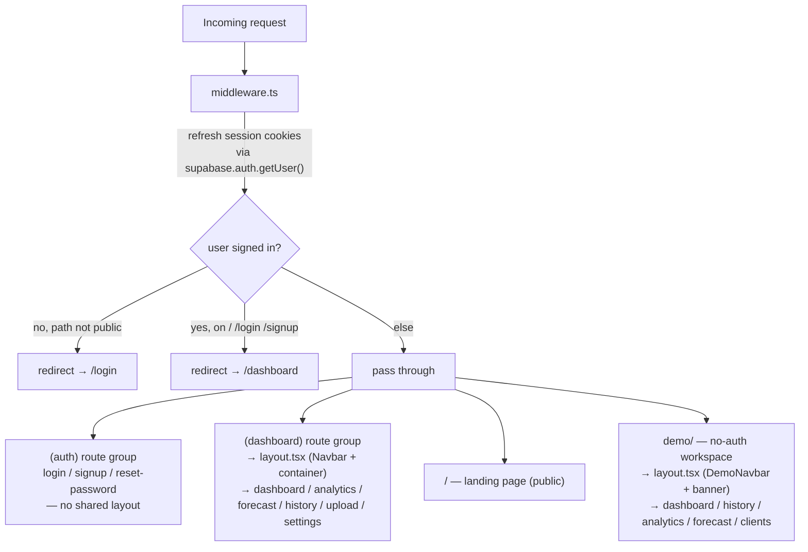
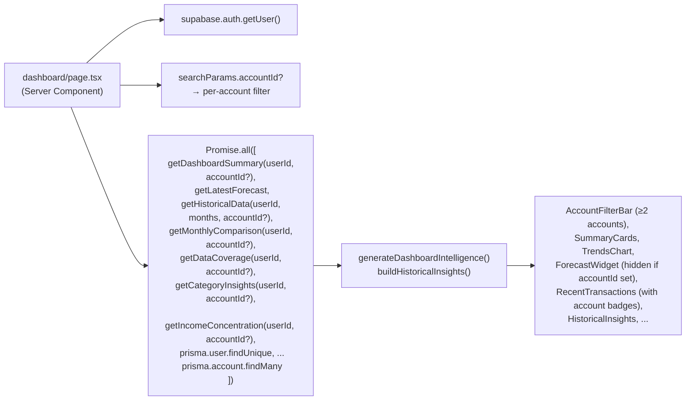
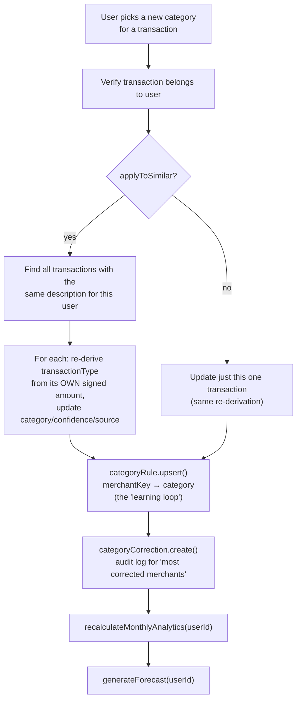
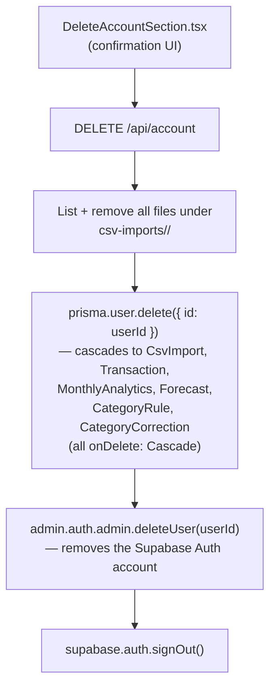

# Architecture

- **What it does**: This document maps the whole codebase — the Next.js App Router structure, how authentication flows through Supabase + middleware, how Prisma talks to Postgres, what each `src/lib` service is responsible for, and which API routes exist (and which don't actually get called by anything).
- **Why it exists**: Every other doc in `/docs` zooms into one engine or one flow. This one is the "map" — if you're not sure *where* something lives or *how two pieces connect*, start here, then follow the cross-reference links into the engine-specific docs.
- **Where the code is**: everything under `src/`, plus `prisma/`, `messages/`, and `scripts/` at the repo root.
- **How to modify it safely**: see [How to modify](#how-to-modify-safely) at the bottom.

---

## 1. Tech stack at a glance

| Layer | Technology | Notes |
|---|---|---|
| Framework | Next.js 15 (App Router) | All pages are React Server Components by default; `"use client"` only where interactivity is needed |
| Language | TypeScript | strict mode |
| Styling | Tailwind CSS | calm-finance dark theme — see the UI theme conventions |
| Database | PostgreSQL via Supabase | accessed through Prisma, never directly |
| ORM | Prisma 5 | `prisma/schema.prisma` is the single source of truth for the schema — see [DATABASE.md](./DATABASE.md) |
| Auth | Supabase Auth (`@supabase/ssr`) | cookie-based sessions, refreshed in `middleware.ts` |
| File storage | Supabase Storage | one private bucket, `csv-imports`, retained for account-deletion cleanup. CSVs are no longer uploaded here — the browser parses the file locally and sends structured JSON to the server. |
| i18n | next-intl | `en` / `fr`, see [TRANSLATIONS.md](./TRANSLATIONS.md) |
| Charts | Recharts | `TrendsChart`, `CashflowChart` |
| CSV parsing | PapaParse | see [CSV_IMPORT.md](./CSV_IMPORT.md) |
| Tests | Vitest | `src/lib/__tests__/`, `src/lib/categorization/__tests__/` |

---

## 2. Project structure

```
src/
├── app/
│   ├── (auth)/                  ← route group: no shared chrome, full-screen forms
│   │   ├── login/page.tsx
│   │   ├── signup/page.tsx
│   │   └── reset-password/page.tsx
│   ├── (dashboard)/              ← route group: shared Navbar + container via layout.tsx
│   │   ├── layout.tsx
│   │   ├── dashboard/page.tsx
│   │   ├── analytics/page.tsx
│   │   ├── clients/page.tsx          ← Client Trust & Risk Center (list — in desktop Navbar and mobile bottom nav via MOBILE_NAV_LINKS)
│   │   ├── clients/[name]/page.tsx   ← Client detail (payment pattern, risk, trend)
│   │   ├── forecast/page.tsx
│   │   ├── history/page.tsx
│   │   ├── upload/page.tsx
│   │   └── settings/page.tsx
│   ├── demo/                     ← no-auth demo workspace (see §10)
│   │   ├── layout.tsx            ← DemoNavbar + amber "Demo Account" banner
│   │   ├── page.tsx              ← demo dashboard (mirrors dashboard/page.tsx)
│   │   ├── history/page.tsx
│   │   ├── analytics/page.tsx
│   │   ├── forecast/page.tsx
│   │   ├── clients/page.tsx
│   │   └── clients/[name]/page.tsx
│   ├── api/                      ← route handlers (see §7)
│   │   ├── account/route.ts
│   │   ├── dashboard/route.ts
│   │   ├── export/route.ts           ← GET: export all user transactions as CSV
│   │   ├── forecast/route.ts
│   │   ├── history/route.ts
│   │   ├── monthly-comparison/route.ts
│   │   ├── payers/{assign,[id]}/route.ts  ← POST assign payer to tx; PATCH rename/edit payer
│   │   ├── transactions/{recategorize,recategorize-all}/route.ts
│   │   ├── transfers/confirm/route.ts    ← POST: confirm a detected internal transfer
│   │   ├── uploads/{rules,process,[id]}/route.ts   ← presign removed; rules is new (GET learned category+intent rules for browser-side parse)
│   │   └── users/create/route.ts
│   ├── layout.tsx                 ← root layout: <html>, font, NextIntlClientProvider
│   └── page.tsx                   ← landing page (public)
├── components/                    ← grouped by feature: analytics/ clients/ dashboard/ demo/ history/ landing/ settings/ ui/ upload/
│   │                               ← clients/: NameSourceButton.tsx (badge showing payer name source), RenameClientForm.tsx (inline rename for payer identity)
│   │                               ← settings/: ExportDataButton.tsx (triggers GET /api/export, downloads CSV)
├── i18n/
│   ├── locales.ts                  ← LOCALES, DEFAULT_LOCALE, INTL_LOCALES
│   └── request.ts                  ← next-intl request config (cookie → locale)
├── lib/
│   ├── analytics-engine.ts         ← see ANALYTICS_ENGINE.md
│   ├── client-identity.ts          ← Client name extraction engine — rail prefix stripping, alias normalization, confidence scoring
│   ├── client-risk-engine.ts       ← Client Trust & Risk Center — status (current/watch/risk/inactive), alias grouping, dependency, trend
│   ├── financial-life-engine.ts    ← Financial Life Intelligence — temporal intent patterns (savings, spending, revenue trends, memory)
│   ├── forecast-engine.ts          ← see FORECAST_ENGINE.md
│   ├── intelligence-engine.ts      ← see INTELLIGENCE_ENGINE.md
│   ├── csv-processor.ts            ← see CSV_IMPORT.md
│   ├── categorization/             ← see CATEGORIZATION_ENGINE.md
│   ├── demo/                       ← in-memory demo engine (see §10)
│   │   ├── transactions.ts         ← DEMO_TRANSACTIONS singleton, DEMO_REF_DATE, DEMO_PERSONA
│   │   ├── engine.ts               ← pure in-memory equivalents of all DB-coupled engines
│   │   └── index.ts                ← barrel: getDemoDataset, DemoDataset, DemoTransaction
│   ├── insight-types.ts            ← Insight/RankedInsight types, cat(), resolveInsightValues()
│   ├── merchant-reports.ts         ← global uncategorized-merchant worklist
│   ├── transfer-detector.ts        ← detects internal account transfers from transaction descriptions (self-transfers, account moves)
│   ├── locale-actions.ts           ← server action: setUserLocale()
│   ├── prisma.ts                   ← PrismaClient singleton
│   └── supabase/{client,server,admin}.ts
├── middleware.ts                   ← session refresh + auth/landing redirects (§4)
├── types/global.d.ts               ← `declare module "*.css"`
└── utils/finance.ts                ← parseAmount, formatCurrency, formatNumber, pct, monthLabel, monthYearLabel

messages/{en,fr}.json                ← all user-facing strings, see TRANSLATIONS.md
prisma/{schema.prisma, seed.ts, seed-data/}  ← schema + merchant-pack seed data, see DATABASE.md
scripts/uncategorized-report.ts      ← CLI: `npm run report:uncategorized`
```

---

## 3. Routing — route groups, layouts, and the auth gate



- **Route groups** `(auth)` and `(dashboard)` are Next.js folder-naming conventions — the parentheses mean the segment doesn't appear in the URL. Each group can have its own `layout.tsx`; `(auth)` has none (each auth page is a standalone full-screen form), `(dashboard)` wraps every page in `<Navbar />` + a centered `<main>` container (`src/app/(dashboard)/layout.tsx`).
- **`middleware.ts`** runs on every request matched by its `config.matcher` (everything except `_next/static`, `_next/image`, `favicon.ico`, and image files). It does two jobs:
  1. **Refreshes the Supabase session cookies** — `@supabase/ssr`'s `createServerClient` with a `setAll` callback that writes any refreshed cookies onto both the incoming request and the outgoing response. This is what keeps a logged-in session alive across server-rendered navigations.
  2. **Redirects based on auth state**:
     - Unauthenticated + not on a public path (`/`, `/login`, `/signup`, `/reset-password`, `/demo`) → `/login`.
     - Authenticated + on `/`, `/login`, or `/signup` → `/dashboard`.
     - **`/reset-password` is deliberately exempt from the "bounce authenticated users" rule** — exchanging a password-recovery code signs the user in via Supabase, but they still need to land on `/reset-password` to actually set a new password. See [AUTHENTICATION.md](./AUTHENTICATION.md) for the full recovery flow.
     - **`/demo` is in `publicPaths` but NOT in `authOnlyPaths`** — both unauthenticated and authenticated users can access the demo workspace. Authenticated users are not bounced to `/dashboard` when visiting `/demo`. See §10 for the demo architecture.
- Every `(dashboard)` page additionally calls `createClient()` → `supabase.auth.getUser()` itself and `redirect("/login")` if there's no user — a defence-in-depth check independent of the middleware (Next.js Server Components don't always re-run middleware on client-side navigations).
- Every `(dashboard)` page sets `export const dynamic = "force-dynamic"` — these pages read live, per-user data from the database and must never be statically cached or pre-rendered.

---

## 4. Supabase integration — three clients, one purpose each

| File | Client type | Used from | Purpose |
|---|---|---|---|
| `src/lib/supabase/client.ts` | `createBrowserClient` | `"use client"` components | Browser-side auth calls — `signUp`, `signInWithPassword`, `signOut`, `resend`, password-reset flows. Reads/writes the session cookie via the browser. |
| `src/lib/supabase/server.ts` | `createServerClient` | Server Components, Route Handlers (`route.ts`) | Reads the session from request cookies (via `next/headers`'s `cookies()`). Used to get the current `user` for every page and almost every API route. Its `setAll` is wrapped in a `try/catch` because **Server Components cannot set cookies** — only middleware and Route Handlers can; the catch silently no-ops in that case. |
| `src/lib/supabase/admin.ts` | `createClient` (plain `@supabase/supabase-js`) with the **service-role key** | Route Handlers only (`account` DELETE) | Bypasses Row-Level Security. Used for: cleaning up any residual Storage files under `csv-imports/<userId>/` during account deletion, and `auth.admin.deleteUser()`. **Never expose this client or the `SUPABASE_SERVICE_ROLE_KEY` to the browser.** |

> **Why three clients instead of one**: the browser client only ever acts *as* the logged-in user (subject to Supabase's auth rules). The server client reads that same user's session server-side for SSR. The admin client is a deliberately separate, narrowly-used escape hatch for the handful of operations (storage management, account deletion) that need to act with elevated privileges — keeping it in its own file makes every privileged operation easy to grep for (`createAdminClient`).

---

## 5. Database layer — Prisma

- **`prisma/schema.prisma`** — 11 models: `User`, `Account`, `CsvImport`, `Transaction`, `MonthlyAnalytics`, `CategoryRule`, `CategoryCorrection`, `Forecast`, `Merchant`, `MerchantAlias`, `UncategorizedMerchantReport`. Full field-by-field documentation, relationships, and cascade behavior: [DATABASE.md](./DATABASE.md).
- **`src/lib/prisma.ts`** — the standard Next.js "singleton `PrismaClient`" pattern: stash the client on `globalThis` in development so hot-reloading doesn't open a new connection pool on every edit. Every server-side file does `import { prisma } from "@/lib/prisma"`.
- **`prisma/seed.ts` + `prisma/seed-data/`** — seeds the `Merchant`/`MerchantAlias` tables from static merchant packs (global, France, UK, Europe). Run via `npm run db:seed`. See [CATEGORIZATION_ENGINE.md](./CATEGORIZATION_ENGINE.md) for how these feed the DB-backed merchant index.
- Money fields are `Decimal(12,2)` — Prisma returns these as `Decimal` objects, which is why almost every API route and page does `Number(tx.amount)` etc. before sending values to the client or doing arithmetic.

---

## 6. The `src/lib` services

| Module | Responsibility | Documented in |
|---|---|---|
| `csv-processor.ts` | Parses uploaded CSVs: column detection, date/amount parsing, dedup, validation | [CSV_IMPORT.md](./CSV_IMPORT.md) |
| `categorization/` (`engine.ts`, `merchant-db.ts`, `keywords.ts`, `packs/`) | Classifies each transaction into a category + `income`/`expense`/`savings`/`transfer`, using learned rules → DB merchants → static packs → keyword fallback | [CATEGORIZATION_ENGINE.md](./CATEGORIZATION_ENGINE.md) |
| `analytics-engine.ts` | Aggregates `Transaction` rows into `MonthlyAnalytics`, computes historical trends, category insights, seasonality, income concentration, client insights, data coverage | [ANALYTICS_ENGINE.md](./ANALYTICS_ENGINE.md) |
| `client-identity.ts` | Extracts real client/merchant names from bank description strings — 35+ rail prefix patterns, confidence scoring (`high`/`medium`/`low`/`unknown`), alias normalization, `UNIDENTIFIED_SOURCE` fallback | [ANALYTICS_ENGINE.md §Client Trust](./ANALYTICS_ENGINE.md) |
| `client-risk-engine.ts` | Client Trust & Risk Center: two-phase alias grouping, status (`current`/`watch`/`risk`/`inactive`), dependency risk, revenue trend, reliability scoring, payment timeline | [ANALYTICS_ENGINE.md §Client Trust](./ANALYTICS_ENGINE.md) |
| `forecast-engine.ts` | Weighted-moving-average + seasonal projection of next month's income/expenses/cashflow, persisted to the `Forecast` table | [FORECAST_ENGINE.md](./FORECAST_ENGINE.md) |
| `intelligence-engine.ts` | Turns analytics/forecast output into `{key, values}` insight descriptors — snapshot summaries, trajectory narratives, health status, biggest risk/opportunity | [INTELLIGENCE_ENGINE.md](./INTELLIGENCE_ENGINE.md) |
| `insight-types.ts` | `Insight`/`RankedInsight` types, `cat()` category sentinel, `resolveInsightValues()` | [INTELLIGENCE_ENGINE.md](./INTELLIGENCE_ENGINE.md) |
| `merchant-reports.ts` | `loadMerchantIndex()` (DB-backed merchant directory for categorization) and `reportUncategorizedMerchants()` (writes to `UncategorizedMerchantReport` for `npm run report:uncategorized`) | [CATEGORIZATION_ENGINE.md](./CATEGORIZATION_ENGINE.md) |
| `transfer-detector.ts` | Detects internal account transfers from transaction descriptions — used to avoid classifying account-to-account moves as income or expense | (used by payer-engine.ts) |
| `locale-actions.ts` | `setUserLocale()` server action — sets the `NEXT_LOCALE` cookie | [TRANSLATIONS.md](./TRANSLATIONS.md) |
| `prisma.ts` | `PrismaClient` singleton | §5 above |
| `supabase/{client,server,admin}.ts` | The three Supabase clients | §4 above |
| `utils/finance.ts` | `parseAmount`, `formatCurrency`, `formatNumber`, `pct`, `monthLabel`, `monthYearLabel` — locale-aware formatting helpers used throughout the UI and the engines | (used by all engines) |

---

## 7. Two data-fetching architectures

This codebase mixes two patterns. Knowing which one applies to a given screen matters when you're tracing "where does this number come from."

### 7a. Page loads — direct server-side calls (no API round-trip)

Every page in `(dashboard)/` is an `async` Server Component that:
1. Calls `createClient()` (Supabase server client) → `supabase.auth.getUser()` → `redirect("/login")` if absent.
2. Calls `lib/*-engine.ts` functions (and sometimes `prisma` directly) in a single `Promise.all([...])`.
3. Renders the result into Server Components and a handful of `"use client"` islands for interactivity.



`analytics/page.tsx` and `forecast/page.tsx` follow the same shape with a different subset of analytics-engine calls (see [ANALYTICS_ENGINE.md](./ANALYTICS_ENGINE.md) and [FORECAST_ENGINE.md](./FORECAST_ENGINE.md)).

### 7b. Client-driven actions — `"use client"` components calling `/api/*`

| Component | Calls | Route | What happens |
|---|---|---|---|
| `CsvUploader.tsx` | `GET /api/uploads/rules` → parse CSV → `GET /api/accounts` → `POST /api/uploads/process` | `uploads/rules`, `accounts`, `uploads/process` | §8a |
| `CsvUploader.tsx` (account picker) | `GET /api/accounts` → `POST /api/accounts` | `accounts` | List existing accounts; create a new account before import |
| `DeleteImportButton.tsx` | `DELETE /api/uploads/[id]` | `uploads/[id]` | Deletes an import's transactions, recalculates analytics + forecast |
| `RecategorizeButton.tsx` | `PATCH /api/transactions/recategorize` | `transactions/recategorize` | §8b |
| `RecategorizeAllButton.tsx` | `POST /api/transactions/recategorize-all` | `transactions/recategorize-all` | Re-runs categorization on every transaction |
| `DeleteAccountSection.tsx` | `DELETE /api/account` | `account` | §8c |
| `ExportDataButton.tsx` | `GET /api/export` | `export` | Streams all of the user's transactions as a downloadable CSV from the Settings page |
| `NameSourceButton.tsx` | `POST /api/payers/assign` | `payers/assign` | Assigns a resolved payer identity to a transaction (used on the Clients pages) |
| `RenameClientForm.tsx` | `PATCH /api/payers/[id]` | `payers/[id]` | Renames/edits a payer identity (canonical name, type override) |
| `signup/page.tsx` | `POST /api/users/create` | `users/create` | Creates the `User` row right after Supabase Auth signup (client-side `signUp()` can't write to Postgres directly) |
| `MonthDrawer.tsx` | `GET /api/analytics/month-breakdown?year=&month=` | `analytics/month-breakdown` | Loads expense + income category totals for a clicked month (used by TrendsChart and CashflowChart drill-down drawers) |
| `MonthDrawer.tsx` | `GET /api/analytics/category-transactions?year=&month=&type=&category=` | `analytics/category-transactions` | Loads individual transactions for a clicked category within a month (also accepts `since=` for all-time category views) |
| `ExpenseBreakdown.tsx` | `GET /api/analytics/category-transactions?category=&type=&since=` | `analytics/category-transactions` | Loads transactions for a category in the Expense/Income breakdown drawer |

### 7c. Routes that exist but aren't currently called

`GET/POST /api/forecast`, `GET /api/dashboard`, `GET /api/history`, and `GET /api/monthly-comparison` are fully implemented (they wrap `getLatestForecast`/`generateForecast`, `getDashboardSummary`, `getHistoricalData` + paginated `Transaction.findMany`, and `getMonthlyComparison` respectively) but **no current frontend code calls them** — the pages that need this data fetch it directly server-side (§7a). They're harmless to leave (each does its own auth check), but if you're tracing "what populates the dashboard," these routes are a dead end — the real path is `dashboard/page.tsx`'s `Promise.all`.

> If you're adding a feature that needs this data from a `"use client"` component (e.g. a refresh button, a mobile client, polling), these routes are ready to use as-is rather than needing to be rebuilt.

---

## 8. Data flow walkthroughs

### 8a. CSV upload pipeline

The raw CSV file is parsed **entirely in the browser** and never sent to the server.

```mermaid
flowchart TD
    A["CsvUploader.tsx\n(user selects/drops file)"] --> B["file.text()\n— read CSV in-memory\nnothing sent to server yet"]
    B --> C["GET /api/uploads/rules\n→ load CategoryRule + UserIntentRule\nfor this user (small JSON)"]
    C --> D["parseCsv(csvText, learnedRules,\nEMPTY_MERCHANT_INDEX, userIntentRules)\n— pure function, client-side\nsee CSV_IMPORT.md + CATEGORIZATION_ENGINE.md\nreturns: transactions[], detectedAccount"]
    D --> E["Account selection step:\nGET /api/accounts → show picker\nPOST /api/accounts if new account\n(detectedAccount pre-fills name field)"]
    E --> F["POST /api/uploads/process\n{ transactions[], fileName, totalRows,\nskippedRows, currencies, accountId }\n— structured rows only, no raw CSV"]
    F --> G["loadMerchantIndex()\n— DB-backed merchant directory"]
    G --> H["Merchant second pass:\ncategorizeTransaction() on each row\n— upgrades keyword/default categories\nif a merchant-db match exists\n— never overrides 'learned' source"]
    H --> I["Application-level dedup:\nfetch existing rows for (userId, accountId, dateRange)\nbuild fingerprint Set, filter incoming rows"]
    I --> J["prisma.csvImport.create()\nstatus: 'processing', accountId"]
    J --> K["prisma.transaction.createMany()\nnew rows only, in batches of 1000\neach tagged with accountId"]
    K --> L["prisma.csvImport.update()\nstatus: 'completed'"]
    L --> M["recalculateMonthlyAnalytics(userId)\nsee ANALYTICS_ENGINE.md"]
    M --> N["generateForecast(userId)\nsee FORECAST_ENGINE.md"]
    N --> O["reportUncategorizedMerchants()\n→ UncategorizedMerchantReport"]
    O --> P["Return summary:\nimportedRows, duplicateRows, skippedRows,\ndateRange, currencies, typeBreakdown"]
```



Key points:
- **The raw CSV never leaves the browser.** `parseCsv()` runs client-side; the server only receives structured JSON. This is both a privacy guarantee and a scalability property — file size doesn't affect the server request body size, only browser memory.
- **Account selection step**: after parsing, the user assigns the CSV to a bank account (or creates one). `parseCsv()` returns a `detectedAccount` extracted from CSV header metadata (e.g. `"Account Name: Revolut Business"`) which pre-fills the new-account form. Assigning an account is optional — the user can skip, in which case `accountId` is `null`.
- **Two-pass categorization**: the browser pass uses the user's learned rules but an empty merchant index (no DB access). The server's second pass re-runs `categorizeTransaction()` against the full `Merchant`/`MerchantAlias` DB to upgrade any transaction that can be matched to a named merchant. User-learned categories (`categorySource: "learned"`) are skipped in the second pass.
- **Account-scoped deduplication**: the app pre-fetches existing transactions for the same `(userId, accountId)` pair and date range, builds a fingerprint set, and filters before `createMany`. This replaces the old `skipDuplicates: true` approach, which couldn't scope uniqueness per account. See [DATABASE.md §4](./DATABASE.md#4-account) for the partial DB indexes that act as a secondary safety net.
- **`/api/uploads/rules`** returns only the current user's `CategoryRule` and `UserIntentRule` rows — it does not expose any other user's data or any raw transaction content.
- `recalculateMonthlyAnalytics` + `generateForecast` run **synchronously, in the request** — for very large imports this makes the request slower but keeps the dashboard always in sync immediately after upload (no background job queue exists in this app).
- **`/api/uploads/presign`** still exists in the codebase but is no longer called by `CsvUploader.tsx` — it is dead code from the previous Supabase Storage upload flow.

### 8b. Recategorize flow (`PATCH /api/transactions/recategorize`)



This is the **learning loop**: a `CategoryRule` row is upserted for the transaction's `merchantKey` (normalized description), so the **next CSV import** (`POST /api/uploads/process`) and any future **recategorize-all** pass will classify that merchant the same way automatically. See [CATEGORIZATION_ENGINE.md](./CATEGORIZATION_ENGINE.md) for `normalizeMerchantKey()` and the full rule-precedence order.

### 8c. Account deletion (`DELETE /api/account`)



If the `User` row is already missing (Prisma error `P2025`), deletion continues to the auth-account removal step regardless — the goal is always to let the person leave cleanly. `Merchant`, `MerchantAlias`, and `UncategorizedMerchantReport` are **global** tables (not user-scoped) and are untouched by account deletion.

---

## 9. Internationalization architecture (brief)

- `next-intl` is wired in via `next.config.ts`'s `createNextIntlPlugin()` and `src/i18n/request.ts`.
- Locale resolution order: `NEXT_LOCALE` cookie → `Accept-Language` header → `DEFAULT_LOCALE` ("en"). Set via `setUserLocale()` (`src/lib/locale-actions.ts`), a server action invoked by `LanguageSwitcher.tsx`.
- `src/app/layout.tsx` (root layout) wraps everything in `<NextIntlClientProvider locale={locale} messages={messages}>` — `messages` is the **entire** `messages/{locale}.json` file, loaded once per request.
- All user-facing strings live in `messages/en.json` / `messages/fr.json`. The `intelligence-engine.ts` insight system (`{key, values}` + `cat()` + `<InsightText>`, see [INTELLIGENCE_ENGINE.md](./INTELLIGENCE_ENGINE.md)) is the main producer of dynamic translated content; everything else uses `useTranslations()` / `getTranslations()` directly.
- Full conventions, message structure, and how to add/edit strings: [TRANSLATIONS.md](./TRANSLATIONS.md).

---

## 10. The demo workspace (`/demo/*`)

A no-login-required replica of the full dashboard workspace, pre-loaded with a fictional freelancer profile (Sophie Martin, UX Designer, 3 years of data). Its purpose is to build trust on the landing page: visitors can explore the real engine's output before signing up.

### Critical design rule

> **The demo workspace uses the exact same engines as real accounts.** Nothing is hardcoded or faked. The same `generateDashboardIntelligence()`, `buildHistoricalInsights()`, forecast algorithms, and client-risk calculations run on the demo data — the only difference is that the input is a pre-seeded in-memory `DemoTransaction[]` array instead of Prisma rows.

### Files

| File | Role |
|---|---|
| `src/lib/demo/transactions.ts` | `DEMO_TRANSACTIONS` — 36 months (Jan 2023–Dec 2025) of realistic UX designer transactions. `DEMO_REF_DATE = new Date(Date.UTC(2026, 0, 1))` — used instead of `new Date()` for all date-relative calculations so clients don't incorrectly appear inactive against the wall-clock date. |
| `src/lib/demo/engine.ts` | Pure in-memory equivalents of all DB-coupled analytics/forecast/client functions. Every function accepts `DemoTransaction[]` and returns the same shape as the real engines. `getDemoDataset(locale)` is cached per locale to avoid recomputing on each render. |
| `src/lib/demo/index.ts` | Barrel export: `getDemoDataset`, `DemoDataset`, `DemoTransaction`, `DEMO_TRANSACTIONS`, `DEMO_REF_DATE`, `DEMO_PERSONA`. |
| `src/app/demo/layout.tsx` | `DemoNavbar` + amber banner: "Demo Account — All data shown is fictional. This is Sophie Martin, Freelance UX Designer." |
| `src/components/demo/DemoNavbar.tsx` | Mirrors the real `Navbar` but links to `/demo/*` routes; shows "Sign In / Create Account" instead of "Sign Out"; no Supabase dependency. |
| `src/app/demo/page.tsx` | Demo dashboard — calls `getDemoDataset(locale)`, then `generateDashboardIntelligence()` and `buildHistoricalInsights()` with that data (same real functions). |
| `src/app/demo/history/page.tsx` | In-memory filter + pagination of `DEMO_TRANSACTIONS`. |
| `src/app/demo/analytics/page.tsx` | Uses `getDemoDataset` + `computeCategoryBreakdown()` + `computeIncomeBySource()` + `computeYtdTotals()`. |
| `src/app/demo/forecast/page.tsx` | Full feature parity with real forecast page; `computeForecast()` returns a complete `ForecastResult` matching the real interface. |
| `src/app/demo/clients/page.tsx` | Uses `getDemoDataset(locale)` for client list. |
| `src/app/demo/clients/[name]/page.tsx` | Full feature parity with real client detail page. |

### Data design choices (why the demo produces interesting insights)

- **Nexo Startup** ≈ 83 % of last-12-month income → `isHighConcentration = true`, concentration insight fires.
- **Nova Digital** last payment Oct 5 2025 → 87 days from `DEMO_REF_DATE` (Jan 1 2026) → `status: "risk"`.
- **DesignCraft Agency** last payment Jun 20 2024 → 559 days from `DEMO_REF_DATE` → `status: "inactive"`.
- Transport costs grew ~32 % YoY vs income ~16 % → transport-growing-faster insight fires.

### Sample CSVs (`public/samples/`)

Four downloadable personas (designer, developer, consultant, photographer) for the landing page's "Upload Sample CSV" CTA. They use the **real upload pipeline** — no shortcuts. Key format constraint: income amounts are positive, expenses are negative (the categorization engine classifies by amount sign); savings rows use descriptions matching `SAVINGS_TRANSFER_OVERRIDES` (e.g. `VIREMENT EPARGNE`, `TRANSFER TO SAVINGS`). See [CSV_IMPORT.md](./CSV_IMPORT.md) and [CATEGORIZATION_ENGINE.md](./CATEGORIZATION_ENGINE.md) for why signed amounts matter.

### `DEMO_REF_DATE` — why it exists

All real engines use `new Date()` ("today") for date-gap calculations. Since demo data ends Dec 2025 and `new Date()` is mid-2026+, every client would appear inactive. `DEMO_REF_DATE = new Date(Date.UTC(2026, 0, 1))` (the day after the last demo transaction) is used throughout `src/lib/demo/engine.ts` instead. **Do not replace it with `new Date()` in demo code** — that would break the intended client-risk states.

---

## How to modify safely

### Adding a new page

1. Create `src/app/(dashboard)/<name>/page.tsx` as an `async` Server Component. Copy the auth-check boilerplate from an existing page (`createClient()` → `getUser()` → `redirect("/login")`) and set `export const dynamic = "force-dynamic"`.
2. It will automatically get the `(dashboard)` layout's `<Navbar />` + container — no extra wiring needed.
3. Add an entry to `NAV_LINKS` in `src/components/ui/Navbar.tsx` for the desktop top bar. `MOBILE_NAV_LINKS` is derived from `NAV_LINKS` with a filter (currently excludes `history` to keep the mobile bar at 5 items). If the new page should appear on mobile too, update that filter. Add `common.nav.<key>` (full label) and `common.nav.<key>Mobile` (short label for the bottom tab) translation keys to both `messages/en.json` and `messages/fr.json`.

### Adding a new API route

1. Create `src/app/api/<name>/route.ts`, export `GET`/`POST`/`PATCH`/`DELETE` as needed.
2. Almost every route should start with the same auth check: `createClient()` → `getUser()` → 401 if absent.
3. If the route needs to touch Supabase Storage with elevated permissions, use `createAdminClient()` — but **scope every storage path to `${user.id}/...`** and verify any path the client sends you starts with that prefix (see §8a's `process` route for the pattern).
4. If the route mutates `Transaction` rows, remember to call `recalculateMonthlyAnalytics(userId)` and `generateForecast(userId)` afterwards — every existing mutation route does this so the dashboard/forecast never go stale. See [ANALYTICS_ENGINE.md](./ANALYTICS_ENGINE.md) and [FORECAST_ENGINE.md](./FORECAST_ENGINE.md) for what these do and how expensive they are.

### Adding a new `src/lib` service

- Keep it **pure relative to the page layer** — accept primitives/Prisma results as arguments, return plain data, do formatting via `utils/finance.ts` and translation via the `{key, values}`/`cat()` pattern (don't hardcode English strings). This is what makes `intelligence-engine.ts` and `forecast-engine.ts` independently unit-testable (see `src/lib/__tests__/`).
- Add a row to the table in §6 of this document, and consider whether it needs its own doc in `/docs`.

### Things to be careful about

- **Don't bypass the Supabase server client's auth check.** Every page and route handler must call `supabase.auth.getUser()` itself — middleware redirects cover most navigation, but Server Components and Route Handlers can be reached in ways middleware doesn't always re-run for (client-side transitions, direct API calls).
- **`createAdminClient()` is service-role — treat every use as a security boundary.** The only places it should appear are: Storage bucket management for CSV uploads, and account deletion. If you find yourself reaching for it elsewhere, there's almost always a way to do it with the regular server client + RLS instead.
- **Decimal fields**: anything coming out of Prisma that maps to `Decimal(12,2)` (`Transaction.amount`, all `MonthlyAnalytics`/`Forecast` money fields) must be converted with `Number(...)` before arithmetic or JSON serialization — Prisma's `Decimal` doesn't serialize to a plain number automatically and `Decimal + Decimal` is not `+`.
- **The two dead-but-functional API routes** (`/api/dashboard`, `/api/history`, `/api/monthly-comparison`, `/api/forecast` GET/POST) are not wired to the UI — don't assume editing them changes anything users see. If you remove or change `analytics-engine.ts`/`forecast-engine.ts` exports, these routes are additional call sites that need to keep compiling even though they're not exercised by manual testing.
- **`prisma/seed-data/`** is global merchant data shared by all users (via `Merchant`/`MerchantAlias`) — re-running `npm run db:seed` affects every account's categorization, not just one user's.
