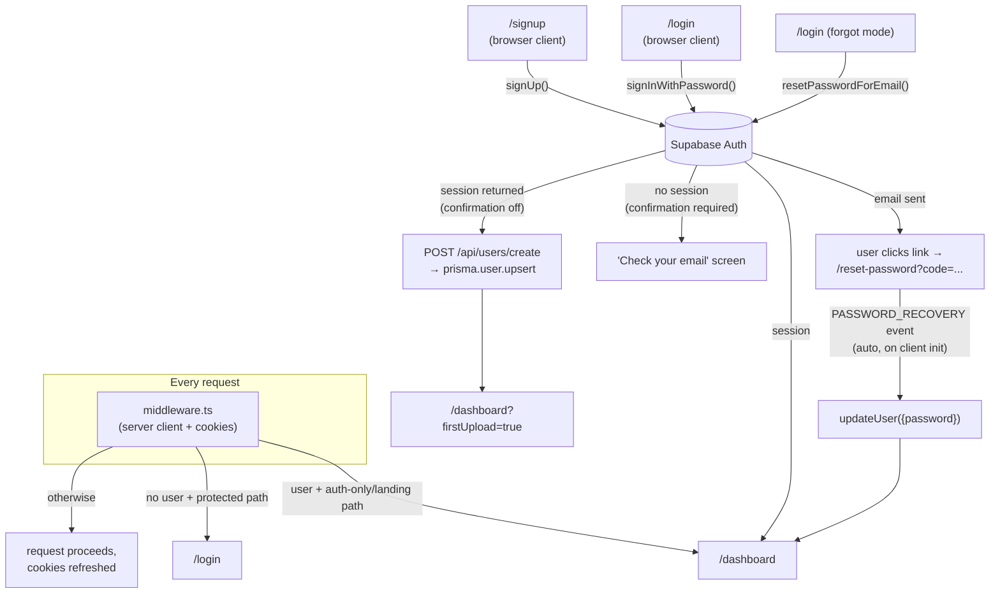
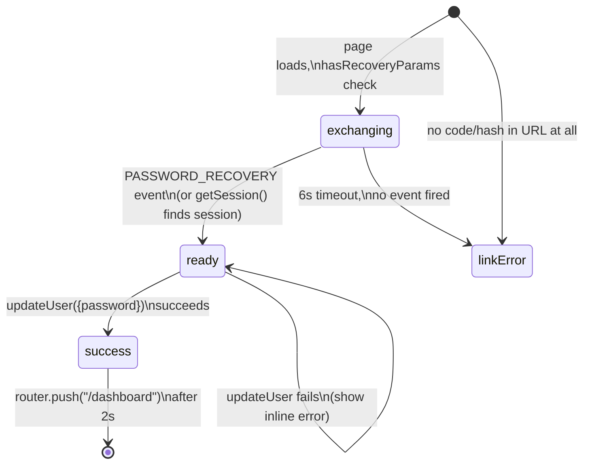

# Authentication

- **What it does**: Covers everything related to identity — signup, login, password reset, session persistence, sign-out, and how the app's own `User` table stays in sync with Supabase Auth.
- **Why it exists**: Authentication is handled almost entirely by **Supabase Auth** (hosted, not custom-built). This doc explains how the app's three different Supabase clients fit together, how `middleware.ts` enforces the auth gate on every request, and the exact mechanics of the trickiest flow — password reset — which relies on a Supabase client-side event rather than a server-side code exchange.
- **Where the code is**:
  - `src/lib/supabase/{client,server,admin}.ts` — the three Supabase client factories
  - `src/middleware.ts` — the auth gate (runs on every request)
  - `src/app/(auth)/{login,signup,reset-password}/page.tsx` — the three auth pages
  - `src/app/api/users/create/route.ts` — syncs a new Supabase Auth user into Prisma's `User` table
  - `src/components/settings/SignOutButton.tsx` — sign-out
  - `prisma/schema.prisma` — `User` model (`id` matches the Supabase Auth user's UUID)
- **How to modify it safely**: see [How to modify](#how-to-modify-safely) at the bottom.

---

## 1. Overview



There is **no custom session storage, JWT signing, or password hashing in this codebase** — all of that is Supabase's responsibility. The app's job is: (1) read/refresh the Supabase session cookie on every request, (2) redirect based on whether a session exists, and (3) keep a mirror `User` row in Postgres (via Prisma) for the app's own foreign keys (`Transaction.userId`, etc.).

---

## 2. The three Supabase clients

| Client | File | Auth context | Used for |
|---|---|---|---|
| **Browser** | `src/lib/supabase/client.ts` | Anon key, runs in the user's browser | All `"use client"` auth forms (login, signup, reset-password, sign-out) — anything calling `supabase.auth.*` directly from interactive UI |
| **Server** | `src/lib/supabase/server.ts` | Anon key, reads/writes cookies via `next/headers` | Server Components and Route Handlers that need `getUser()` for the current request (every `(dashboard)/*/page.tsx`, every API route) |
| **Admin** | `src/lib/supabase/admin.ts` | **Service-role key** — bypasses Row Level Security | Privileged operations only: `DELETE /api/account` (deletes the Supabase Auth user), Storage operations on the `csv-imports` bucket |

### Browser client (`src/lib/supabase/client.ts`)

```ts
export function createClient() {
  return createBrowserClient(
    process.env.NEXT_PUBLIC_SUPABASE_URL!,
    process.env.NEXT_PUBLIC_SUPABASE_ANON_KEY!
  );
}
```

The simplest of the three — `createBrowserClient` from `@supabase/ssr` automatically manages the session in cookies so it stays in sync with the server clients.

### Server client (`src/lib/supabase/server.ts`)

```ts
export async function createClient() {
  const cookieStore = await cookies();
  const setAll: SetAllCookies = (cookiesToSet) => {
    try {
      cookiesToSet.forEach(({ name, value, options }) => cookieStore.set(name, value, options));
    } catch {
      // Server component — cookies can be set only from middleware/route handlers
    }
  };
  return createServerClient(URL, ANON_KEY, { cookies: { getAll: () => cookieStore.getAll(), setAll } });
}
```

> **Why the `try/catch` around `setAll`**: Next.js forbids setting cookies from a Server **Component** render (only Route Handlers, Server Actions, and Middleware can). `getUser()` may try to *refresh* the session (writing new cookies) even during a plain page render. The `try/catch` silently swallows that — it's a no-op in Server Components, but works correctly when the same `createClient()` is called from a Route Handler (where cookie-setting succeeds).
>
> In practice this means: **middleware is what actually persists refreshed session cookies** (§3). The server client in Server Components is "read-mostly" — it can read the current session and call `getUser()`, but a session refresh that happens mid-render won't be persisted unless middleware also runs (which it does, on every request, before the Server Component renders).

### Admin client (`src/lib/supabase/admin.ts`)

```ts
export function createAdminClient() {
  const url = process.env.NEXT_PUBLIC_SUPABASE_URL;
  const key = process.env.SUPABASE_SERVICE_ROLE_KEY;
  if (!url || !key) throw new Error("Missing NEXT_PUBLIC_SUPABASE_URL or SUPABASE_SERVICE_ROLE_KEY env variables");
  return createClient(url, key, { auth: { autoRefreshToken: false, persistSession: false } });
}
```

> **This is the most powerful client in the app** — the service-role key bypasses all Row Level Security and can act as any user (`admin.auth.admin.deleteUser(userId)`) or read/write any Storage object. `autoRefreshToken: false, persistSession: false` are set because this client is created fresh per-request on the server and never needs to maintain its own session — it authenticates via the service-role key itself, not a user session.
>
> **Never call `createAdminClient()` from a `"use client"` component or expose `SUPABASE_SERVICE_ROLE_KEY` to the browser** — it is not prefixed `NEXT_PUBLIC_` for exactly this reason. It must only be referenced from server-side code (Route Handlers).

---

## 3. The auth gate (`middleware.ts`)

Runs on every request (per `config.matcher`, which excludes `_next/static`, `_next/image`, `favicon.ico`, and common image extensions).

```ts
const publicPaths = ["/login", "/signup", "/reset-password"];
const authOnlyPaths = ["/login", "/signup"];   // bounce signed-in users away from these
const isLanding = pathname === "/";
const isPublic  = isLanding || publicPaths.some((p) => pathname.startsWith(p));
const isAuthOnly = authOnlyPaths.some((p) => pathname.startsWith(p));

if (!user && !isPublic) return NextResponse.redirect(new URL("/login", request.url));
if (user && (isLanding || isAuthOnly)) return NextResponse.redirect(new URL("/dashboard", request.url));
```

| Path | Anonymous visitor | Signed-in user |
|---|---|---|
| `/` (landing) | ✅ shown | 🔁 redirected to `/dashboard` |
| `/login`, `/signup` | ✅ shown | 🔁 redirected to `/dashboard` |
| `/reset-password` | ✅ shown | ✅ **shown** (not redirected) |
| `/dashboard`, `/upload`, `/history`, `/analytics`, `/forecast`, `/settings`, `/api/*` | 🔁 redirected to `/login` | ✅ shown |

> **Why `/reset-password` is in `publicPaths` but *not* `authOnlyPaths`**: clicking a password-recovery email link causes the Supabase browser client to establish a session (see §6) — so by the time the page is interactive, the user technically *is* "signed in." If `/reset-password` were in `authOnlyPaths`, middleware would immediately bounce this newly-authenticated user to `/dashboard` *before* they could set their new password, silently aborting the recovery flow. This is a one-line list membership that's easy to "fix" by mistake — see the code comment in `middleware.ts` itself and [How to modify safely](#how-to-modify-safely).

### Session refresh mechanics

Every middleware invocation:
1. Builds a `supabase` server client backed by the *request's* cookies.
2. Calls `supabase.auth.getUser()` — this validates the access token and, if expired, uses the refresh token to get a new one.
3. If new tokens were issued, the `setAll` cookie callback writes them onto **both** `request.cookies` (so the rest of this request sees the new session) and `supabaseResponse.cookies` (so the browser receives the updated `Set-Cookie` headers).
4. Returns `supabaseResponse` (unless a redirect happened first) — this is what carries the refreshed cookies back to the browser.

This is the **only** place session cookies are reliably refreshed — see the `try/catch` note in §2's server client.

---

## 4. Sign up (`/signup`)

**File**: `src/app/(auth)/signup/page.tsx`, `"use client"`. Two `Mode`s: `"signup"` (form) and `"confirm"` (post-signup waiting screen).

```ts
const { data, error } = await supabase.auth.signUp({
  email, password,
  options: { data: { full_name: fullName } },   // stored in Supabase Auth user_metadata
});

if (data.user) {
  await fetch("/api/users/create", {            // mirror into Prisma `users` table
    method: "POST",
    body: JSON.stringify({ id: data.user.id, fullName, email }),
  });
}

if (data.session) {
  router.push("/dashboard?firstUpload=true");   // confirmation disabled — signed in immediately
} else {
  setMode("confirm");                           // confirmation required — show "check your email"
}
```

- **Validation**: `email` (HTML `type="email"`, required), `password` (`minLength={8}`, with a live hint shown while `0 < length < 8`), `fullName` (required, free text).
- **`POST /api/users/create`** (`src/app/api/users/create/route.ts`) is called **only if `data.user` exists** (i.e. the signup itself succeeded), regardless of whether a session was returned. It does:
  ```ts
  prisma.user.upsert({ where: { id }, update: {}, create: { id, fullName: fullName || "", email } });
  ```
  `upsert` (not `create`) makes this endpoint **idempotent** — if it's ever called twice for the same Supabase Auth `id` (e.g. a retried request), the second call is a harmless no-op (`update: {}`).
- **`friendlyError()`** maps raw Supabase error strings (lowercased, substring match) to translation keys: `alreadyRegistered`, `passwordTooShort`, `invalidEmail`, `rateLimit`, else `generic`.
- **`"confirm"` mode** ("check your email"): shows the email address, an instructions message, and a **Resend** button (`supabase.auth.resend({ type: "signup", email })`) with `resending`/`resentDone` states. A link back to `/login` is also shown.

> **Whether `"confirm"` mode is ever reached depends entirely on the Supabase project's "Confirm email" setting** (Supabase Dashboard → Authentication → Providers → Email), not on anything in this codebase. With confirmation **off**, `data.session` is always populated and users go straight to `/dashboard?firstUpload=true`.

---

## 5. Log in (`/login`)

**File**: `src/app/(auth)/login/page.tsx`, `"use client"`. Three `Mode`s: `"signin"` (default), `"forgot"`, `"sent"`.

### `"signin"` mode

```ts
const { error } = await supabase.auth.signInWithPassword({ email, password });
if (error) { setError(friendlyError(error.message, tErrors)); return; }
router.push("/dashboard");
router.refresh();
```

`router.refresh()` after `router.push()` is important: it re-runs Server Components (including `(dashboard)/layout.tsx` and `dashboard/page.tsx`) so they pick up the now-authenticated session via the server Supabase client — without it, the client-side navigation could render the dashboard shell before server data has a valid session.

A password show/hide toggle (`showPassword` state) is shared visual pattern across all three auth pages.

### `friendlyError()` mapping (login)

| Raw Supabase message contains... | Shown error key |
|---|---|
| "invalid login credentials" / "invalid credentials" | `invalidCredentials` |
| "email not confirmed" | `emailNotConfirmed` |
| "too many requests" / "rate limit" | `tooManyRequests` |
| "user not found" | `userNotFound` |
| "email" **and** "invalid" | `invalidEmail` |
| "network" / "fetch" | `network` |
| *(anything else)* | `generic` |

### `"forgot"` mode

```ts
const { error } = await supabase.auth.resetPasswordForEmail(resetEmail, {
  redirectTo: `${window.location.origin}/reset-password`,
});
```

Clicking "Forgot password?" on the signin form pre-fills `resetEmail` with whatever was typed into the email field, then switches to `"forgot"` mode. On success, switches to `"sent"` mode.

### `"sent"` mode

A static confirmation screen ("check your email") showing the email address it was sent to, with a "try again" link back to `"forgot"` and a "back to sign in" link.

---

## 6. Password reset (`/reset-password`)

**File**: `src/app/(auth)/reset-password/page.tsx`, `"use client"`, wrapped in `<Suspense>` (uses `useSearchParams()`).

This is the most subtle auth flow in the app. The recovery link Supabase emails contains either a `?code=...` query param or a `#...type=recovery` hash fragment.



### Why there's no manual `exchangeCodeForSession()` call

> The Supabase **browser client automatically detects** the recovery code/token in the URL and establishes the session **during its own initialization** (when `createClient()` is called and the client mounts), emitting a `PASSWORD_RECOVERY` event via `onAuthStateChange`. Calling `exchangeCodeForSession()` manually here would try to consume the same single-use code a **second time** and always fail. So the page only **listens**:

```ts
const { data: { subscription } } = supabase.auth.onAuthStateChange((event) => {
  if (event === "PASSWORD_RECOVERY") { setExchanging(false); setReady(true); }
});

// Fallback: in case init (and the event) already happened before this listener attached
supabase.auth.getSession().then(({ data: { session } }) => {
  if (session) { setExchanging(false); setReady(true); }
});

// Fallback: if neither fires within 6s, the link is treated as expired/invalid
const timeout = setTimeout(() => {
  setExchanging((current) => { if (current) setError(tErrors("expiredLink")); return false; });
}, 6000);
```

### The four UI states

| State | Condition | What's shown |
|---|---|---|
| **exchanging** | Initial state, `hasRecoveryParams` true | Spinner + "verifying" message |
| **expired/invalid** | No `?code=`/`#type=recovery` in URL at all, **or** 6s timeout with no `PASSWORD_RECOVERY` event | Error icon, "link expired" heading, "Request new link" button → `/login` |
| **ready** | `PASSWORD_RECOVERY` event fired (or `getSession()` found a session) | New-password form: password + confirm fields, live validation messages (`passwordHint` if <8 chars, `passwordsNoMatch`/`passwordsMatch` once both filled) |
| **success** | `updateUser({ password })` succeeded | Success icon + message, then `router.push("/dashboard")` after a 2-second delay |

Validation before submit: `password.length >= 8` and `password === confirm` (submit button is `disabled` until both hold). On `updateUser()` error, shows `updateFailed` inline (state stays `ready`).

---

## 7. Sign out

**File**: `src/components/settings/SignOutButton.tsx`, used on `/settings`. Also duplicated inline in `Navbar.tsx`'s `handleSignOut()`.

```ts
await supabase.auth.signOut();
router.push("/login");
router.refresh();
```

`supabase.auth.signOut()` clears the session cookie (via the browser client, which is wired to the same cookie storage as the server/middleware clients). `router.refresh()` ensures the next Server Component render sees no user and middleware redirects appropriately if the user navigates back.

---

## 8. The `User` table — bridging Supabase Auth and Prisma

Supabase Auth has its own internal `auth.users` table (UUIDs, emails, hashed passwords, etc.) that this app's code **never queries directly** (except via `admin.auth.admin.*` for account deletion). Instead, the app's own Prisma schema has:

```prisma
model User {
  id        String   @id @default(uuid())   // matches the Supabase Auth user's UUID — NOT auto-generated independently
  fullName  String
  email     String   @unique
  createdAt DateTime @default(now())
  updatedAt DateTime @updatedAt

  csvImports          CsvImport[]
  transactions        Transaction[]
  monthlyAnalytics    MonthlyAnalytics[]
  forecasts           Forecast[]
  categoryRules       CategoryRule[]
  categoryCorrections CategoryCorrection[]

  @@map("users")
}
```

`POST /api/users/create` (§4) is the **only** place this row is created — called once, right after `supabase.auth.signUp()` succeeds, passing `data.user.id` as the primary key. Every other table's `userId` foreign key points at this same UUID, which is shared between Supabase Auth and Prisma by convention (not a database-level foreign key to `auth.users`, since that table lives in Supabase's own schema). See [DATABASE.md](./DATABASE.md) for the full schema and relationships.

> If a user exists in Supabase Auth but `POST /api/users/create` never ran (e.g. it failed silently — its result isn't checked in `signup/page.tsx`), every Prisma query scoped by `userId` for that user will simply return empty results — the dashboard would show the empty state (see [USER_JOURNEY.md §8](./USER_JOURNEY.md)) even though the user can log in. There's no automatic repair for this; see [How to modify safely](#how-to-modify-safely).

---

## 9. Required environment variables

| Variable | Used by | Notes |
|---|---|---|
| `NEXT_PUBLIC_SUPABASE_URL` | all three clients | Public — safe to expose to the browser |
| `NEXT_PUBLIC_SUPABASE_ANON_KEY` | browser + server clients | Public — Row Level Security protects data, not this key |
| `SUPABASE_SERVICE_ROLE_KEY` | admin client only | **Secret** — full database/Storage access, bypasses RLS. Server-side only. |

---

## How to modify safely

### Adding a new auth page (e.g. magic-link login, OAuth)

1. Add the new path to `publicPaths` in `middleware.ts` (so unauthenticated users can reach it) and, if it should bounce already-signed-in users, also to `authOnlyPaths` — **unless** the page itself establishes a session as a side effect of loading (like `/reset-password`), in which case leave it out of `authOnlyPaths` (see §3's callout).
2. Follow the existing pages' structure: `"use client"`, a `Mode` union for sub-states if needed, `BrandHeader`-style branding, `friendlyError()` for mapping Supabase error strings, and the shared `Spinner` component.
3. Add translation keys under a new `auth.<feature>` namespace — see [TRANSLATIONS.md](./TRANSLATIONS.md).

### Changing redirect targets

- The post-login/signup redirect target (`/dashboard` or `/dashboard?firstUpload=true`) is hardcoded in each page (`login/page.tsx`, `signup/page.tsx`, `reset-password/page.tsx`). If you change where users should land, update all three — there's no shared constant.
- `middleware.ts`'s redirect targets (`/login`, `/dashboard`) are also hardcoded `new URL(...)` calls — same caveat.

### Adjusting `friendlyError()` mappings

- These are plain `string.includes()` checks against Supabase's **raw English error messages**, which Supabase can change without notice (it's not a stable API contract). If users start seeing "generic" errors for a case that should be specific, log the raw `error.message` temporarily and add a new substring match — don't assume the existing list is exhaustive.

### Things to be careful about

- **`middleware.ts`'s `publicPaths`/`authOnlyPaths` lists must stay in sync with reality.** A path present in neither list, for an unauthenticated user, gets redirected to `/login` — including new API routes under `/api/*` if you ever want them to be publicly callable (none currently are).
- **The admin client (`createAdminClient()`) must never be imported into client-bundled code.** It's only safe because `SUPABASE_SERVICE_ROLE_KEY` is a server-only env var (no `NEXT_PUBLIC_` prefix) — but a careless `import` from a `"use client"` file would still try to bundle the module (and fail at runtime when the env var is undefined in the browser, or worse, succeed if someone misconfigures the env). Keep admin-client usage confined to Route Handlers.
- **`POST /api/users/create`'s result is not checked** in `signup/page.tsx` (the `fetch` call's response isn't awaited for success/failure beyond the call itself completing). If this call fails (network blip, DB down), the Supabase Auth user exists but the Prisma `User` row doesn't — see §8's callout. If you need this to be more robust, the fix belongs in `signup/page.tsx` (retry/surface an error), not in the route itself (which is already correctly idempotent via `upsert`).
- **Password minimum length (8 chars) is enforced client-side only** (`minLength={8}` + manual checks in `signup`/`reset-password` pages) — Supabase Auth itself also enforces a minimum (configurable in the Supabase dashboard, default 6). If you lower the client-side minimum below Supabase's configured minimum, users would see Supabase's own rejection message instead of the friendly `passwordTooShort` translation.
