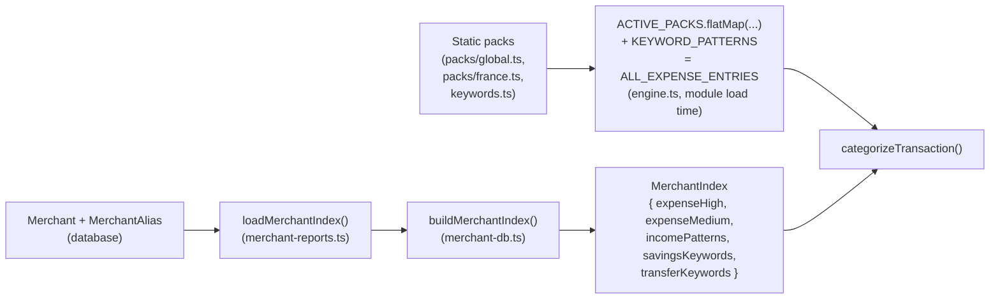

# Categorization Engine

- **What it does**: Looks at a transaction's description and amount and decides three things: its **type** (`income`, `expense`, `savings`, or `transfer`), its **category** (e.g. `food`, `taxes`, `freelance platform`), and how **confident** it is in that guess.
- **Why it exists**: Every other engine in the app (analytics, forecast, intelligence) depends on transactions already being correctly bucketed into income/expense/savings/transfer and categorized. Getting this right — and getting *better* at it over time as a specific user corrects it — is the foundation the rest of the product is built on.
- **Where the code is**: `src/lib/categorization/`
  - `engine.ts` — the core `categorizeTransaction()` function and the priority waterfall (381 lines)
  - `types.ts` — shared type definitions (`Confidence`, `CategorizationResult`, `MerchantEntry`, `MerchantIndex`, etc.)
  - `keywords.ts` — `KEYWORD_PATTERNS`, the Layer 3 generic-keyword list
  - `packs/global.ts`, `packs/france.ts`, `packs/index.ts` — static, hand-curated merchant databases ("packs")
  - `merchant-db.ts` — merges database-backed `Merchant`/`MerchantAlias` rows into the same shape the static packs use
  - `index.ts` — the public barrel export
  - `__tests__/engine.test.ts`, `__tests__/merchant-db.test.ts` — unit tests
- **How to modify it safely**: see [How to modify](#how-to-modify-safely) at the bottom. In short: most improvements (new merchants, new keywords) are **pure data changes** — add an entry to a pack or to the `Merchant` table, no engine code changes needed.

---

## 1. The core function

```ts
function categorizeTransaction(
  description: string,
  amount: number,
  learnedRules?: LearnedRules,        // Map<merchantKey, category> — this user's corrections
  ownerName?: string,                 // for self-transfer detection
  merchantIndex?: MerchantIndex       // DB-backed merchants, merged with static packs
): CategorizationResult
```

```ts
interface CategorizationResult {
  transactionType: "income" | "expense" | "savings" | "transfer";
  category: string;        // e.g. "food", "taxes", "freelance platform", "uncategorized"
  confidence: "high" | "medium" | "low";
  source: string;          // "learned" | "merchant" | "keyword" | "fallback" | "heuristic:self-transfer" | "heuristic:personal-transfer"
}
```

It's called from two places:
- **`src/lib/csv-processor.ts`** — once per row, during CSV import.
- **`POST /api/transactions/recategorize-all`** — re-run against every existing transaction when the engine or merchant database has improved.

It is a **pure function** — no I/O, no database access. This makes it fast (can run on thousands of rows in a loop) and easy to unit-test (`__tests__/engine.test.ts`).

### Two normalization helpers, used everywhere

```ts
stripDiacritics("Virement épargne")   // -> "Virement epargne"
normalizeMerchantKey("PAYPAL *UBER 88213764")  // -> "paypal uber"
```

- **`stripDiacritics()`** — bank exports are inconsistent about accents. Every keyword list *and* every incoming description are run through this, so `"épargne"` and `"epargne"` always match.
- **`normalizeMerchantKey()`** — lowercases, strips `*`/`#`, strips any run of 4+ digits (reference numbers, card-terminal IDs), and collapses whitespace. This is the **lookup key** for learned rules — it's what makes `"PAYPAL *UBER 88213764"` and `"Paypal *Uber 99102331"` both resolve to the same learned rule (`"paypal uber"`), even though the raw descriptions differ.

---

## 2. The priority waterfall

`categorizeTransaction()` is a strict **first-match-wins waterfall** — each step either returns a result immediately or falls through to the next. The order matters a lot, and the comments in `engine.ts` explain *why* for each step. Here's the full picture:

```mermaid
flowchart TD
    Start["Transaction: description + amount"] --> L1{Layer 1:\nLearned rule for\nthis merchant key?}
    L1 -- yes --> R_Learned["Use saved category\n(source: learned)"]
    L1 -- no --> P1{Priority 1:\nSavings-transfer\nphrase?\n('to my ISA', 'vers epargne'...)}

    P1 -- yes --> R_Savings1["savings / savings\n(source: merchant)"]
    P1 -- no --> P2{Priority 2:\nGeneral transfer\nkeyword?\n('internal transfer',\n'revolut vault'...)}

    P2 -- yes --> R_Transfer["transfer / transfer\n(source: merchant)"]
    P2 -- no --> P2b{'Transfer to/from X'\nAND X is the\naccount owner?}

    P2b -- yes --> R_Transfer
    P2b -- no --> P3{Priority 3:\nSavings keyword?\n(ISA, pension,\nVanguard, Livret A...)}

    P3 -- yes --> R_Savings2["savings / savings\n(source: merchant)"]
    P3 -- no --> P4{Priority 4:\namount < 0 AND\ntax keyword?\n(URSSAF, HMRC,\nimpots.gouv...)}

    P4 -- yes --> R_Tax["expense / taxes\n(source: merchant)"]
    P4 -- no --> P5{Priority 5:\namount > 0?}

    P5 -- yes --> P5a{Matches an income\npattern?\n(stripe, paypal,\ninvoice, salary...)}
    P5a -- yes --> R_Income["income / <subcategory>\n(source: merchant or keyword)"]
    P5a -- no --> R_IncomeFallback["income / income\n(source: fallback)"]

    P5 -- no, amount <= 0 --> P6a{Priority 6, Layer 1-2:\nHigh-confidence\nbrand match?\n(global + france packs\n+ DB merchants)}
    P6a -- yes --> R_ExpenseHigh["expense / <category>\n(source: merchant,\nconfidence: high)"]
    P6a -- no --> P6b{Layer 3:\nMedium-confidence\ngeneric keyword?\n('boulangerie',\n'coffee shop'...)}

    P6b -- yes --> R_ExpenseMed["expense / <category>\n(source: keyword,\nconfidence: medium)"]
    P6b -- no --> L5a{Layer 5:\nSelf-transfer?\n(description contains\nuser's own name)}

    L5a -- yes --> R_SelfTransfer["transfer / transfer\n(confidence: medium,\nsource: heuristic:self-transfer)"]
    L5a -- no --> L5b{'To/From <Title Case Name>'\npattern?}

    L5b -- yes --> R_PersonalTransfer["transfer / transfer\n(confidence: low,\nsource: heuristic:personal-transfer)"]
    L5b -- no --> R_Uncategorized["expense / uncategorized\n(confidence: low,\nsource: fallback)"]
```

### Why this order?

1. **Learned rules first, always.** A user's own correction is ground truth and must be able to override *any* built-in rule — including a brand-new high-confidence merchant entry that happens to be wrong for this user's specific situation.
2. **Savings-flavored transfers before general transfers.** A phrase like `"transfer to savings"` contains the word "transfer", but it's not a neutral internal movement — it's the user choosing to save. If general transfer detection ran first, this would be miscategorized as a no-op transfer and the user's savings rate would be understated.
3. **Transfers before savings/income/expense.** Internal account movements (between the user's own accounts) must never leak into income or expense totals, so they're filtered out early — but only when they're *unambiguous* (see the `"transfer to/from X"` handling below).
4. **Taxes only for negative amounts**, checked before generic income/expense — a tax *refund* (positive) should not be caught by the same keyword list that catches a tax *payment* (negative); it falls through to income detection instead.
5. **Any positive amount is income**, with sub-categorization as a bonus, never a requirement. The worst case for a positive amount is `category: "income"` with `confidence: "medium"` — **never** `"uncategorized"`. A real client payment must never disappear.
6. **Expense brand match (high) before generic keyword (medium) before structural heuristics (low).** This is a confidence ladder — the engine always prefers the most specific signal available, and only falls back to "this looks like it might be a personal transfer based on its shape" as an absolute last resort.

---

## 3. Transfer detection

**Goal**: identify money moving between the user's *own* accounts (savings pots, round-ups, "own transfer") so it's excluded from both income and expenses — it's not real cashflow.

### `SAVINGS_TRANSFER_OVERRIDES` (Priority 1)

Checked **first**, before general transfer detection. Phrases like `"transfer to savings"`, `"to my isa"`, `"vers epargne"`, `"to pocket"` (Revolut/N26 auto-save pockets), or neobank names commonly used as savings vehicles (`"n26"`, `"trade republic"`, `"lightyear"`). These all contain transfer-like language but represent the user *choosing to save*, so they're routed to `savings` rather than `transfer`.

### `TRANSFER_KEYWORDS` (Priority 2)

Structural phrases that **always** describe the user's own accounts and never name a third party — `"internal transfer"`, `"own transfer"`, `"between accounts"`, `"my account"`, Monzo/Revolut/Starling pot-and-vault names, round-up features (`"round up"`, `"spare change"`, `"auto-save"`), and international remittance services (`"worldremit"`, `"western union"`, etc. — typically personal money sent abroad, not a business expense). Because these phrases are unambiguous, they match regardless of amount sign.

### `AMBIGUOUS_TRANSFER_KEYWORDS` — the "transfer to/from X" problem

This is the trickiest part of the engine. Many banks describe an **incoming client payment** as `"TRANSFER FROM ACME CONSULTING LTD"`. If the engine treated every `"transfer from ..."` as an internal transfer, real client payments would silently vanish from income.

The fix: `"transfer to"` / `"transfer from"` only counts as an internal transfer if **`isTransferToOwner()`** confirms the named party *is the account owner*:

```ts
function isTransferToOwner(lower, ownerName): boolean {
  // Extracts everything after "transfer to/from "
  // True only if EVERY word of ownerName appears in that text,
  // and any extra words are just reference numbers/codes
  // (e.g. "Robert Arthur Ref 12345" — still the owner)
}
```

This is **intentionally stricter** than the self-transfer heuristic below — it stops a client whose company name happens to contain the owner's name (e.g. owner "Paul Martin" vs. a client "PAUL MARTIN CONSULTING LTD") from being misread as a self-transfer and having their payment dropped.

If `"transfer to/from X"` is present but X is *not* the owner:
- **Positive amount** → falls through to income detection (Priority 5) — it's a real client payment.
- **Negative amount** → falls through to expense matching — it's a real vendor payment (e.g. `"Transfer to ABC Supplies Ltd"`).

### Layer 5 fallback heuristics — `isSelfTransfer` and `isPersonalTransferPattern`

If nothing else matched and the amount is negative, two last-resort structural checks run:

- **`isSelfTransfer(lower, ownerName)`** — true if *every word* of the user's full name (split on whitespace, diacritics stripped) appears somewhere in the description. Confidence: `medium`, source: `heuristic:self-transfer`.
- **`isPersonalTransferPattern(description)`** — true if the description matches `/^(to|from)\s+(.+)$/i` **and** the captured name is Title Case (`TITLE_CASE_NAME_PATTERN`). This is what catches `"To Camille Pervenche"` (a personal money transfer to a named individual) while *not* matching ALL-CAPS business names like `"To PICKUP SERVICES"`. Confidence: `low`, source: `heuristic:personal-transfer`.

Both produce `transactionType: "transfer"` — the reasoning is that a guess of "this looks like a personal transfer" is more useful to a user reviewing their data than dumping it in `uncategorized`, while the low/medium confidence flags it for review.

---

## 4. Savings detection (Priority 3)

`SAVINGS_KEYWORDS` covers two things:
- **Structural phrases**: `"savings transfer"`, `"to savings"`, `"investment transfer"`, `"emergency fund"`, `" isa "`, `" sipp "`, `"pension fund"`.
- **Named platforms**: Vanguard, Fidelity, Trading 212, Wealthsimple, DEGIRO, eToro, Coinbase Savings, Schwab, Robinhood, Betterment, Acorns — plus French equivalents (Livret A, LDDS, Livret Jeune, PEA, Boursorama Épargne, Fortuneo Épargne, Yomoni, Nalo).

Matches here produce `transactionType: "savings", category: "savings"`. **Savings are deliberately excluded from both income and expense totals** — see [ANALYTICS_ENGINE.md](./ANALYTICS_ENGINE.md) for how `netCashflow` is calculated (`income - expenses`, savings excluded entirely). The reasoning: money moved to savings is a *choice the user made*, not an operating cost — counting it as an expense would make a financially healthy freelancer who saves aggressively look like they're losing money.

---

## 5. Tax detection (Priority 4)

`TAX_KEYWORDS` only applies when **`amount < 0`** — a tax *payment*. (A positive amount matching e.g. `"refund"` is handled separately by income detection, so a tax refund isn't miscategorized as a tax expense.)

Covers UK (HMRC, PRSI, National Insurance), US (IRS), Ireland (Revenue Commissioners), and several EU countries (Agenzia delle Entrate, Hacienda, Finanzamt) — but with **heavy emphasis on France**, since URSSAF (the French freelancer social-contributions body) is extremely common in this user base: `urssaf`, `dgfip`, `impots.gouv.fr`, `cfe`, `cotisation fonciere`, `cotisation sociale`, `carsat`, `tresor public`, `prelevement a la source`, `acoss`, and even local government (`mairie de`, `ville de paris`).

A match always produces `transactionType: "expense", category: "taxes", confidence: "high"`.

---

## 6. Income detection (Priority 5)

**The core rule: any positive amount is income.** Sub-categorization is a bonus on top of that guarantee — it can never *prevent* a positive transaction from being counted as income.

```ts
if (amount > 0) {
  for (const pattern of incomePatterns) {
    if (pattern.keywords.some((kw) => lower.includes(kw))) {
      return { transactionType: "income", category: pattern.subcategory, confidence: pattern.confidence, ... };
    }
  }
  return { transactionType: "income", category: "income", confidence: "medium", source: "fallback" };
}
```

`INCOME_PATTERNS_RAW`, in priority order:

| Subcategory | Confidence | Example keywords |
|---|---|---|
| `stripe` | high | `stripe` |
| `paypal` | high | `paypal` |
| `freelance platform` | high | `upwork`, `fiverr`, `toptal`, `99designs`, `malt`, `comet`, `brigad`, `crew` |
| `card payment` | high | `smile & pay`, `sumup`, `izettle`/`zettle`, `lydia pro` — mobile card terminals common for French freelancers taking in-person payments |
| `invoice payment` | medium | `invoice payment`, `inv-`, `#inv`, `facture` |
| `client payment` | medium | `client payment`, `consulting fee`, `retainer`, `honoraires`, `prestation de service` |
| `salary` | medium | `salary`, `payroll`, `wages`, `salaire`, `virement de salaire` |
| `bank transfer` | medium | `wire transfer`, `sepa credit`, `bacs credit`, `faster payment`, `virement sepa` |
| `refund` | medium | `refund`, `reimbursement`, `cashback`, `remboursement` |

If nothing matches, the result is `category: "income", confidence: "medium", source: "fallback"` — a generic but correctly-typed income transaction.

> **Why is Stripe/PayPal income here but a "banking fee" merchant elsewhere?** Income patterns and expense merchant entries are deliberately **separate lists**. A `"STRIPE PAYOUT"` (positive amount) is a client payment arriving via Stripe; a `"STRIPE FEE"` (negative amount) would instead need to match an expense entry. Because income detection only runs for `amount > 0`, there's no collision — but it's why you'll find "stripe" conceptually in two different places if you go looking.

---

## 7. Expense detection (Priority 6) and merchant recognition

For negative amounts that didn't match taxes, this is a **two-layer confidence ladder**:

### Layer 1–2: high-confidence brand match

`findBestMatch(lower, highEntries)` — searches every `confidence: "high"` entry from `ACTIVE_PACKS` (global + france, see below) plus any high-confidence DB merchants. **Longest matching keyword wins** — this is what makes `"Uber Eats"` correctly match a food-category `"uber eats"` entry instead of a transport-category `"uber"` entry, regardless of which list either entry is defined in:

```ts
function findBestMatch(lower, entries) {
  let best = null;
  for (const entry of entries) {
    if (lower.includes(entry.keyword) && (!best || entry.keyword.length > best.keyword.length)) {
      best = entry;
    }
  }
  return best;
}
```

### Layer 3: medium-confidence generic keyword match

If no high-confidence brand matched, the same `findBestMatch()` runs against `confidence: "medium"` entries — `KEYWORD_PATTERNS` (generic descriptive words like `"boulangerie"` → `food`, `"pharmacie"` → `health`, `"coffee shop"` → `food`, `"bank fee"` → `banking fees`) plus any medium-confidence pack/DB entries.

### The merchant packs (`src/lib/categorization/packs/`)

A **`MerchantPack`** is just `{ id, label, entries: MerchantEntry[] }`, where each `MerchantEntry` is `{ keyword, category, confidence: "high" | "medium" }`. `ACTIVE_PACKS = [GLOBAL_PACK, FRANCE_PACK]` (`packs/index.ts`) — **adding a new country pack is a pure data change**: write `packs/<country>.ts` exporting a `MerchantPack`, add it to `ACTIVE_PACKS`, done.

**`GLOBAL_PACK`** (`packs/global.ts`, ~287 lines) — worldwide brands, organized into sections:
- **AI tools**: OpenAI, ChatGPT, Anthropic/Claude, Midjourney, ElevenLabs, Perplexity, GitHub Copilot, etc. → `ai tools`
- **Software & SaaS**: Adobe, Figma, Notion, Slack, Zoom, Microsoft 365, Dropbox, Asana, Linear, Canva, Webflow, Shopify, QuickBooks, Xero, Sentry, Datadog, etc. → `software`
- **Hosting/infra, banking/payment processors, travel, food & dining, telecom, office/coworking, government & taxes, retail, subscriptions/entertainment, equipment/electronics, education, marketing/advertising, health/wellness, sports/fitness** — each a block of `h(...)`/`m(...)` entries.
- A final "additional brand coverage" and "bare-brand aliases" section catching common shorthand spellings.

**`FRANCE_PACK`** (`packs/france.ts`, ~140 lines) — French-market institutions and brands:
- **Government & taxes**: URSSAF, impots.gouv, DGFIP, CAF, CPAM/Ameli (→ `health`), Pôle Emploi/France Travail, CARSAT, Trésor Public, ANTAI amendes → `taxes` (and `health` for CPAM/Ameli)
- **Banking (FR)**: Boursorama, Société Générale, BNP Paribas, Crédit Agricole, LCL, Caisse d'Épargne, Qonto, Shine, Revolut France → `banking fees`
- **Transport (FR)**: SNCF Connect, OUIGO, RATP, Navigo, Vélib, BlaBlaCar, FlixBus France, Vinci Autoroutes → `transport`
- Further sections (visible in the file but not all read in this pass) cover **telecom** (Orange, SFR, Free, Bouygues), **retail & food** (Carrefour, Leclerc, Monoprix), **cafés/bakeries**, **health & insurance**, **office/coworking**, **entertainment**, and **business/professional services**, plus France-specific Layer 3 keywords feeding into the same `KEYWORD_PATTERNS`-style generic matching.

A deliberate convention in `france.ts`: **bare common-word brand names are avoided** (e.g. not just `"orange"` or `"free"` or `"spa"`) in favor of qualified variants (`"orange.fr"`, `"free mobile"`) — `"orange"` and `"free"` are common English words and would cause false-positive matches on unrelated descriptions.

### `KEYWORD_PATTERNS` (`keywords.ts`, Layer 3)

All entries are `confidence: "medium"`. Two groups:
1. **French generic terms** — `boulangerie`/`patisserie`/`epicerie` → `food`; `pharmacie`/`opticien`/`dentiste` → `health`; `tabac`/`pressing`/`coiffeur` → `personal spending`; `crossfit`/`yoga class`/`gym` → `sports`; `droguerie`/`fleuriste`/`librairie` → `retail`; `station essence`/`peage autoroute` → `transport`.
2. **International generic terms** — software/SaaS (`saas subscription`, `cloud hosting`, `google`), marketing/advertising, education, equipment/electronics, office supplies, banking fees (`bank fee`, `atm fee`, `fx fee`, `overdraft fee`), travel, food (`coffee shop`, `supermarket`, `grocery`), health (`gp visit`, `dental`, `physio`), housing (`rent payment`, `mortgage`, `landlord`), utilities, subscriptions, business services (`accounting fee`, `legal fee`), entertainment (`concert`, `cinema ticket`).

> Note on `"spa"`: deliberately **not** included as a bare keyword — too short and collision-prone (matches "espace", "spasme", etc.). `"institut de beaute"`, `"sauna"`, `"hammam"` cover the personal-care case more safely.

---

## 8. Merchant recognition: static packs vs. database

There are **two sources of merchant data**, merged at runtime into one lookup:



- **Static packs** are compiled into the app — changing them requires a code change and deploy.
- **Database merchants** (`Merchant` + `MerchantAlias` tables, see [DATABASE.md](./DATABASE.md)) can be added at any time without a deploy. `loadMerchantIndex()` (`src/lib/merchant-reports.ts`) loads every `isActive: true` merchant with its aliases and calls `buildMerchantIndex()` to bucket them by `transactionType`:
  - `income` → `incomePatterns`
  - `savings` → `savingsKeywords`
  - `transfer` → `transferKeywords`
  - `expense` with `confidence: "high"` → `expenseHigh`, otherwise → `expenseMedium`

Inside `categorizeTransaction()`, each DB bucket is **concatenated** with its static counterpart (DB entries first, so a DB-defined merchant can be added/adjusted ahead of a static one with the same keyword):

```ts
const highEntries = merchantIndex?.expenseHigh.length
  ? [...HIGH_CONFIDENCE_ENTRIES, ...merchantIndex.expenseHigh]
  : HIGH_CONFIDENCE_ENTRIES;
```

`loadMerchantIndex()` is called once per CSV import and once per recategorize-all pass — it's not cached, so a new `Merchant` row added via direct DB access takes effect on the *next* upload or recategorize-all without any deploy.

---

## 9. User learning: `CategoryRule` and `CategoryCorrection`

This is **Layer 1** — checked before everything else.

### How a correction becomes a rule

1. User opens a transaction in History and picks a different category (optionally "apply to all similar").
2. `PATCH /api/transactions/recategorize` (or `POST /api/transactions/recategorize-all`'s per-row equivalent):
   - Updates the `Transaction` row(s) — `category`, `categoryConfidence` (set to `"high"`), `categorySource` (set to `"learned"` on the next pass), `transactionType`.
   - **Upserts a `CategoryRule`** keyed on `(userId, merchantKey)` where `merchantKey = normalizeMerchantKey(description)`.
   - **Inserts a `CategoryCorrection`** row — an immutable audit log entry (`fromCategory`, `toCategory`, `appliedToSimilar`, `affectedCount`).
   - Triggers `recalculateMonthlyAnalytics()` and `generateForecast()` since the category change can shift `transactionType` and therefore monthly totals.

### How a rule is applied

On the **next** CSV import or recategorize-all pass:

```ts
const learnedRules: LearnedRules = new Map(
  userCategoryRules.map((r) => [r.merchantKey, r.category])
);
```

This map is passed as `categorizeTransaction(description, amount, learnedRules, ...)`. Layer 1 looks up `normalizeMerchantKey(description)` in this map — if found, the transaction immediately gets that category with `confidence: "high", source: "learned"`, **before any other rule runs**. This is what makes the system "learn": once a user corrects `"PAYPAL *UBER 88213764"` to `category: "transport"`, every future Uber transaction (any reference number) for that user is automatically `transport`.

### Why two tables (`CategoryRule` *and* `CategoryCorrection`)?

- **`CategoryRule`** holds only the **current** mapping per merchant key — it's what the engine reads.
- **`CategoryCorrection`** is a permanent **history** of every correction ever made, even if later overwritten. `getCategorizationHealth()` (see [ANALYTICS_ENGINE.md](./ANALYTICS_ENGINE.md)) reads `topCorrectedMerchants` from this table — merchants the user has corrected repeatedly are a signal that the built-in categorization for that merchant is weak, useful for prioritizing future pack/DB additions.

### The global feedback loop: `UncategorizedMerchantReport`

Anything that falls all the way through to `category: "uncategorized"` is aggregated — across **all users** — into the `UncategorizedMerchantReport` table via `reportUncategorizedMerchants()` (`src/lib/merchant-reports.ts`), called after every import and recategorize-all pass. Run `npm run report:uncategorized` to see the highest-occurrence unrecognized merchants across the whole user base — these are the best candidates for new entries in `packs/global.ts`, `packs/france.ts`, or the `Merchant` table. See [DATABASE.md §11](./DATABASE.md#11-uncategorizedmerchantreport---global-worklist).

---

## How to modify safely

### Add a new recognized merchant (most common change)

**Option A — static pack (requires code change + deploy):**
1. Open `packs/global.ts` (worldwide brand) or `packs/france.ts` (French-market brand), or create a new `packs/<country>.ts` and register it in `packs/index.ts`.
2. Add an entry using the `h(...)` (high confidence — specific brand name) or `m(...)` (medium confidence — generic term) helper:
   ```ts
   h("newbrand.com", "software"),
   ```
3. The `category` string must correspond to a key in the `categories` i18n namespace in **both** `messages/en.json` and `messages/fr.json` — otherwise the UI will show the raw slug instead of a translated label. See [TRANSLATIONS.md](./TRANSLATIONS.md).
4. Run `npm test` — `__tests__/engine.test.ts` has coverage for the matching logic; add a case if the new keyword could plausibly collide with an existing one (check via `findBestMatch`'s longest-match rule).

**Option B — database row (no deploy needed):**
1. Insert a `Merchant` row (and optional `MerchantAlias` rows) directly — `keyword` (lowercase), `transactionType`, `category`, `confidence`, `isActive: true`.
2. Takes effect on the next CSV import or recategorize-all for **every** user — no code change.
3. Same i18n category requirement as above.

### Add a new keyword pattern (generic, not brand-specific)

Add to `KEYWORD_PATTERNS` in `keywords.ts` using `m("some phrase", "category")`. Keep these **medium confidence** — they're for words that *suggest* a category without naming a specific business. Avoid short/ambiguous substrings (see the `"spa"` caution above) — test against a sample of real descriptions if unsure.

### Add a new income source pattern

Add to `INCOME_PATTERNS_RAW` in `engine.ts`, in the array position matching its specificity — more specific/unambiguous brand names near the top (checked first), generic phrases lower. Remember: **this only ever adds sub-categorization**; even with no changes here, any positive amount is already guaranteed to be `income`.

### Add a new transfer/savings/tax keyword

Add the (diacritic-aware, lowercase) phrase to `TRANSFER_KEYWORDS`, `SAVINGS_TRANSFER_OVERRIDES`, `SAVINGS_KEYWORDS`, or `TAX_KEYWORDS` in `engine.ts`. Double-check **priority order** — e.g. a new savings-flavored "transfer to X" phrase must go in `SAVINGS_TRANSFER_OVERRIDES` (Priority 1), not `SAVINGS_KEYWORDS` (Priority 3), or general transfer detection (Priority 2) will catch it first.

### Things to be careful about

- **Don't reorder the priority waterfall** without re-reading the comments in `engine.ts` for each step — the order encodes specific bug-prevention reasoning (especially around the `"transfer to/from X"` ambiguity and savings-vs-transfer phrases).
- **`findBestMatch` is longest-match-wins**, not first-match — so a new short keyword (e.g. `"pay"`) could unexpectedly "lose" to a longer existing keyword that also matches, or vice versa "win" over a more specific one if yours is longer. Test with real-world descriptions.
- **Category strings are plain strings, not an enum** — a typo in a new category (e.g. `"sofware"` instead of `"software"`) won't fail at compile time, only show up as an untranslated/odd label in the UI and a fragmented category in analytics. Cross-check against `messages/en.json`'s `categories` namespace.
- **Re-run `npm run report:uncategorized` after adding merchants** to confirm the change actually reduces the uncategorized backlog for real user data, if you have access to it.
