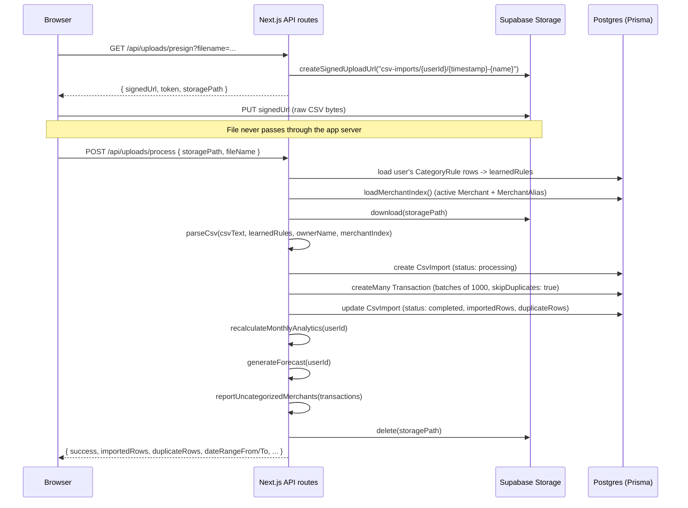
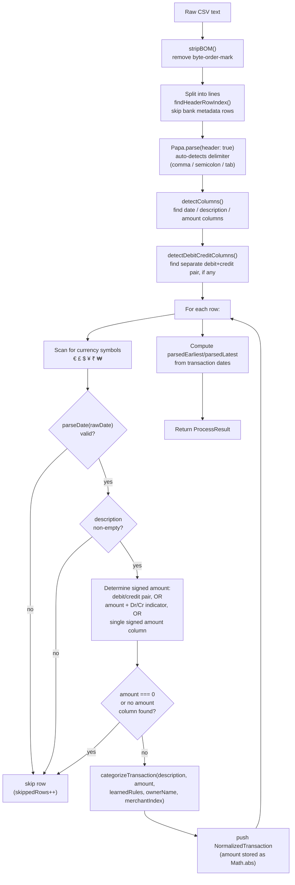

# CSV Import

- **What it does**: Takes an arbitrary bank-exported CSV file — in *any* bank's column layout, date format, amount format, or delimiter — and turns it into a clean list of `{ date, description, amount, transactionType, category, confidence, source }` records ready to insert as `Transaction` rows.
- **Why it exists**: Freelancer OS's core promise is "upload your bank statement, any bank, anywhere" (see [PRODUCT.md](./PRODUCT.md)). Banks do not agree on column names, date formats, number formats, or even whether a transaction has one signed `Amount` column or separate `Debit`/`Credit` columns. This module is the single place that absorbs all of that variation so every downstream engine can assume a uniform `NormalizedTransaction` shape.
- **Where the code is**: `src/lib/csv-processor.ts` (410 lines) — one file, no external dependencies besides PapaParse (CSV parsing) and the categorization engine.
- **How to modify it safely**: see [How to modify](#how-to-modify-safely) at the bottom.

---

## 1. Where this fits in the upload pipeline



`parseCsv()` itself is a **pure function** — it doesn't touch the database or network. Everything database-related (loading learned rules, inserting transactions, recalculating analytics) happens in `/api/uploads/process` (`src/app/api/uploads/process/route.ts`), which calls `parseCsv()` once with the full CSV text. See [ARCHITECTURE.md](./ARCHITECTURE.md) for the full route inventory.

---

## 2. The `parseCsv()` pipeline, step by step



### `ProcessResult` — the function's output

```ts
interface ProcessResult {
  transactions: NormalizedTransaction[];
  totalRows: number;        // data rows found in the CSV (post-header)
  validRows: number;        // transactions.length
  skippedRows: number;      // rows that failed date/description/amount validation
  currencies: string[];     // distinct currency symbols seen, e.g. ["€", "$"]
  hasMixedCurrencies: boolean; // currencies.length > 1
  parsedEarliest: Date | null;
  parsedLatest: Date | null;
}
```

`/api/uploads/process` uses `totalRows`/`validRows`/`skippedRows` to populate the upload summary screen, and `hasMixedCurrencies` to show the "we detected multiple currencies" warning (forecasts assume a single currency).

---

## 3. CSV detection: finding the real header row

Many banks prepend account metadata before the actual column header:

```
Barclays Bank PLC
Account: 12345678
Date range: 01 Jan 2024 to 31 Jan 2024
Date,Description,Amount
01/01/2024,Tesco,-45.20
```

`findHeaderRowIndex()` scans the **first 20 lines** and picks the first line that looks like a real header — defined as a line containing something that looks like a "date" column **and** something that looks like an "amount" or "description" column:

```ts
const hasDate   = /\bdate\b|datum\b|fecha\b|data\b/.test(lower);
const hasAmount = /amount|montant|debit|credit|betrag|bedrag|importe|money.?in|money.?out|paid.?in|paid.?out|withdrawal|deposit/.test(lower);
const hasDesc   = /description|details|narrative|payee|merchant|reference|memo|omschrijving|particulars|libelle/.test(lower);
if (hasDate && (hasAmount || hasDesc)) return i;
```

Everything before this line is discarded. If no line matches in the first 20, line 0 is used (i.e. assume there's no metadata preamble).

### Diacritic-insensitive header matching

Headers go through `normalize()` — NFD-decompose + strip combining marks + lowercase — so `"Libellé"`, `"Débit"`, `"Crédit"`, `"Montant"` match the same keyword lists as their unaccented forms.

### Delimiter detection

After the header row is located, the remaining text is handed to PapaParse with `header: true`. PapaParse **auto-detects the delimiter** (comma, semicolon, or tab) — no explicit configuration needed, which is important since many European banks export semicolon-delimited CSVs.

---

## 4. Column detection

### Date / description / single-amount columns — `detectColumns()`

For each of three roles, a prioritized candidate list of normalized header names is checked **exact match first, then partial/substring match**:

| Role | Candidates (abridged) |
|---|---|
| `dateCol` | `date`, `transaction date`, `value date`, `booking date`, `posted date`, `datum`, `fecha`, `data`, `started date`, `completed date` |
| `descCol` | `description`, `details`, `narrative`, `memo`, `payee`, `merchant`, `reference`, `particulars`, `omschrijving`, `beneficiary name`, `remittance info`, `libelle` |
| `amountCol` | `amount`, `transaction amount`, `value`, `net amount`, `betrag`, `importe`, `bedrag`, `montant` |

```ts
const find = (candidates) => {
  for (const c of candidates) {
    const exact = lower.indexOf(c);
    if (exact !== -1) return headers[exact];          // exact match wins first
    const partial = lower.findIndex((h) => h.includes(c));
    if (partial !== -1) return headers[partial];      // then substring match
  }
  return null;
};
```

The candidate list order matters: more specific/canonical names are checked first across **all** candidates at the exact-match level before any candidate falls back to partial matching — so a header literally named `"Date"` is preferred over a column that merely *contains* the word "date" as a substring of something else.

### Separate debit/credit columns — `detectDebitCreditColumns()`

Several major banks (NatWest, AIB, Bank of Ireland, Ulster Bank, Lloyds, Santander, Monzo) use **two always-positive columns** instead of one signed amount — e.g. `"Debit"` and `"Credit"`, or `"Money Out"` / `"Money In"`.

```ts
const debitKeywords  = ["debit", "withdrawal", "money out", "paid out", "payments out", "out ", "amount out", "withdrawals"];
const creditKeywords = ["credit", "deposit", "money in", "paid in", "payments in", "in ",  "amount in", "deposits"];
const drCrKeywords   = ["d/c", "cr/dr", "dr/cr", "dc", "debit/credit indicator", "credit/debit"];
```

- If **both** a debit and credit column are found (and they're not the same column), `useDebitCreditPair = true` and the single-`amountCol` path is bypassed entirely for that file.
- A third optional `drCrCol` — a single indicator column containing values like `"D"`/`"C"` or `"Dr"`/`"Cr"` — is detected separately and used when there's **one** amount column plus a separate direction indicator (see §6 below).

---

## 5. Date parsing — `parseDate()`

**Every format produces a UTC-midnight `Date`** (`Date.UTC(year, month, day)`), so that `getUTCMonth()`/`getUTCFullYear()` extraction later (in `recalculateMonthlyAnalytics`, etc.) is **completely timezone-independent** — a transaction dated "2024-01-31" is always month=January/year=2024 no matter what timezone the server or user is in.

Formats are tried **in this order**, first match wins:

| # | Pattern | Example | Notes |
|---|---|---|---|
| 1 | `YYYY-MM-DD` (ISO 8601, `-` or `/`, optional time suffix ignored) | `2024-01-31`, `2024/01/31T10:00:00Z` | Most unambiguous — checked first |
| 2 | `DD/MM/YYYY`, `DD-MM-YYYY`, `DD.MM.YYYY` | `31/01/2024` | **Validated**: month must be 1–12. A 2-digit year is expanded as `2000 + yy`. |
| 3 | `MM/DD/YYYY` (US) | `01/31/2024` | Only reached if pattern 2 didn't match (e.g. first field > 12) — `01/31/2024` can't be DD/MM (no month 31), so it falls here. |
| 4 | `"01 Jan 2024"` / `"01 January 2024"` | `"01 Jan 2024"` | Month name matched via `MONTH_ABBR` (first 3 letters, case-insensitive) |
| 5 | `"Jan 01, 2024"` / `"January 01, 2024"` | `"Jan 31, 2024"` | Same `MONTH_ABBR` map, month-first |

If nothing matches, `parseDate()` returns `null` and the row is **skipped**.

### Why pattern 2 (DD/MM/YYYY) is tried before pattern 3 (MM/DD/YYYY)

Freelancer OS's primary user base skews European/French (see [PRODUCT.md](./PRODUCT.md)), so **day-first** is the priority assumption — `"05/03/2024"` is read as 5 March, not May 3rd. The month-range validation (`+mm >= 1 && +mm <= 12`) is what allows genuinely US-formatted dates like `"01/13/2024"` (month 13 is invalid as DD/MM) to correctly fall through to the MM/DD/YYYY branch. **Ambiguous dates where both day and month are ≤ 12** (e.g. `"03/05/2024"`) are *always* read as DD/MM — there is no way to disambiguate from the date string alone, so this is a deliberate, documented assumption.

---

## 6. Amount parsing — `parseRawAmount()`

Handles essentially every format seen in real bank exports, applied as a sequence of strips/transforms:

| Step | Handles | Example |
|---|---|---|
| 1 | Parentheses = negative (accounting notation) | `"(1,234.56)"` → `-1234.56` |
| 2 | Leading `-` / `+` | `"-45.20"`, `"+45.20"` |
| 3 | Strip currency symbols `€ £ $ ¥ ₹ ₩` (doesn't affect sign) | `"-€45.20"` → `"45.20"` (sign already captured) |
| 4 | Trailing `-` | `"45.20-"` → `-45.20` |
| 5 | `Dr`/`Cr` **suffix** (case-insensitive) | `"45.20 Dr"` → negative, `"45.20 Cr"` → positive (overrides earlier sign) |
| 6 | `Dr`/`Cr` **prefix** | `"Dr 45.20"` → negative, `"Cr 45.20"` → positive |
| 7 | Strip spaces (French thousands separator) | `"1 234,56"` → `"1234,56"` |
| 8 | **Decimal convention detection** | see below |

### Step 8 — the European vs. US number format problem

The same string `"1.234,56"` (European: one thousand, two hundred thirty-four point five six) and `"1,234.56"` (US/UK: same value, different punctuation) must both parse to `1234.56`. The rule:

```ts
if (/,\d{1,2}$/.test(s)) {
  // Ends with comma + 1-2 digits => comma is the DECIMAL separator (European)
  s = s.replace(/\./g, "").replace(",", ".");  // strip all periods (thousands), comma -> period
} else {
  // Otherwise comma is a THOUSANDS separator (US/UK) — just remove it
  s = s.replace(/,/g, "");
}
```

So `"1.234,56"` → ends in `,56` → European → strip periods, comma→period → `"1234.56"`. And `"1,234.56"` → does **not** end in `,XX` → US → strip commas → `"1234.56"`. Both converge to the same `parseFloat` input.

A result of `NaN` or exactly `0` returns `0` — both cases are treated as "no usable amount" (see validation rules below).

---

## 7. Determining the signed amount per row

Once columns are detected, each row's final signed `amount` is computed by one of three paths, checked in this order:

### Path A — separate debit/credit columns (`useDebitCreditPair`)

```ts
const credit = parseRawAmount(row[creditCol]);
const debit  = parseRawAmount(row[debitCol]);
if (credit > 0)     amount = credit;    // money in -> positive
else if (debit > 0) amount = -debit;    // money out -> negative
else { skip }                            // both zero/blank -> skip
```

### Path B — single amount column + separate Dr/Cr indicator column

```ts
const raw = parseRawAmount(row[amountCol]);
const indicator = row[drCrCol].toLowerCase().trim();
if (indicator startsWith "d" or is "out"/"withdrawal"/"debit")  amount = -Math.abs(raw);
else if (indicator startsWith "c" or is "in"/"deposit"/"credit") amount = Math.abs(raw);
else amount = raw;  // unrecognized indicator (e.g. "CARD_PAYMENT") -> trust the raw signed value
```

The "trust the raw signed value" fallback matters: some banks put transaction-type codes (not D/C indicators) in a column that superficially looks like a Dr/Cr column — defaulting to the already-signed amount avoids corrupting those.

### Path C — single signed amount column (most common case)

```ts
amount = parseRawAmount(row[amountCol]);
if (amount === 0) { skip }
```

### Currency symbol scanning

Before parsing, the raw amount/credit/debit cell values are scanned with `/[€£$¥₹₩]/g` and every distinct symbol found is added to a `Set`. This produces the `currencies` / `hasMixedCurrencies` fields in `ProcessResult` — used to warn the user if a single CSV mixes currencies (forecasts assume one currency throughout).

---

## 8. Validation rules — when a row is skipped

A row increments `skippedRows` and is **excluded** from `transactions` if **any** of these are true:

1. **`parseDate()` returns `null`** — date column missing, empty, or in an unrecognized format.
2. **Description is empty** after `.trim()`.
3. **Amount resolves to `0`** in any of the three amount paths (e.g. both debit and credit are blank, or the single amount column parses to zero).
4. **No amount column was found at all** (`!amountCol && !useDebitCreditPair`) — every row is skipped in this case.

There is **no row-count limit** and **no maximum file size enforced in `parseCsv()` itself** — any practical limits would come from the Supabase Storage upload step or serverless function memory/time limits, not from this module.

### What happens to valid rows

Each surviving row is categorized via `categorizeTransaction()` (see [CATEGORIZATION_ENGINE.md](./CATEGORIZATION_ENGINE.md)) and pushed as a `NormalizedTransaction`:

```ts
{
  transactionDate: date,              // UTC-midnight Date
  description,                        // trimmed, raw casing preserved
  amount: Math.abs(amount),           // ALWAYS POSITIVE — sign is captured by transactionType
  transactionType,                    // "income" | "expense" | "savings" | "transfer"
  category,
  categoryConfidence,
  categorySource,
}
```

**`amount` is always stored as a positive number** — see [DATABASE.md §5](./DATABASE.md#5-transaction) for why (it mirrors the `Transaction.amount` column convention).

### Deduplication (handled downstream, not in `parseCsv`)

`parseCsv()` does **not** deduplicate against existing data — that's enforced by the database's `@@unique([userId, transactionDate, description, amount])` constraint and `createMany({ skipDuplicates: true })` in `/api/uploads/process`. Re-uploading the same file (or an overlapping date range) is therefore safe: identical rows are silently skipped at the DB layer and counted as `duplicateRows` on the `CsvImport` record. See [DATABASE.md §4–5](./DATABASE.md#4-csvimport).

---

## How to modify safely

### Add support for a new bank's column naming

1. Identify the exact header names used (export a sample CSV from that bank).
2. Add the (normalized — lowercase, diacritics will be stripped automatically) header name to the relevant candidate array in `detectColumns()` (`dateCandidates`, `descCandidates`, `amountCandidates`) or `detectDebitCreditColumns()` (`debitKeywords`/`creditKeywords`/`drCrKeywords`).
3. Put more specific/canonical names earlier in the array if there's any risk of a substring collision with an existing entry (exact match is tried first across the whole list, but partial match falls back to array order).
4. Add a test case to whatever test file covers `csv-processor.ts` with a small sample CSV using the new bank's headers — confirm `detectColumns`/`detectDebitCreditColumns` pick the right columns and a sample row parses to the expected `NormalizedTransaction`.

### Add support for a new date or amount format

- **Dates**: add a new pattern branch to `parseDate()`. Preserve the **try-in-order, first-match-wins** structure, and make sure new patterns don't shadow existing ones for ambiguous strings (e.g. don't add a loose pattern before the strict ISO check). Always construct via `Date.UTC(...)` — never `new Date(string)` — to keep dates timezone-independent.
- **Amounts**: add a new strip/transform step to `parseRawAmount()`, in the appropriate position in the sequence (sign-related steps before the final decimal-convention check). Be careful with step 8 (decimal convention) — it's the most fragile part; test against both `"1.234,56"`-style and `"1,234.56"`-style inputs for any new currency/locale.

### Adjust header-row detection

If a real-world CSV's metadata preamble is longer than 20 lines, or its header row doesn't match the `hasDate && (hasAmount || hasDesc)` heuristic, extend `findHeaderRowIndex()` — but be conservative: a false-positive header match (treating a metadata row as the header) silently corrupts column detection for the whole file with no error shown to the user.

### Things to be careful about

- **`parseCsv()` is pure and synchronous** — keep it that way. Any database access (learned rules, merchant index) must be loaded by the *caller* and passed in as `learnedRules`/`merchantIndex` arguments. This keeps it unit-testable without a database.
- **Changing what counts as "skipped"** directly changes the `skippedRows`/`validRows`/`totalRows` numbers shown to users on the upload summary screen — make sure any change is reflected in the user-facing copy too (`messages/en.json` / `messages/fr.json`, see [TRANSLATIONS.md](./TRANSLATIONS.md)).
- **The DD/MM vs MM/DD ambiguity is a permanent, documented trade-off**, not a bug — don't "fix" it by switching the default without considering the (larger) European/French user base.
- **`amount: Math.abs(amount)`** — if you ever need the *signed* amount during parsing (e.g. for a new validation rule), compute it before this line; everything downstream of `parseCsv()` assumes positive amounts + a separate `transactionType`.
