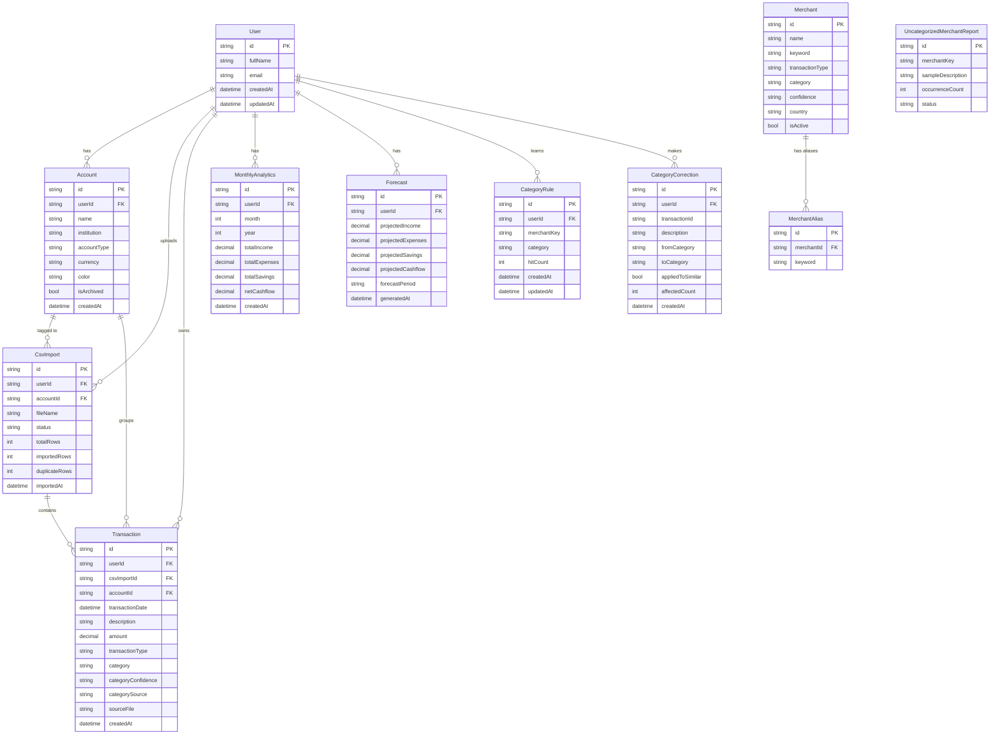

# Database

This document describes every table in the Freelancer OS database, what each field is for, how the tables relate to each other, and how to make safe schema changes.

- **What it does**: Stores users, their imported transactions, computed analytics, forecasts, and the merchant-recognition data that powers categorization.
- **Why it exists**: Freelancer OS is fundamentally a CSV-in, insights-out product. Almost every feature is a query (or a precomputed aggregate) over this schema.
- **Where the code is**: [`prisma/schema.prisma`](../prisma/schema.prisma) — the single source of truth for the schema. Prisma generates the TypeScript client from this file (`npm run db:generate`).
- **How to modify it safely**: see [Making schema changes](#making-schema-changes) at the bottom.

---

## 1. Engine & datasource

```prisma
generator client {
  provider      = "prisma-client-js"
  binaryTargets = ["native", "rhel-openssl-1.0.x"]
}

datasource db {
  provider  = "postgresql"
  url       = env("DATABASE_URL")
  directUrl = env("DIRECT_URL")
}
```

- **Provider**: PostgreSQL, hosted on Supabase.
- **`DATABASE_URL`**: the pooled connection string (PgBouncer) — used at runtime by the app.
- **`DIRECT_URL`**: a direct (non-pooled) connection — used by Prisma Migrate, since DDL statements (`CREATE TABLE`, etc.) don't work reliably through a connection pooler.
- **`binaryTargets`**: includes `rhel-openssl-1.0.x` so `prisma generate` produces a query engine binary compatible with common serverless/Linux deployment targets (e.g. Vercel) in addition to your local machine (`native`).

---

## 2. Entity-relationship diagram



`UncategorizedMerchantReport` is intentionally **not** connected to `User` — it's a global, cross-user table (see [§10](#10-uncategorizedmerchantreport---global-worklist)).

---

## 3. `User`

```prisma
model User {
  id           String   @id @default(uuid())
  fullName     String
  email        String   @unique
  createdAt    DateTime @default(now())
  updatedAt    DateTime @updatedAt

  csvImports          CsvImport[]
  transactions        Transaction[]
  monthlyAnalytics    MonthlyAnalytics[]
  forecasts           Forecast[]
  categoryRules       CategoryRule[]
  categoryCorrections CategoryCorrection[]

  @@map("users")
}
```

| Field | Purpose |
|---|---|
| `id` | UUID primary key. **Note**: this is a separate row from Supabase Auth's own `auth.users` table — see below. |
| `fullName` | Display name, used for greetings ("Welcome back, Robert") and for the self-transfer heuristics in the categorization engine (matching "To Robert Arthur" style descriptions). |
| `email` | Unique. Mirrors the Supabase Auth email. |
| `createdAt` / `updatedAt` | Standard audit timestamps. |

### Why a separate `User` table when Supabase Auth already has `auth.users`?

Supabase Auth owns authentication (`auth.users`, sessions, passwords, magic links). Prisma can't easily model or migrate that schema (it's managed by Supabase). So the app maintains its **own** `users` row — keyed by the **same UUID** as the Supabase Auth user — for everything the app needs to query, join, and migrate freely (relations to transactions, analytics, etc.).

This row is created by the `POST /api/users/create` route immediately after Supabase Auth signup succeeds (see [AUTHENTICATION.md](./AUTHENTICATION.md)).

### Cascade behavior

Every child table uses `onDelete: Cascade` on its `userId` relation. Deleting a `User` row deletes **all** of that user's accounts, transactions, imports, analytics, forecasts, rules, and corrections. This is what powers the "Delete account" feature in Settings — a single `prisma.user.delete()` cleans up everything.

---

## 4. `Account`

```prisma
enum AccountType {
  personal_checking
  personal_savings
  business_checking
  business_savings
  investment
  credit_card
  other
}

model Account {
  id          String      @id @default(uuid())
  userId      String
  name        String
  institution String?
  accountType AccountType @default(personal_checking)
  currency    String      @default("EUR")
  color       String?
  isArchived  Boolean     @default(false)
  createdAt   DateTime    @default(now())
  updatedAt   DateTime    @updatedAt

  user         User          @relation(fields: [userId], references: [id], onDelete: Cascade)
  transactions Transaction[]
  csvImports   CsvImport[]

  @@unique([userId, name])
  @@index([userId])
  @@map("accounts")
}
```

Represents a single bank account (or credit card, investment account, etc.) belonging to a user. When a CSV is imported, the user assigns it to an account — every transaction from that file is tagged with `accountId`.

| Field | Purpose |
|---|---|
| `name` | User-given label: `"Revolut Business"`, `"BNP Courant"`. Unique per user — upserted by name on creation. |
| `institution` | Auto-detected bank name from CSV header metadata (e.g. `"Revolut"`, `"BNP"`). Nullable — not always detectable. |
| `accountType` | `AccountType` enum. Drives UI labels and future filtering. Defaults to `personal_checking`. |
| `currency` | ISO code, defaults to `"EUR"`. Stored here for potential future multi-currency account views. |
| `color` | Hex accent for UI dot indicators (e.g. `"#3AB5A0"`). Chosen by the user in the import flow. |
| `isArchived` | Soft-delete flag. Archived accounts are hidden from the account picker but their transactions remain. |

### Why an Account model instead of a free-text label on Transaction?

A dedicated model lets us:
1. Show the user their accounts as a list (with transaction counts).
2. Scope deduplication per-account — re-uploading the same Revolut export won't falsely deduplicate against a Barclays transaction with the same date/amount/description.
3. Render per-account color dots consistently in the UI without storing color on every transaction row.

### Deduplication scope

The `@@unique([userId, name])` constraint prevents duplicate account names per user. At the transaction level, two partial DB indexes scope the `(date, description, amount)` uniqueness within the same account:

```sql
-- for transactions tagged to an account
CREATE UNIQUE INDEX tx_dedup_with_account
  ON transactions("userId", "accountId", "transactionDate", description, amount)
  WHERE "accountId" IS NOT NULL;

-- for transactions with no account tag
CREATE UNIQUE INDEX tx_dedup_no_account
  ON transactions("userId", "transactionDate", description, amount)
  WHERE "accountId" IS NULL;
```

These are applied via `prisma/apply-account-indexes.sql` (run once, not tracked by Prisma). The application also enforces this in `POST /api/uploads/process` by pre-fetching existing rows and filtering duplicates before calling `createMany` — so the DB constraint is a safety net, not the primary mechanism.

---

## 5. `CsvImport`

```prisma
model CsvImport {
  id            String   @id @default(uuid())
  userId        String
  accountId     String?
  fileName      String
  status        String   @default("pending")
  totalRows     Int      @default(0)
  importedRows  Int      @default(0)
  duplicateRows Int      @default(0)
  importedAt    DateTime @default(now())

  user         User          @relation(fields: [userId], references: [id], onDelete: Cascade)
  account      Account?      @relation(fields: [accountId], references: [id], onDelete: SetNull)
  transactions Transaction[]

  @@index([userId])
  @@map("csv_imports")
}
```

One row per uploaded CSV file. This is the **audit trail** for uploads — it's how the History page shows "Imported `bank-export-2024.csv` — 312 rows, 8 duplicates skipped" and how "delete this import" can remove exactly the transactions that came from it (via the `csvImportId` FK on `Transaction`, `onDelete: SetNull` — see below).

| Field | Purpose |
|---|---|
| `accountId` | Nullable FK to `Account`. Set when the user assigns the import to an account in the upload UI. `onDelete: SetNull` so archiving an account doesn't destroy the import audit trail. |
| `fileName` | The original uploaded filename, shown in the UI. |
| `status` | `"pending"` → `"completed"` (or `"failed"`). Set by `/api/uploads/process`. |
| `totalRows` | Total data rows found in the CSV (including skipped/invalid ones). |
| `importedRows` | Rows that were successfully parsed **and** inserted as new `Transaction` rows. |
| `duplicateRows` | Rows that parsed successfully but were already in the database (matched the dedup check — see [§4 Account](#4-account)) and were therefore skipped. |
| `importedAt` | When the import was processed. |

### Why track `duplicateRows` separately from skipped rows?

`totalRows - importedRows - duplicateRows` = rows that failed to parse (bad date, no amount, etc.). Surfacing `duplicateRows` specifically lets the UI say "you've already uploaded some of this" rather than implying data was lost — duplicates are an *expected*, *good* outcome (it means the user can safely re-upload overlapping date ranges without double-counting).

---

## 5. `Transaction`

```prisma
model Transaction {
  id                 String   @id @default(uuid())
  userId             String
  csvImportId        String?
  accountId          String?
  transactionDate    DateTime
  description        String
  amount             Decimal  @db.Decimal(12, 2)
  transactionType    String
  category           String   @default("uncategorized")
  categoryConfidence String   @default("medium")
  categorySource     String?
  sourceFile         String?
  createdAt          DateTime @default(now())

  user      User       @relation(fields: [userId], references: [id], onDelete: Cascade)
  csvImport CsvImport? @relation(fields: [csvImportId], references: [id], onDelete: SetNull)
  account   Account?   @relation(fields: [accountId], references: [id], onDelete: SetNull)

  @@index([userId, transactionDate])
  @@index([userId, transactionType])
  @@index([userId, transactionDate, transactionType])
  @@index([userId, accountId])
  @@map("transactions")
}
```

This is the **core table** — every other table either feeds it, is derived from it, or corrects it.

| Field | Purpose |
|---|---|
| `csvImportId` | Nullable FK to `CsvImport`. `onDelete: SetNull` means deleting an import does **not** delete its transactions by default in the schema — the app explicitly deletes the transactions for that import (see [USER_JOURNEY.md](./USER_JOURNEY.md)), but the FK is `SetNull` so orphaned rows never cause an FK-violation crash if that logic ever changes. |
| `accountId` | Nullable FK to `Account`. Populated when the user assigns the CSV import to an account in the upload flow. Scopes deduplication — two rows are considered duplicates only if they share the same `(userId, accountId, transactionDate, description, amount)` tuple. See [§4 Account](#4-account). |
| `transactionDate` | Always stored as a **UTC-midnight** `Date` (see [CSV_IMPORT.md](./CSV_IMPORT.md)) so month/year extraction (`getUTCMonth()`, `getUTCFullYear()`) is timezone-independent everywhere downstream. |
| `description` | The raw description string from the bank statement, as-is (used both for display and as the categorization input). |
| `amount` | `Decimal(12, 2)`, **always stored as a positive number**. The sign is captured separately by `transactionType` (income vs. expense), not by the sign of `amount`. This avoids "is a negative expense actually income?" ambiguity everywhere downstream. |
| `transactionType` | One of `"income"`, `"expense"`, `"savings"`, `"transfer"`. Determines which bucket the amount counts toward in `MonthlyAnalytics`. `"transfer"` rows are excluded from both income and expenses entirely (internal account movements). |
| `category` | A lowercase category slug (e.g. `"food"`, `"taxes"`, `"freelance platform"`, `"uncategorized"`). See [CATEGORIZATION_ENGINE.md](./CATEGORIZATION_ENGINE.md) for the full list and how it's chosen. Translated for display via the `categories` i18n namespace — see [TRANSLATIONS.md](./TRANSLATIONS.md). |
| `categoryConfidence` | `"high"` \| `"medium"` \| `"low"` — how sure the categorization engine was. Drives the "Needs Review" banner (low-confidence transactions are surfaced for the user to confirm). |
| `categorySource` | Free-text provenance string: `"learned"`, `"merchant"`, `"keyword"`, `"fallback"`, or `"heuristic:self-transfer"` / `"heuristic:personal-transfer"`. Useful for debugging *why* a transaction got the category it did. |
| `sourceFile` | Currently unused by the categorization/analytics code paths read so far, reserved for future provenance display. |

### Why `Decimal(12, 2)` and not `Float`/`Int`?

Floating-point arithmetic on money compounds rounding errors across thousands of transactions and months of aggregation. PostgreSQL's `Decimal` (mapped from Prisma's `Decimal` type, backed by `decimal.js` in the client) keeps every sum exact to the cent. Application code converts to `number` via `Number(tx.amount)` only at the point of use (display, arithmetic for analytics) — the database itself never loses precision.

### Deduplication strategy

Making "upload the same CSV twice" or "upload overlapping date ranges from two different exports" safe requires deduplication. The key challenge is that the uniqueness scope changed with the introduction of `Account`: a €4.50 coffee charge on the same day could legitimately appear in both a personal Monzo account and a business Revolut account — those are *not* duplicates, even though `(userId, transactionDate, description, amount)` collides.

**The solution: account-scoped deduplication via application-level pre-filtering and partial DB indexes.**

**Application layer** (`POST /api/uploads/process`):
1. Fetch all existing transactions for `(userId, accountId ?? null)` within the date range being imported.
2. Build a `Set` of `"isoDate|description|amount"` fingerprints.
3. Filter the incoming rows against the set — only truly new rows reach `createMany`.

This is the *primary* mechanism. It avoids both NULL-in-unique-constraint PostgreSQL edge cases and the blunt `skipDuplicates: true` that Prisma used to use (which couldn't express account-scoped logic).

**Database layer** (`prisma/apply-account-indexes.sql`):
```sql
-- Rows tagged to an account: dedup within that account
CREATE UNIQUE INDEX tx_dedup_with_account
  ON transactions("userId", "accountId", "transactionDate", description, amount)
  WHERE "accountId" IS NOT NULL;

-- Rows with no account: dedup globally (legacy imports)
CREATE UNIQUE INDEX tx_dedup_no_account
  ON transactions("userId", "transactionDate", description, amount)
  WHERE "accountId" IS NULL;
```

These are a safety net only — `createMany` will still error if the application-level filter somehow missed a duplicate, but in normal operation the app filters first.

The same heuristic limitation applies: two genuinely different transactions on the same day with the same description and amount (e.g. two identical €4.50 coffee purchases from the same account) will still collide. In practice this is rare; preventing accidental double-counting from re-uploads is the much more common case.

### Indexes

- `[userId, transactionDate]` — powers "all of a user's transactions ordered by date" (History page, `getHistoricalData`, `getDataCoverage`).
- `[userId, transactionType]` — powers category/income/expense breakdowns (`getCategoryInsights`, `getIncomeConcentration`, `getClientInsights` all filter by `transactionType`).
- `[userId, transactionDate, transactionType]` — composite index for queries that filter on both (e.g. "income transactions in the last 12 months").

---

## 6. `MonthlyAnalytics`

```prisma
model MonthlyAnalytics {
  id            String  @id @default(uuid())
  userId        String
  month         Int
  year          Int
  totalIncome   Decimal @db.Decimal(12, 2) @default(0)
  totalExpenses Decimal @db.Decimal(12, 2) @default(0)
  totalSavings  Decimal @db.Decimal(12, 2) @default(0)
  netCashflow   Decimal @db.Decimal(12, 2) @default(0)
  createdAt     DateTime @default(now())

  user User @relation(fields: [userId], references: [id], onDelete: Cascade)

  @@unique([userId, month, year])
  @@index([userId, year, month])
  @@map("monthly_analytics")
}
```

A **precomputed, one-row-per-month aggregate** of `Transaction`, rebuilt from scratch every time transactions change (see `recalculateMonthlyAnalytics` in [ANALYTICS_ENGINE.md](./ANALYTICS_ENGINE.md)).

| Field | Purpose |
|---|---|
| `month` / `year` | 1–12 / four-digit year, derived via `getUTCMonth() + 1` / `getUTCFullYear()`. |
| `totalIncome` | Sum of `amount` for all `transactionType: "income"` transactions in that month. |
| `totalExpenses` | Sum of `amount` for all `transactionType: "expense"` transactions in that month. |
| `totalSavings` | Sum of `amount` for all `transactionType: "savings"` transactions in that month — tracked separately, **not** part of cashflow. |
| `netCashflow` | `totalIncome - totalExpenses`. **This is the single, canonical definition of "cashflow" used everywhere in the app** — dashboard cards, charts, the health score, forecasts, month-over-month comparisons. Savings are deliberately excluded (they represent a chosen allocation, not an operating loss). |

### Why precompute this instead of aggregating `Transaction` on every page load?

1. **Performance** — the Forecast page alone needs up to 999 months of history (`getHistoricalData(userId, 999)`); summing raw transactions for that on every request would be expensive.
2. **Stable basis for forecasting** — `generateForecast` reads directly from this table; it needs a consistent monthly grain regardless of how many individual transactions exist.
3. **Cheap to keep correct** — `recalculateMonthlyAnalytics` is a full rebuild (delete-then-recreate logic via upsert + stale-row cleanup), so it's always consistent with `Transaction`, never incrementally drifting.

### When is it recalculated?

After every CSV import, every recategorization (single or bulk), and every import deletion — anything that changes `Transaction` rows triggers `recalculateMonthlyAnalytics(userId)` followed by `generateForecast(userId)`.

---

## 7. `CategoryRule`

```prisma
model CategoryRule {
  id          String   @id @default(uuid())
  userId      String
  merchantKey String
  category    String
  hitCount    Int      @default(1)
  createdAt   DateTime @default(now())
  updatedAt   DateTime @updatedAt

  user User @relation(fields: [userId], references: [id], onDelete: Cascade)

  @@unique([userId, merchantKey])
  @@index([userId, category])
  @@map("category_rules")
}
```

The **per-user "learned rules" table** — this is what makes the categorization engine improve over time for a specific user.

| Field | Purpose |
|---|---|
| `merchantKey` | The output of `normalizeMerchantKey(description)` (lowercased, diacritics stripped, reference numbers removed — see [CATEGORIZATION_ENGINE.md](./CATEGORIZATION_ENGINE.md)). This is the **lookup key**, not the raw description, so "PAYPAL *UBER 88213764" and "Paypal *Uber 99102331" both normalize to `"paypal uber"` and share one rule. |
| `category` | The category the user corrected this merchant **to**. |
| `hitCount` | How many times this rule has matched/been reinforced. Currently informational (not read by the categorization engine itself, which only checks for existence of a mapping). |

### How it's populated and used

1. User recategorizes a transaction (single or "apply to similar") via the History page.
2. `POST /api/transactions/recategorize` (or `recategorize-all`) upserts a `CategoryRule` row keyed on `(userId, merchantKey)`.
3. On the **next** CSV import or recategorize-all pass, `categorizeTransaction()` is called with a `learnedRules: Map<string, string>` built from this table (`merchantKey -> category`).
4. **Learned rules are Layer 1** — checked *before* any hardcoded merchant pack or keyword pattern. A user's correction always wins, even if it contradicts the built-in merchant database.

---

## 8. `CategoryCorrection`

```prisma
model CategoryCorrection {
  id               String   @id @default(uuid())
  userId           String
  transactionId    String
  description      String
  fromCategory     String
  toCategory       String
  appliedToSimilar Boolean  @default(false)
  affectedCount    Int      @default(1)
  createdAt        DateTime @default(now())

  user User @relation(fields: [userId], references: [id], onDelete: Cascade)

  @@index([userId, createdAt])
  @@index([userId, description])
  @@map("category_corrections")
}
```

An **immutable audit log** of every recategorization a user has ever made. Distinct from `CategoryRule` (which holds only the *current* mapping):

| Field | Purpose |
|---|---|
| `transactionId` | The specific transaction that was corrected (not a FK — `Transaction` rows can be deleted independently, e.g. via import deletion, without breaking this history). |
| `fromCategory` / `toCategory` | What it was, and what the user changed it to. |
| `appliedToSimilar` | `true` if the user used "apply to all similar transactions" rather than correcting just one. |
| `affectedCount` | How many transactions were updated in that single action. |

### Why keep this if `CategoryRule` already has the current mapping?

- **`getCategorizationHealth()`** (in [ANALYTICS_ENGINE.md](./ANALYTICS_ENGINE.md)) reads `topCorrectedMerchants` from this table to show "you've corrected these merchants most often" — a signal that the built-in categorization for that merchant is weak and worth reporting upstream.
- It's a permanent record even if a `CategoryRule` is later overwritten by a different correction (the rule table only ever holds the *latest* mapping per merchant key; this table holds the full history).

---

## 9. `Forecast`

```prisma
model Forecast {
  id                String   @id @default(uuid())
  userId            String
  projectedIncome   Decimal  @db.Decimal(12, 2)
  projectedExpenses Decimal  @db.Decimal(12, 2)
  projectedSavings  Decimal  @db.Decimal(12, 2)
  projectedCashflow Decimal  @db.Decimal(12, 2)
  forecastPeriod    String
  generatedAt       DateTime @default(now())

  user User @relation(fields: [userId], references: [id], onDelete: Cascade)

  @@unique([userId, forecastPeriod])
  @@index([userId])
  @@map("forecasts")
}
```

One row per user holding the **most recently generated** forecast for the next calendar month. See [FORECAST_ENGINE.md](./FORECAST_ENGINE.md) for the full formula.

| Field | Purpose |
|---|---|
| `forecastPeriod` | A `"YYYY-MM"` string identifying which month this forecast is *for* (always "next month" relative to when it was generated). |
| `projected*` | The weighted-average (and optionally seasonally-adjusted) projections for income, expenses, savings, and cashflow. |
| `generatedAt` | When this forecast was computed. |

### Why `@@unique([userId, forecastPeriod])` plus a prune step?

`generateForecast()` is re-run on every data change (new upload, recategorization, etc.). If it's run twice within the same month, the unique constraint lets it **upsert** rather than insert a duplicate row. After upserting, the code explicitly deletes any *other* (older-period) forecast rows for that user — so this table never accumulates history; it always holds exactly one row per user (the latest). This keeps the table small without needing a scheduled cleanup job.

---

## 10. `Merchant` / `MerchantAlias` — merchant recognition infrastructure

```prisma
model Merchant {
  id              String   @id @default(uuid())
  name            String                          // display name, e.g. "Carrefour"
  keyword         String                          // lowercase match string, e.g. "carrefour"
  transactionType String   @default("expense")    // income | expense | savings | transfer
  category        String                          // e.g. "food", "taxes", "freelance platform"
  confidence      String   @default("high")       // high | medium | low
  country         String?                         // ISO 3166-1 alpha-2, null = international
  notes           String?
  isActive        Boolean  @default(true)
  createdAt       DateTime @default(now())
  updatedAt       DateTime @updatedAt

  aliases MerchantAlias[]

  @@unique([keyword, transactionType])
  @@index([country])
  @@index([category])
  @@map("merchants")
}

model MerchantAlias {
  id         String   @id @default(uuid())
  merchantId String
  keyword    String   @unique                     // alternate lowercase match string
  createdAt  DateTime @default(now())

  merchant Merchant @relation(fields: [merchantId], references: [id], onDelete: Cascade)

  @@index([merchantId])
  @@map("merchant_aliases")
}
```

This is the **database-backed supplement** to the static merchant lists in `src/lib/categorization/packs/` (`GLOBAL_PACK`, `FRANCE_PACK`). It exists so that **new merchants can be added or fixed without a code deploy** — an admin can insert a row directly (or via a future admin UI) and every user's *next* upload or recategorize-all pass benefits.

| Field | Purpose |
|---|---|
| `name` | Human-readable display name (currently informational — not shown directly to end users, used for admin/seed-data clarity). |
| `keyword` | The primary lowercase substring to match against transaction descriptions (diacritic-stripped at load time). |
| `transactionType` | Which bucket this merchant feeds: `income` (e.g. a new freelance platform), `expense` (most merchants), `savings`, or `transfer`. |
| `category` | The category to assign on match (for `expense`/`income` types) — must correspond to a key in the `categories` i18n namespace to render correctly (see [TRANSLATIONS.md](./TRANSLATIONS.md)). |
| `confidence` | `high` → joins the Layer 1–2 brand-match pool (checked first); `medium`/`low` → joins the Layer 3 generic-keyword pool (checked after). |
| `country` | Optional ISO country code, purely informational/filterable — the matching engine doesn't currently scope by country (all active merchants are merged into one global index regardless of `country`). |
| `isActive` | Soft-delete flag. Inactive merchants are excluded from `loadMerchantIndex()` without deleting the row. |

`MerchantAlias` rows let one merchant match multiple spellings (e.g. "Carrefour" + alias "carrefour market" + alias "carrefour city") — all aliases are merged into the same matching bucket as the parent `Merchant.keyword`.

### How this plugs into the engine

`src/lib/merchant-reports.ts`'s `loadMerchantIndex()` loads all active `Merchant` rows (with aliases) and calls `buildMerchantIndex()` (`src/lib/categorization/merchant-db.ts`) to bucket them into a `MerchantIndex` — the same shape the engine's static arrays use. This index is passed into `categorizeTransaction()` and its entries are **concatenated** with the static pack entries at each matching priority level. See [CATEGORIZATION_ENGINE.md](./CATEGORIZATION_ENGINE.md) for the full priority order.

### `@@unique([keyword, transactionType])`

The same keyword string can legitimately mean different things depending on transaction direction — e.g. "stripe" as a *positive*-amount income source (a client payment via Stripe) vs. "stripe fee" as a *negative*-amount expense (banking fees). Scoping uniqueness to `(keyword, transactionType)` rather than just `keyword` allows this.

---

## 11. `UncategorizedMerchantReport` — global worklist

```prisma
model UncategorizedMerchantReport {
  id                String   @id @default(uuid())
  merchantKey       String   @unique              // normalizeMerchantKey(description)
  sampleDescription String
  occurrenceCount   Int      @default(1)
  status            String   @default("new")      // new | reviewed | resolved | ignored
  firstSeenAt       DateTime @default(now())
  lastSeenAt        DateTime @default(now())
  createdAt         DateTime @default(now())
  updatedAt         DateTime @updatedAt

  @@index([status, occurrenceCount])
  @@map("uncategorized_merchant_reports")
}
```

The **only table with no `userId`** — deliberately global and cross-user.

- **What it does**: every transaction that falls through the entire categorization waterfall to `category: "uncategorized"` is aggregated here by `normalizeMerchantKey(description)`, with a running `occurrenceCount` and a `sampleDescription` for context.
- **Why it exists**: it's the maintainer's worklist for improving the merchant database. Run `npm run report:uncategorized` (`scripts/uncategorized-report.ts`) to see which unrecognized merchants are most common *across all users* — the highest-occurrence rows are the best candidates for new `Merchant`/`MerchantAlias` rows or new entries in `packs/global.ts` / `packs/france.ts`.
- **Privacy note**: because it's global and has no `userId`, this table is a shared signal across the entire user base — only the merchant key and a sample description are stored, not full transaction details or amounts.
- **Distinct from** `CategorizationHealth.topUncategorizedMerchants` (in [ANALYTICS_ENGINE.md](./ANALYTICS_ENGINE.md)), which is the **per-user** view of the same problem shown in-app (e.g. via the "Needs Review" banner).

`status` lets a maintainer mark entries `reviewed`/`resolved`/`ignored` as they work through the list, without deleting the historical signal.

---

## Making schema changes

1. **Edit `prisma/schema.prisma`** directly — add/modify models, fields, indexes.
2. **Generate a migration**: `npm run db:migrate` (runs `prisma migrate dev`) — this creates a SQL migration file under `prisma/migrations/` and applies it to your local database using `DIRECT_URL`.
3. **Regenerate the client**: happens automatically as part of `db:migrate`, or run `npm run db:generate` standalone — this updates the TypeScript types Prisma Client exposes (`prisma.merchant.findMany(...)`, etc.).
4. **Update dependent code**:
   - New/changed fields on `Transaction` → check `src/lib/csv-processor.ts` (what gets written on import) and `src/lib/categorization/types.ts` (`CategorizationResult` shape).
   - New/changed fields on `MonthlyAnalytics` → check `src/lib/analytics-engine.ts`'s `recalculateMonthlyAnalytics`.
   - New category strings → add a corresponding key to the `categories` namespace in **both** `messages/en.json` and `messages/fr.json` (see [TRANSLATIONS.md](./TRANSLATIONS.md)) — otherwise `InsightText`/category labels will show the raw slug.
5. **Production**: `prisma migrate deploy` applies pending migrations without prompting — wire this into your deploy step (it is **not** run automatically by `npm run build`, which only runs `prisma generate`).

### Safe vs. risky changes

- **Safe (additive)**: new optional fields (`String?`), new tables, new indexes, new enum-like string values (categories/types are plain strings, not Postgres enums, so adding a new category is just a data convention — no migration needed beyond i18n).
- **Risky**: renaming/removing fields that are read by `analytics-engine.ts`, `intelligence-engine.ts`, or `forecast-engine.ts` — these files assume specific field names and will fail at the Prisma Client type-check level (good — TypeScript will catch it at build time) but double-check every read site before renaming.
- **Be careful with** `@@unique([userId, transactionDate, description, amount])` on `Transaction` — this is load-bearing for dedup on re-upload. Changing it changes what counts as a "duplicate" for every existing user.
