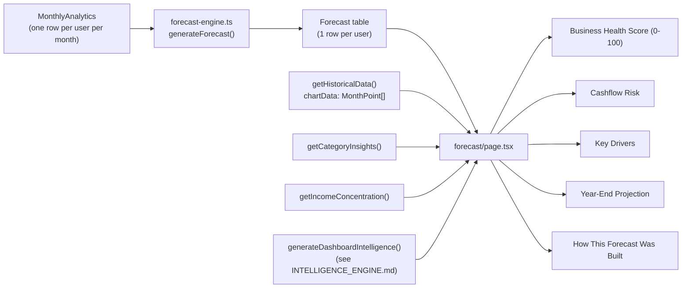
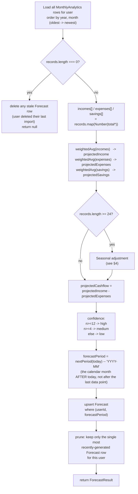
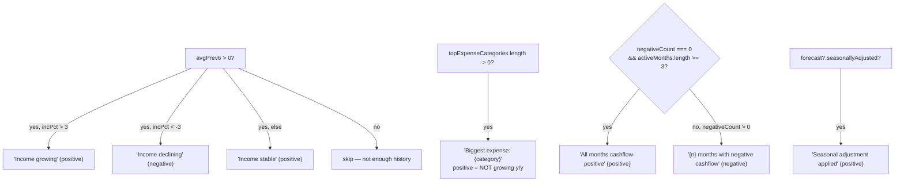

# Forecast Engine

- **What it does**: Projects next month's income, expenses, savings, and cashflow from the user's historical `MonthlyAnalytics`, then (on the Forecast page) turns that projection — plus the rest of the dashboard's intelligence — into a 0–100 "Business Health Score," a cashflow risk level, a year-end projection, and a list of "key drivers."
- **Why it exists**: A freelancer's biggest planning question is "what's coming next, and should I be worried?" Raw historical totals don't answer that — they need to be turned into a forward-looking number, with an honest signal about how much to trust it.
- **Where the code is**:
  - `src/lib/forecast-engine.ts` (176 lines) — the actual projection math (`generateForecast`, `getLatestForecast`), persisted to the `Forecast` table.
  - `src/app/(dashboard)/forecast/page.tsx` (466 lines) — everything *derived* from that projection (Health Score, Cashflow Risk, Key Drivers, Year-End Projection, "How this forecast was built"). None of this is persisted; it's recomputed on every page load.
- **How to modify it safely**: see [How to modify](#how-to-modify-safely) at the bottom.

---

## 1. Two layers



`forecast-engine.ts` answers **"what will next month's numbers be?"** — three plain numbers (income, expenses, cashflow) plus a confidence label, persisted so the dashboard can show a forecast without recomputing it on every page.

`forecast/page.tsx` answers **"so what does that mean for my business?"** — it combines the persisted forecast with the full historical chart (`MonthPoint[]` from [ANALYTICS_ENGINE.md](./ANALYTICS_ENGINE.md)) and the narrative insights from `intelligence-engine.ts` (see [INTELLIGENCE_ENGINE.md](./INTELLIGENCE_ENGINE.md)) to produce everything the user actually sees: the score, the risk badge, the key drivers list, and the year-end numbers.

---

## 2. `generateForecast(userId)` — the projection pipeline



**Where `records` comes from**: every row of `MonthlyAnalytics` for this user, oldest first — i.e. the *entire* history, not just the last N months. Older months still influence the projection, just with a smaller weight (§3).

**Called from** (always immediately after `recalculateMonthlyAnalytics(userId)` — see [ANALYTICS_ENGINE.md](./ANALYTICS_ENGINE.md)):

| Call site | When |
|---|---|
| `src/app/api/uploads/process/route.ts` | After a CSV import finishes |
| `src/app/api/uploads/[id]/route.ts` | After an import is **deleted** |
| `src/app/api/transactions/recategorize/route.ts` | After a single transaction is recategorized |
| `src/app/api/transactions/recategorize-all/route.ts` | After a bulk "apply this category to all similar transactions" action |
| `src/app/(dashboard)/forecast/page.tsx` | Every time the Forecast page is loaded (cheap — one pass over `MonthlyAnalytics`) |
| `POST /api/forecast` | Manual refresh trigger, if ever wired up client-side |

> **Why regenerate so often?** The projection is a pure function of `MonthlyAnalytics`. Any time that table changes — new data, a recategorization that moves a transaction from "expense" to "transfer," a deleted import — the projection is stale until recomputed. Recomputing is cheap (it's a handful of numbers per month, not per transaction), so it's simplest to just always re-run it.

---

## 3. The weighted moving average — `weightedAvg()`

```ts
function weightedAvg(values: number[]): number {
  if (values.length === 0) return 0;
  const weights = values.map((_, i) => {
    const fromEnd = values.length - 1 - i;
    if (fromEnd < 3) return 3;
    if (fromEnd < 9) return 2;
    return 1;
  });
  const totalWeight = weights.reduce((a, b) => a + b, 0);
  return values.reduce((sum, v, i) => sum + v * weights[i], 0) / totalWeight;
}
```

Applied independently to the `totalIncome`, `totalExpenses`, and `totalSavings` columns of every `MonthlyAnalytics` row (oldest → newest).

| Months from the end (`fromEnd`) | Weight | Meaning |
|---|---|---|
| 0, 1, 2 (the most recent 3 months) | **3** | Recent behavior is the strongest signal |
| 3–8 (the next 6 months back) | **2** | Medium-term trend, still relevant |
| 9+ (everything older) | **1** | Long-term baseline — still counted, but diluted |

**Formula**:

```
weighted average = Σ(value[i] × weight[i]) / Σ(weight[i])
```

### Worked example (10 months of income, oldest → newest)

| Month index | Income | fromEnd | Weight |
|---|---|---|---|
| 0 | 3,000 | 9 | 1 |
| 1 | 3,200 | 8 | 2 |
| 2 | 2,800 | 7 | 2 |
| 3 | 3,500 | 6 | 2 |
| 4 | 4,000 | 5 | 2 |
| 5 | 3,900 | 4 | 2 |
| 6 | 4,200 | 3 | 2 |
| 7 | 4,500 | 2 | 3 |
| 8 | 4,800 | 1 | 3 |
| 9 | 5,000 | 0 | 3 |

`totalWeight = 1 + 2×6 + 3×3 = 22`. The most recent 3 months (weight 3 each = 9 of 22, ~41%) dominate, the middle 6 months (weight 2 each = 12 of 22, ~55%) provide trend context, and the single oldest month (weight 1, ~4.5%) barely moves the result. With only one month of history, `fromEnd = 0` so it gets weight 3 — `weightedAvg` degenerates to that single value, which is correct.

> **Why this shape, not a simple N-month average?** A flat "average of the last 3 months" reacts too fast to one unusual month (a big one-off client payment). A flat "average of all months" reacts too slowly to a real trend change (e.g. the user doubled their rates 6 months ago). The tiered weighting is a middle ground: recent months dominate, but the projection doesn't whiplash on a single outlier month, and a freelancer with 2 years of history still gets *some* signal from year-old months without those months drowning out what's happening now.

---

## 4. Seasonal adjustment — `buildSeasonalMap()`

Only runs if `records.length >= 24` (at least 2 full years of `MonthlyAnalytics`), so that every calendar month has appeared **at least twice** in history before it's allowed to influence the projection.

```ts
function buildSeasonalMap(records: { month: number; value: number }[]) {
  const map: Record<number, { total: number; count: number }> = {};
  for (const r of records) {
    if (!map[r.month]) map[r.month] = { total: 0, count: 0 };
    map[r.month].total += r.value;
    map[r.month].count += 1;
  }
  return map;
}
```

Steps, for income (expenses are identical, run independently):

1. Build `incomeSeasonMap`: for each calendar month 1–12, the total and count of `totalIncome` across all years.
2. `overallAvgIncome` = the plain average of `totalIncome` across **all** months in history.
3. `nextMonthNum = ((now.getUTCMonth() + 1) % 12) + 1` — the calendar month number (1–12) of *next month*, based on **today's real-world date**, not the user's last data point.
4. If `incomeSeasonMap[nextMonthNum]` exists and has `count >= 2` and `overallAvgIncome > 0`:
   ```
   ratio = (seasonal total for that month / seasonal count) / overallAvgIncome
   projectedIncome = projectedIncome × 0.5 + projectedIncome × ratio × 0.5
                    = projectedIncome × (0.5 + ratio × 0.5)
   ```
   i.e. a **50/50 blend** between the plain weighted average and "the weighted average scaled by how this calendar month historically compares to the yearly average."
5. Expenses go through the exact same blend independently, using `expenseSeasonMap` and `overallAvgExpenses`.
6. `seasonallyAdjusted = true` if **either** the income or expense adjustment was applied.

> **Why a 50/50 blend instead of using the seasonal ratio directly?** With only 2–3 occurrences of a given month in history, the seasonal ratio is noisy — one unusually high or low August could otherwise swing the whole projection. Blending halves the impact, so seasonality nudges the forecast in the right direction without letting a thin sample dominate it.

> **Why ≥24 months specifically?** `count >= 2` for *every* month requires at least 2 full years of data in the best case. 24 is the earliest point where that's even possible. Below that threshold, `seasonallyAdjusted` stays `false` and the projection is purely the weighted average from §3.

> **A note on "next month"**: unlike the rest of the app (see the "anchor to the data, not the wall clock" principle in [ANALYTICS_ENGINE.md](./ANALYTICS_ENGINE.md)), `nextMonthNum` and `forecastPeriod` (§6) are both based on **`new Date()` — the real-world date the forecast is generated on** — not the user's latest `MonthlyAnalytics` row. For an actively-used account this is the same thing. If a user's data is stale (e.g. they haven't uploaded in 6 months), the forecast still labels itself "next calendar month from today," even though the underlying weighted average is computed from months that ended well before that. The *numbers* are still a reasonable projection of "if recent patterns continue"; only the *period label* can drift from the data. Keep this in mind if you ever change either calculation — they should probably move together.

---

## 5. Cashflow, confidence, and `ForecastResult`

```ts
const projectedCashflow = projectedIncome - projectedExpenses;
const n = records.length;
const confidence: "low" | "medium" | "high" =
  n >= 12 ? "high" : n >= 4 ? "medium" : "low";
```

- **`projectedCashflow`** uses the exact same definition as `MonthlyAnalytics.netCashflow` (income − expenses; savings are tracked separately and excluded — see [DATABASE.md §5](./DATABASE.md#5-transaction) and [ANALYTICS_ENGINE.md](./ANALYTICS_ENGINE.md)).
- **`confidence`** is based on `n`, the **total number of `MonthlyAnalytics` rows** — all-time history, *not* the "active months" count used by the Health Score on the page (§7). A user with 12 months of history but several zero-activity months still gets `"high"` confidence here.

| `confidence` | Months of history (`n`) | Meaning shown to the user |
|---|---|---|
| `"low"` | < 4 | Very little history — treat the projection as a rough guess |
| `"medium"` | 4–11 | Enough to spot a trend, not enough for a full seasonal cycle |
| `"high"` | ≥ 12 | At least a year of data — projection reflects a full annual cycle |

```ts
export interface ForecastResult {
  projectedIncome: number;
  projectedExpenses: number;
  projectedSavings: number;
  projectedCashflow: number;
  forecastPeriod: string;       // "YYYY-MM"
  basedOnMonths: number;         // = n
  confidence: "low" | "medium" | "high";
  seasonallyAdjusted: boolean;
  generatedAt: Date;
}
```

---

## 6. Persistence — upsert + prune

```ts
function nextPeriod(date: Date): string {
  const next = new Date(Date.UTC(date.getUTCFullYear(), date.getUTCMonth() + 1, 1));
  return `${next.getUTCFullYear()}-${String(next.getUTCMonth() + 1).padStart(2, "0")}`;
}

const forecastPeriod = nextPeriod(new Date());
```

`forecastPeriod` is a locale-independent `"YYYY-MM"` string for the calendar month after *today*. It's formatted for display via `monthYearLabel()` (`src/utils/finance.ts`) at render time, not stored pre-formatted.

```ts
await prisma.forecast.upsert({
  where: { userId_forecastPeriod: { userId, forecastPeriod } },
  create: { userId, forecastPeriod, ...forecastValues },
  update: forecastValues,
});

const stale = await prisma.forecast.findMany({
  where: { userId },
  orderBy: { generatedAt: "desc" },
  skip: 1,
  select: { id: true },
});
if (stale.length > 0) {
  await prisma.forecast.deleteMany({ where: { id: { in: stale.map((f) => f.id) } } });
}
```

1. **Upsert** on the `(userId, forecastPeriod)` unique constraint — if `generateForecast` runs again within the same calendar month (e.g. after another upload), it updates the existing row rather than erroring on the unique constraint.
2. **Prune** — after upserting, fetch all `Forecast` rows for this user ordered by `generatedAt` descending, skip the first (the one just written), and delete the rest. This keeps **exactly one row per user**, always the most recently generated — including when the calendar rolls over to a new month and a new `forecastPeriod` value is introduced. No scheduled cleanup job is needed.

### Edge case: no data at all

```ts
if (records.length === 0) {
  await prisma.forecast.deleteMany({ where: { userId } });
  return null;
}
```

If the user has deleted their last import (and `recalculateMonthlyAnalytics` consequently left zero `MonthlyAnalytics` rows), any existing `Forecast` row is deleted too — so the dashboard doesn't keep showing a projection for data that no longer exists. The Forecast page's `hasData` check (`monthCount > 0`) then renders the empty state instead.

---

## 7. `getLatestForecast(userId)` — the read path

Used by `/api/dashboard` and the main `/dashboard` page (cheaper than `generateForecast` — no recomputation, just a lookup):

```ts
const forecast = await prisma.forecast.findFirst({
  where: { userId },
  orderBy: { generatedAt: "desc" },
});
if (!forecast) return null;

const monthsCount = await prisma.monthlyAnalytics.count({ where: { userId } });
const confidence = monthsCount >= 12 ? "high" : monthsCount >= 4 ? "medium" : "low";

const forecastPeriod = PERIOD_RE.test(forecast.forecastPeriod)
  ? forecast.forecastPeriod
  : nextPeriod(forecast.generatedAt);
```

Three things are **recomputed fresh on read**, not trusted from the stored row:

- **`confidence`** — derived from the *current* `MonthlyAnalytics` count, so confidence reflects today's data even if the stored `Forecast` row hasn't been regenerated since.
- **`seasonallyAdjusted`** — simply `monthsCount >= 24` (the same threshold as §4), recomputed rather than stored.
- **`forecastPeriod`** — guarded by `PERIOD_RE = /^\d{4}-\d{2}$/`. Rows written before the `"YYYY-MM"` format was introduced may still contain an old locale-formatted string (e.g. `"March 2027"`). If the stored value doesn't match the pattern, `forecastPeriod` is derived from `nextPeriod(forecast.generatedAt)` instead — a one-time compatibility shim that self-heals the next time `generateForecast()` runs and overwrites the row.

---

## 8. Business Health Score (0–100) — `forecast/page.tsx`

This score is **not** part of `forecast-engine.ts` and **not** persisted — it's computed fresh on every Forecast page render, from `chartData` (the full `MonthPoint[]` history from `getHistoricalData(userId, 999)`, see [ANALYTICS_ENGINE.md](./ANALYTICS_ENGINE.md)) plus `intel.healthStatus` from `generateDashboardIntelligence()` (see [INTELLIGENCE_ENGINE.md](./INTELLIGENCE_ENGINE.md)).

### Step 1 — active months and positive ratio

```ts
const activeMonths  = chartData.filter(d => d.income > 0 || d.expenses > 0);
const positiveCount = activeMonths.filter(d => d.cashflow >= 0).length;
const negativeCount = activeMonths.length - positiveCount;
const posRatio      = activeMonths.length > 0 ? positiveCount / activeMonths.length : 0;
```

`activeMonths` excludes months where the user had literally zero income and zero expenses (e.g. months before they started using the account, or gaps in their CSV history) — these shouldn't count against (or for) them.

### Step 2 — income trend (last 6 vs. previous 6 months)

```ts
const last6    = activeMonths.slice(-6);
const prev6    = activeMonths.slice(-12, -6);
const avgLast6 = last6.length ? last6.reduce((s, d) => s + d.income, 0) / last6.length : 0;
const avgPrev6 = prev6.length ? prev6.reduce((s, d) => s + d.income, 0) / prev6.length : 0;
const incTrend = avgPrev6 > 0 ? (avgLast6 - avgPrev6) / avgPrev6 : 0;
const incPct   = Math.round(incTrend * 100);
```

`incTrend` is the percentage change in average monthly income between the two 6-month windows. If there's no `prev6` data (less than 7 active months total) or `avgPrev6` is 0, `incTrend` is `0` (treated as stable).

### Step 3 — the four score components (sum capped at 100)

```ts
const cashflowScore = Math.round(posRatio * 40);
const trendScore    = incTrend > 0.05 ? 25 : incTrend > -0.05 ? 15 : 5;
const depthScore    = activeMonths.length >= 12 ? 20 : activeMonths.length >= 6 ? 12 : 5;
const statusScore   = intel.healthStatus === "healthy" ? 15 : intel.healthStatus === "watch" ? 8 : 0;
const healthScore   = Math.min(100, cashflowScore + trendScore + depthScore + statusScore);
```

| Component | Max | Formula | What it rewards |
|---|---|---|---|
| **Cashflow consistency** | 40 | `round(posRatio × 40)` | The fraction of active months with `cashflow >= 0` |
| **Income trend** | 25 | `>+5%` → 25, `>−5%` → 15, else → 5 | Growing income scores highest; a moderate decline still gets partial credit; only a >5% drop scores low |
| **Data depth** | 20 | `≥12` months → 20, `≥6` → 12, else → 5 | More history = a more reliable score, independent of how good the numbers are |
| **Health status** | 15 | `healthy` → 15, `watch` → 8, `at-risk`/other → 0 | Pulls in the categorical assessment from `intelligence-engine.ts` (see [INTELLIGENCE_ENGINE.md](./INTELLIGENCE_ENGINE.md)) |

### Step 4 — coloring the score (`scoreLevel`)

```ts
const scoreLevel: "healthy" | "watch" | "at-risk" =
  healthScore >= 80 ? "healthy" : healthScore >= 50 ? "watch" : "at-risk";
```

> **Why is this a *separate* tier from `intel.healthStatus`, when `statusScore` already factors `intel.healthStatus` in?** They answer different questions. `intel.healthStatus` (see [INTELLIGENCE_ENGINE.md](./INTELLIGENCE_ENGINE.md)) is about *recent trajectory* — "is something worth watching right now?" `healthScore`/`scoreLevel` is about the *overall foundation* — consistency, trend, and history combined. A business with a long, consistently-positive history (`scoreLevel: "healthy"`, score ≥ 80) might still have `intel.healthStatus === "watch"` because of one recent dip — and that's a legitimate, *useful* disagreement: the score says "you're on solid ground," the status narrative says "but here's something to keep an eye on." Coloring the score card by `scoreLevel` rather than `intel.healthStatus` means a single recent blip can't paint an otherwise-strong score amber. **Do not collapse these into one value** — it would hide real information.

---

## 9. Cashflow Risk

```ts
const cashflowRisk: "low" | "medium" | "high" | "critical" =
  posRatio >= 0.85 && incTrend > -0.05 ? "low" :
  posRatio >= 0.65 ? "medium" :
  posRatio >= 0.40 ? "high" : "critical";
```

| Level | Condition | Displayed as |
|---|---|---|
| `low` | ≥85% of active months had non-negative cashflow **and** income isn't declining >5% | Green badge, `cashflowRisk.low.*` copy |
| `medium` | ≥65% positive months (and didn't qualify for `low`) | Amber badge |
| `high` | ≥40% positive months | Red badge |
| `critical` | <40% positive months | Red badge, more urgent copy |

This is intentionally a **different calculation** from `healthScore`/`scoreLevel` — it's a narrower, single-purpose "should I be worried about running out of cash" signal, driven only by `posRatio` and `incTrend`, whereas the Health Score also weighs data depth and the categorical health status.

---

## 10. Key Drivers

An ordered list, built incrementally — each driver is `{ label, detail, positive: boolean }`, rendered with an ↑ (green, `positive: true`) or ↓ (amber, `positive: false`) icon.



1. **Income trend** (only if `avgPrev6 > 0`, i.e. there's a prior-6-month baseline to compare against):
   - `incPct > 3` → *"Income growing"* (positive) — shows `avgLast6` vs `avgPrev6` formatted as currency.
   - `incPct < -3` → *"Income declining"* (negative) — same detail, with `Math.abs(incPct)`.
   - otherwise → *"Income stable"* (positive).
2. **Biggest expense category** (if `categoryInsights.topExpenseCategories` is non-empty — see [ANALYTICS_ENGINE.md](./ANALYTICS_ENGINE.md)): the single largest all-time expense category, labeled `positive: !growing` where `growing = top.yearOverYearTrend === "growing"`. The category key is translated via the `categories` namespace if a translation exists, otherwise shown raw (see [TRANSLATIONS.md](./TRANSLATIONS.md)).
3. **Cashflow consistency**:
   - If `negativeCount === 0 && activeMonths.length >= 3` → *"All months cashflow-positive"* (positive).
   - Else if `negativeCount > 0` → *"{negativeCount} of {activeMonths.length} months had negative cashflow"* (negative).
   - (If neither condition is true — fewer than 3 active months and none negative — no driver is added for this.)
4. **Seasonal adjustment** (if `forecast?.seasonallyAdjusted`): *"Seasonal adjustment applied"* (positive) — tells the user the projection accounted for which calendar month is coming next.

All copy comes from the `forecast.keyDrivers.*` translation keys (`messages/en.json` / `messages/fr.json`).

---

## 11. Year-End Projection

```ts
const annualIncome   = forecast ? forecast.projectedIncome   * 12 : 0;
const annualExpenses = forecast ? forecast.projectedExpenses * 12 : 0;
const annualCashflow = forecast ? forecast.projectedCashflow * 12 : 0;

const projMarginPct = forecast && forecast.projectedIncome > 0
  ? Math.round((forecast.projectedCashflow / forecast.projectedIncome) * 100)
  : null;
```

- **Income / Expenses / Cashflow** are simply the monthly projection × 12 — i.e. "if next month repeats 12 times." This is a deliberately simple extrapolation; it does **not** re-run the seasonal logic per month, so it under/over-states totals for businesses with strong seasonality (the per-month figure shown alongside each card is the more honest number).
- **Margin** (`projMarginPct`) is "what % of projected income is left after expenses" — i.e. the projected cashflow margin. `null` if `projectedIncome` is 0 (avoids dividing by zero / showing a meaningless "−∞%" or "0%").

| Margin | Color |
|---|---|
| `null` (no income projected) | Grey, "—" |
| ≥ 30% | Green |
| 10–29% | Amber |
| < 10% | Red |

---

## 12. "How This Forecast Was Built" panel

A transparency panel at the bottom of the Forecast page — shown so users can sanity-check *why* the numbers look the way they do, not just trust them blindly.

| Field | Source |
|---|---|
| **Data analyzed** | `coverage.earliest` – `coverage.latest`, from `getDataCoverage(userId)` (see [ANALYTICS_ENGINE.md](./ANALYTICS_ENGINE.md)) |
| **Months of history** | `forecast?.basedOnMonths ?? monthCount` |
| **Transactions** | `coverage.count`, locale-formatted |
| **Forecast confidence** | `forecast?.confidence` (`low`/`medium`/`high`, colored red/amber/green) |

Below the grid, free-text notes:

- `howBuilt.builtFrom` — summarizes the date range used (`coverage.rangeLabel`, falling back to a transaction count if no range label is available).
- `howBuilt.seasonalApplied` — appended only if `forecast?.seasonallyAdjusted`.
- `howBuilt.weightingNote` — a fixed explanation of the §3 weighting scheme.
- `howBuilt.seasonalAdjustmentNote` — shown only if `forecast?.seasonallyAdjusted`.
- `confidenceDescriptions.{low|medium|high}` + `howBuilt.moreHistoryNote` — explains what the current confidence level means and that more history improves it.

All of this text is translated — see [TRANSLATIONS.md](./TRANSLATIONS.md) for the `forecast.howBuilt.*` and `forecast.confidenceDescriptions.*` keys.

---

## How to modify safely

### Change the weighting scheme (§3)

- `weightedAvg()` is a pure function over `number[]` — easy to unit-test in isolation (see `__tests__/`).
- If you change the weight tiers (currently 3/6/rest with weights 3/2/1), remember it's applied to **income, expenses, and savings independently** — a change here affects `projectedCashflow` (their difference) too.
- Keep the "first-match-wins by `fromEnd`" structure — `fromEnd < 3` must be checked before `fromEnd < 9`, otherwise every month would match the loosest branch.

### Change the seasonal adjustment (§4)

- The `>= 24` months gate exists so every calendar month has appeared ≥2 times before its seasonal ratio is trusted. If you lower this threshold, also reconsider the `count >= 2` check inside the per-month branch — they're meant to work together.
- The 50/50 blend ratio (`× 0.5 + ... × 0.5`) is a damping factor for noisy small samples. If you make it more aggressive (e.g. 70/30 toward the seasonal ratio), test with users who have exactly 24–30 months of history (the noisiest case — only 2 samples per month).
- If you ever change `nextPeriod()` or `nextMonthNum` to anchor on the user's latest data point instead of `new Date()` (to match the "anchor to the data" principle elsewhere — see [ANALYTICS_ENGINE.md](./ANALYTICS_ENGINE.md)), change **both** — they currently share the same "today" assumption and a mismatch between them would make the seasonal adjustment target a different month than the one named in `forecastPeriod`.

### Change confidence tiers (§5, §7)

- The thresholds (`>=12` high, `>=4` medium) appear in **two places**: `generateForecast()` (using `records.length`) and `getLatestForecast()` (using a fresh `monthlyAnalytics.count()`). Keep them in sync — they're meant to represent the same tiers.
- `confidence` in the returned `ForecastResult` is **never read from the database** — it's always computed from the current row count. Don't add a stored `confidence` column without updating both functions to keep using the live count (otherwise a user who imports more data won't see their confidence improve until the next forecast regeneration).

### Change the Business Health Score, Cashflow Risk, or Key Drivers (§8–11)

- All of this lives in `src/app/(dashboard)/forecast/page.tsx`, **not** `forecast-engine.ts` — there is nothing to migrate or persist; changes take effect on the next page load.
- `activeMonths`, `posRatio`, and `incTrend` are computed once near the top of the component and reused by the Health Score, Cashflow Risk, *and* Key Drivers — if you change how any of these three are derived, double check all three consumers still make sense together.
- Score component maxes (40/25/20/15) sum to exactly 100 by construction. If you add, remove, or reweight a component, update the sum and the `Math.min(100, ...)` is still just a safety clamp, not load-bearing — the real invariant is "components sum to 100."
- Keep `scoreLevel` (for coloring the score card) and `intel.healthStatus` (the narrative) as **separate** signals — see the callout in §8. Merging them removes a deliberate piece of information ("the foundation is solid, but here's a recent thing to watch").

### Things to be careful about

- **`forecast-engine.ts` has no UI dependencies** — it can be called from any server context (API routes, page components, scripts). Don't add `next-intl` translation calls or React imports to it; all user-facing text derived from the forecast lives in `forecast/page.tsx` and the `forecast.*` translation namespace.
- **The `Forecast` table holds exactly one row per user** (after pruning). If you need historical forecasts (e.g. "what did we predict for March, looking back from January?"), you'll need a schema change — don't repurpose the prune logic to "sometimes keep more rows," as `getLatestForecast()` assumes `findFirst` by `generatedAt desc` returns *the* forecast, not *a* forecast.
- **`projectedSavings` is computed but barely used** on the Forecast page itself — it's part of `ForecastResult` and is fed into `generateDashboardIntelligence()` (see [INTELLIGENCE_ENGINE.md](./INTELLIGENCE_ENGINE.md)), but doesn't appear in the Year-End Projection cards. If you add a "Year-end savings" card, use `forecast.projectedSavings * 12` for consistency with the income/expenses/cashflow cards.
- **Don't call `generateForecast()` from a loop or batch job without rate-limiting** — each call does a full `MonthlyAnalytics` read plus an upsert and a prune query. For a single user on a single page load this is trivial, but a script that regenerates forecasts for *all* users should batch/paginate.
