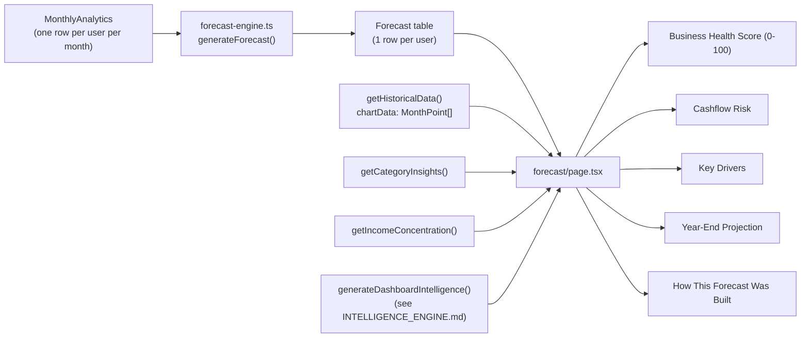
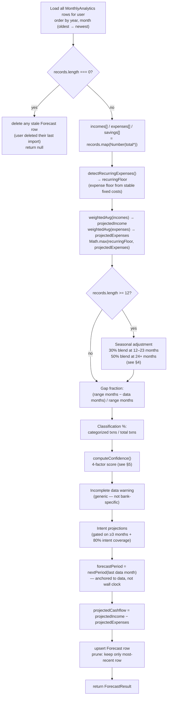

# Forecast Engine

- **What it does**: Projects next month's income, expenses, savings, and cashflow from the user's historical `MonthlyAnalytics`, then (on the Forecast page) turns that projection — plus the rest of the dashboard's intelligence — into a 0–100 "Business Health Score," a cashflow risk level, a year-end projection, and a list of "key drivers."
- **Why it exists**: A freelancer's biggest planning question is "what's coming next, and should I be worried?" Raw historical totals don't answer that — they need to be turned into a forward-looking number, with an honest signal about how much to trust it.
- **Where the code is**:
  - `src/lib/forecast-engine.ts` — the actual projection math (`generateForecast`, `getLatestForecast`), persisted to the `Forecast` table.
  - `src/app/(dashboard)/forecast/page.tsx` — everything *derived* from that projection (Health Score, Cashflow Risk, Key Drivers, Year-End Projection, "How this forecast was built"). None of this is persisted; it's recomputed on every page load.
- **How to modify it safely**: see [How to modify](#how-to-modify-safely) at the bottom.

---

## 1. Two layers



`forecast-engine.ts` answers **"what will next month's numbers be?"** — three plain numbers (income, expenses, cashflow) plus a confidence score and diagnostic signals, persisted so the dashboard can show a forecast without recomputing it on every page.

`forecast/page.tsx` answers **"so what does that mean for my business?"** — it combines the persisted forecast with the full historical chart (`MonthPoint[]` from [ANALYTICS_ENGINE.md](./ANALYTICS_ENGINE.md)) and the narrative insights from `intelligence-engine.ts` (see [INTELLIGENCE_ENGINE.md](./INTELLIGENCE_ENGINE.md)) to produce everything the user actually sees: the score, the risk badge, the key drivers list, and the year-end numbers.

---

## 2. `generateForecast(userId)` — the projection pipeline



**Where `records` comes from**: every row of `MonthlyAnalytics` for this user, oldest first — the *entire* history, not just the last N months. Older months still influence the projection via the weighted average (§3), just with a smaller weight.

**Called from** (always immediately after `recalculateMonthlyAnalytics(userId)`):

| Call site | When |
|---|---|
| `src/app/api/uploads/process/route.ts` | After a CSV import finishes |
| `src/app/api/uploads/[id]/route.ts` | After an import is **deleted** |
| `src/app/api/transactions/recategorize/route.ts` | After a single transaction is recategorized |
| `src/app/api/transactions/recategorize-all/route.ts` | After a bulk recategorization action |
| `src/app/(dashboard)/forecast/page.tsx` | Every time the Forecast page is loaded (cheap — one pass over `MonthlyAnalytics`) |
| `POST /api/forecast` | Manual refresh trigger, if ever wired up client-side |

> **Why regenerate so often?** The projection is a pure function of `MonthlyAnalytics`. Any time that table changes — new data, a recategorization, a deleted import — the projection is stale until recomputed. Recomputing is cheap (a handful of numbers per month, not per transaction), so it's simplest to always re-run it.

---

## 3. The weighted moving average — `weightedAvg()`

```ts
function weightedAvg(values: number[]): number {
  if (values.length === 0) return 0;
  const weights = values.map((_, i) => {
    const fromEnd = values.length - 1 - i;
    if (fromEnd < 3) return 3;
    if (fromEnd < 9) return 2;
    return 1;
  });
  const totalWeight = weights.reduce((a, b) => a + b, 0);
  return values.reduce((sum, v, i) => sum + v * weights[i], 0) / totalWeight;
}
```

Applied independently to the `totalIncome`, `totalExpenses`, and `totalSavings` columns of every `MonthlyAnalytics` row (oldest → newest).

| Months from the end (`fromEnd`) | Weight | Meaning |
|---|---|---|
| 0, 1, 2 (the most recent 3 months) | **3** | Recent behavior is the strongest signal |
| 3–8 (the next 6 months back) | **2** | Medium-term trend, still relevant |
| 9+ (everything older) | **1** | Long-term baseline — still counted, but diluted |

**Formula**:

```
weighted average = Σ(value[i] × weight[i]) / Σ(weight[i])
```

### Worked example (10 months of income, oldest → newest)

| Month index | Income | fromEnd | Weight |
|---|---|---|---|
| 0 | 3,000 | 9 | 1 |
| 1 | 3,200 | 8 | 2 |
| 2 | 2,800 | 7 | 2 |
| 3 | 3,500 | 6 | 2 |
| 4 | 4,000 | 5 | 2 |
| 5 | 3,900 | 4 | 2 |
| 6 | 4,200 | 3 | 2 |
| 7 | 4,500 | 2 | 3 |
| 8 | 4,800 | 1 | 3 |
| 9 | 5,000 | 0 | 3 |

`totalWeight = 1 + 2×6 + 3×3 = 22`. The most recent 3 months (weight 3 each = 9 of 22, ~41%) dominate, the middle 6 months (weight 2 each = 12 of 22, ~55%) provide trend context, and the single oldest month (weight 1, ~4.5%) barely moves the result. With only one month of history, `fromEnd = 0` so it gets weight 3 — `weightedAvg` degenerates to that single value, which is correct.

> **Why this shape, not a simple N-month average?** A flat "average of the last 3 months" reacts too fast to one unusual month (a big one-off client payment). A flat "average of all months" reacts too slowly to a real trend change (e.g. the user doubled their rates 6 months ago). The tiered weighting is a middle ground: recent months dominate, but the projection doesn't whiplash on a single outlier month, and a freelancer with 2 years of history still gets *some* signal from year-old months without those months drowning out what's happening now.

---

## 4. Seasonal adjustment — `buildSeasonalMap()`

Runs if `records.length >= 12` (at least 12 months of `MonthlyAnalytics`). The blend factor depends on how much history is available:

| History | Blend factor | Rationale |
|---|---|---|
| 12–23 months | **30%** | Enough for seasonality to be directionally correct, but sample sizes per month are thin (1–2 occurrences). A light blend avoids over-weighting noisy ratios. |
| 24+ months | **50%** | Every month has appeared ≥2 times — the seasonal ratio is more reliable. |

```ts
const blend = records.length >= 24 ? 0.5 : 0.3;
```

Steps, for income (expenses are identical, run independently):

1. Build `incomeSeasonMap`: for each calendar month 1–12, the total and count of `totalIncome` across all years.
2. `avgIncome` = the plain average of `totalIncome` across **all** months in history.
3. **`nextMonthNum`** is derived from the **last `MonthlyAnalytics` record**, not from `new Date()`. The forecast targets the month after the user's last data point — "what does the next period look like?" — not "what is next calendar month from today?". This is consistent with the "anchor to the data" principle elsewhere in the app (see [ANALYTICS_ENGINE.md](./ANALYTICS_ENGINE.md)).
4. If `incomeSeasonMap[nextMonthNum]` exists and has `count >= 2` and `avgIncome > 0`:
   ```
   ratio = (seasonal total for that month / seasonal count) / avgIncome
   projectedIncome = projectedIncome × (1 − blend) + projectedIncome × ratio × blend
   ```
5. Expenses go through the same blend independently, but the seasonal result is always bounded from below by `recurringFloor` (§5b) — seasonality cannot push expenses below the detected stable fixed-cost floor.
6. `seasonallyAdjusted = true` if **either** the income or expense adjustment was applied.

> **Why the 30%/50% split?** At 12–23 months each calendar month has appeared at most once in history — only the most recent occurrence is in the map. A 30% blend lets the signal nudge the forecast without a single data point dominating. At 24+ months, `count >= 2` is satisfied for all months, so the ratio is more reliable and a 50% blend is appropriate.

---

## 5. Confidence score — `computeConfidence()`

The confidence system was rebuilt from a simple threshold rule (`>=12 → "high"`) into a **4-factor weighted composite**, returning a numeric `0–1` score plus categorical level and plain-English reasons.

```ts
function computeConfidence(
  monthCount: number,
  incomeValues: number[],
  expenseValues: number[],
  gapFraction: number,
  classifiedPct: number
): { score: number; level: "low" | "medium" | "high"; reasons: string[] }
```

### The four factors

| Factor | Weight | Formula | What it measures |
|---|---|---|---|
| **History depth** | 40% | `Math.min(1, monthCount / 12)` | Months of data. Full marks at ≥12 months, proportional below. |
| **Income volatility** | 25% | `Math.max(0, 1 − clamp(CV, 0, 1.5) / 1.5)` | Coefficient of Variation (CV = stdDev/mean) on non-zero income months. Stable income → score near 1; CV ≥1.5 → score 0. |
| **Gap fraction** | 20% | `Math.max(0, 1 − gapFraction × 2)` | Fraction of calendar months in the data range with no `MonthlyAnalytics` row. Each 10% gap subtracts 20% from this factor (so ≥50% gaps → 0). |
| **Classification %** | 15% | `classifiedPct / 100` (capped at 1) | Percentage of transactions with a category assigned. Higher categorization → better intent and expense-floor signals. |

**Composite**:
```
score = depthScore × 0.40 + volatilityScore × 0.25 + gapScore × 0.20 + classScore × 0.15
```

**Categorical level**:
```
level = score >= 0.65 ? "high" : score >= 0.40 ? "medium" : "low"
```

**Plain-English `reasons[]`** — four entries, one per factor, e.g.:
- `"14 months of history — solid foundation for forecasting."`
- `"Income varies significantly month to month — projections carry more uncertainty."`
- `"Some months have no transaction data — possible gaps in uploaded history."`
- `"78% of transactions categorized."`

The reasons array is stored in the `Forecast` row's JSON blob and displayed in the "How This Forecast Was Built" panel (§12).

### Gap fraction calculation

```ts
const totalMonthsInRange =
  (last.year - first.year) * 12 + (last.month - first.month) + 1;
gapFraction = (totalMonthsInRange - records.length) / totalMonthsInRange;
```

If the user uploaded one CSV covering January–December 2024 but has no data for June (month deleted, or never uploaded), `totalMonthsInRange = 12`, `records.length = 11`, `gapFraction ≈ 0.083`. A sparse 6-month import in a 12-month window would produce `gapFraction = 0.5`, lowering the gap factor to 0.

### Classification percentage

```ts
const [totalTxCount, classifiedTxCount] = await Promise.all([
  prisma.transaction.count({ where: { userId } }),
  prisma.transaction.count({ where: { userId, category: { not: undefined } } }),
]);
const classifiedPct = totalTxCount > 0 ? (classifiedTxCount / totalTxCount) * 100 : 0;
```

> **`not: undefined` vs `not: null`**: Prisma's type for the `not` filter in `StringFilter` doesn't accept literal `null` — it must be `undefined`, which Prisma interprets as "the field exists and has any value" (i.e. is not null in the database).

---

## 5b. Recurring expense detection — `detectRecurringExpenses()`

Runs **before** the weighted average is applied to expenses. Its purpose is to create a stable floor below which the expense projection cannot be pushed — even in months with unusually low recorded spending.

```ts
async function detectRecurringExpenses(
  userId: string,
  records: { year: number; month: number }[]
): Promise<{ total: number; categories: { category: string; monthlyAvg: number }[] }>
```

**Algorithm**:

1. Fetch all `expense` transactions for the user.
2. Group by `category` × calendar month — produce `catMonth: Map<category, Map<"YYYY-M", totalAmount>>`.
3. For each category, compute:
   - `appearanceRate = nonZeroMonths / totalMonthsInRange` — how often the category shows up.
   - `cv = coefficientOfVariation(nonZeroAmounts)` — how consistent the amounts are.
4. A category is **recurring** if `appearanceRate >= 0.70` **and** `cv <= 0.50` (present in ≥70% of months, with ≤50% variation in amount).
5. `recurringFloor = Σ monthlyAvg` across all recurring categories.

**How the floor is used**:

```ts
// After weightedAvg(expenses):
if (records.length >= 3 && recurringFloor > 0) {
  projectedExpenses = Math.max(recurringFloor, projectedExpenses);
}
// After seasonal adjustment (if applied):
projectedExpenses = Math.max(recurringFloor, seasonal);
```

This means the projected expenses never drop below the sum of the user's stable fixed costs — even if recent months had unusually low spending, or if seasonality would otherwise suggest a very low-expense month.

> **Why CV ≤ 0.50?** A CV of 0 would mean perfectly identical amounts every month (e.g. a fixed subscription). 0.50 allows about ±50% variation around the mean, which covers subscriptions with minor fluctuations, consistent phone/utility bills, regular software fees, etc. Categories with CV > 0.50 are considered too variable to be "recurring" (e.g. ad spend, materials costs).

---

## 5c. Cashflow, confidence tier, and `ForecastResult`

```ts
const projectedCashflow = projectedIncome - projectedExpenses;
```

`projectedCashflow` uses the same definition as `MonthlyAnalytics.netCashflow` (income − expenses; savings are tracked separately).

The `confidence` label is derived from `confidenceScore` (§5), not from a raw month count:

```ts
const confidence: "low" | "medium" | "high" =
  score >= 0.65 ? "high" : score >= 0.40 ? "medium" : "low";
```

```ts
export interface ForecastResult {
  // Core projection
  projectedIncome:   number;
  projectedExpenses: number;
  projectedSavings:  number;
  projectedCashflow: number;
  forecastPeriod:    string;        // "YYYY-MM" — month after the user's last data point
  basedOnMonths:     number;        // total MonthlyAnalytics rows
  confidence:        "low" | "medium" | "high";
  confidenceScore:   number;        // 0–1 numeric composite (see §5)
  confidenceReasons: string[];      // human-readable per-factor notes (see §5)
  seasonallyAdjusted: boolean;
  generatedAt: Date;

  // Intent-aware projections (null when intent coverage < 80% or < 3 months)
  projectedBusinessRevenue: number | null;
  projectedBusinessCosts:   number | null;
  projectedBusinessProfit:  number | null;
  projectedPersonalSpend:   number | null;
  projectedDebtService:     number | null;
  projectedTrueNetCashflow: number | null;

  // Data quality signals
  hasIncompleteDataWarning: boolean;  // recent income substantially below historical average
  recurringExpensesTotal:   number;   // monthly floor from detected recurring costs (§5b)
  gapFraction:              number;   // fraction of months in date range with no data (§5)
  classifiedPct:            number;   // % of transactions with a category (§5)
}
```

The intent fields are stored in the `Forecast` table as a single `intentBreakdown Json?` column (see §5d) and read back by `getLatestForecast()` into the typed fields above.

---

## 5d. Intent-based projections

Runs inside `generateForecast()` **after** the core weighted average, gated on `records.length >= 3` and `intentCoveragePct >= 80`.

**Coverage check** — queries `Transaction` twice: total count and count where `intent IS NOT NULL`. If `classifiedCount / totalCount < 0.80`, all intent fields remain `null` and the JSON column is stored as `null`.

**Per-intent series** — all intent-classified transactions are fetched and bucketed into a `byMonth` map keyed by `"YYYY-M"`. The five intent buckets:

| Bucket | Intents |
|---|---|
| Business revenue | `freelance_income`, `salary` |
| Business costs | `business_expense`, `tax_payment`, `subscription` |
| Debt service | `loan_repayment` |
| Personal spend | `personal_expense`, `family_support` |
| Passive / refunds | `passive_income`, `refund` |

Each bucket's monthly series is aligned to the `MonthlyAnalytics` record order so all algorithms operate consistently.

**Four forecast algorithms:**

| Pattern | Series | Algorithm | Rationale |
|---|---|---|---|
| 1 | Business revenue | `weightedAvg()` (same as §3) | Freelance income is variable — recency matters, outliers shouldn't dominate |
| 2 | Debt service | `rolling3Avg()` — mean of last 3 months | Fixed commitments, rarely change |
| 3 | Business costs | `weightedAvg()` | Low variability, but recency still more relevant than old spend |
| 4 | Personal spend | `rolling3Avg()` | Lifestyle-stable; recent 3 months is the best predictor |

```
projectedBusinessProfit  = projectedBusinessRevenue − projectedBusinessCosts
projectedTrueNetCashflow = projectedBusinessRevenue + projectedPassive
                         − projectedBusinessCosts − projectedPersonalSpend
                         − projectedDebtService
```

**Incomplete data guard** — fires when `incomes.length >= 3` and the average of the last 2 months' income is less than 35% of the historical average (excluding those 2 months), provided the historical average exceeds €200. Also fires if the most recent month has zero income after a non-zero history (again, provided history average > €200).

This is a **generic signal** — it does not assume a specific bank, data format, or account. It simply detects that recent income looks anomalously low relative to historical patterns, which could mean: a missing CSV upload, a slow month, or truly reduced business activity. The UI shows a warning banner asking the user to verify their data is complete, rather than asserting a specific cause.

```ts
// Generic incomplete data check — no bank-specific assumptions
if (incomes.length >= 3) {
  const recentAvg   = simpleAvg(incomes.slice(-2));
  const historicAvg = simpleAvg(incomes.slice(0, -2));
  if (historicAvg > 200 && recentAvg < historicAvg * 0.35) {
    hasIncompleteDataWarning = true;
  }
}
if (incomes.length >= 2 && incomes[incomes.length - 1] === 0
    && simpleAvg(incomes.slice(0, -1)) > 200) {
  hasIncompleteDataWarning = true;
}
```

**Storage** — all signal fields (`confidenceScore`, `confidenceReasons`, `recurringExpensesTotal`, `gapFraction`, `classifiedPct`, `hasIncompleteDataWarning`) plus the seven intent fields are serialised into a `StoredBreakdown` object and written to `Forecast.intentBreakdown` (a `Json?` column). `getLatestForecast()` reads the column back and spreads all fields into the returned `ForecastResult`.

---

## 6. Persistence — upsert + prune

```ts
function nextPeriod(date: Date): string {
  const next = new Date(Date.UTC(date.getUTCFullYear(), date.getUTCMonth() + 1, 1));
  return `${next.getUTCFullYear()}-${String(next.getUTCMonth() + 1).padStart(2, "0")}`;
}

// Anchored to the user's last data point, not the wall clock
const lastRecord     = records[records.length - 1];
const lastDataDate   = new Date(Date.UTC(lastRecord.year, lastRecord.month - 1, 1));
const forecastPeriod = nextPeriod(lastDataDate);
```

`forecastPeriod` is a locale-independent `"YYYY-MM"` string for the calendar month after the user's **last data point** — "what does the month after my most recent data look like?" This is consistent with the "anchor to the data, not the wall clock" principle used throughout the app (see [ANALYTICS_ENGINE.md](./ANALYTICS_ENGINE.md)).

> **Important difference from the old behavior**: the previous engine used `nextPeriod(new Date())` — next calendar month from today. If a user's data ended in December 2024 and they run the app in June 2026, the old engine would label the forecast "July 2026" while projecting from data that ended 18 months earlier. The new engine labels it "January 2025" — the honest next step from the data.

`forecastPeriod` is formatted for display via `monthYearLabel()` (`src/utils/finance.ts`) at render time, not stored pre-formatted.

```ts
await prisma.forecast.upsert({
  where: { userId_forecastPeriod: { userId, forecastPeriod } },
  create: { userId, forecastPeriod, ...forecastValues },
  update: forecastValues,
});

const stale = await prisma.forecast.findMany({
  where: { userId },
  orderBy: { generatedAt: "desc" },
  skip: 1,
  select: { id: true },
});
if (stale.length > 0) {
  await prisma.forecast.deleteMany({ where: { id: { in: stale.map((f) => f.id) } } });
}
```

1. **Upsert** on the `(userId, forecastPeriod)` unique constraint — running `generateForecast` again within the same data window updates the existing row rather than erroring.
2. **Prune** — after upserting, keep only the most recently-generated row. No scheduled cleanup job is needed.

### Edge case: no data at all

```ts
if (records.length === 0) {
  await prisma.forecast.deleteMany({ where: { userId } });
  return null;
}
```

If the user has deleted their last import, any existing `Forecast` row is deleted so the dashboard doesn't keep showing a projection for data that no longer exists.

---

## 7. `getLatestForecast(userId)` — the read path

Used by the main `/dashboard` page (cheaper than `generateForecast` — no recomputation, just a lookup):

```ts
const forecast    = await prisma.forecast.findFirst({
  where: { userId }, orderBy: { generatedAt: "desc" },
});
if (!forecast) return null;

const monthsCount = await prisma.monthlyAnalytics.count({ where: { userId } });

const forecastPeriod = PERIOD_RE.test(forecast.forecastPeriod)
  ? forecast.forecastPeriod
  : nextPeriod(forecast.generatedAt);

const ib = forecast.intentBreakdown as StoredBreakdown | null;

// Backward-compat: if confidenceScore not in stored JSON, derive from month count
const storedScore = ib?.confidenceScore
  ?? (monthsCount >= 12 ? 0.75 : monthsCount >= 4 ? 0.50 : 0.25);
const confidence: "low" | "medium" | "high" =
  storedScore >= 0.65 ? "high" : storedScore >= 0.40 ? "medium" : "low";
```

Three things are **recomputed or read from the JSON blob**, not trusted as raw database columns:

- **`confidence` and `confidenceScore`** — read from `ib.confidenceScore` in the stored JSON. For rows written before the new system (no `confidenceScore` in JSON), a backward-compatible default is derived from `monthsCount` (`>=12 → 0.75`, `>=4 → 0.50`, else `0.25`).
- **`seasonallyAdjusted`** — `monthsCount >= 12` (the new seasonality threshold, §4). Recomputed from the live row count rather than stored, so it self-updates as the user imports more data without waiting for the next forecast regeneration.
- **`forecastPeriod`** — guarded by `PERIOD_RE = /^\d{4}-\d{2}$/`. Rows written before the `"YYYY-MM"` format was introduced may still contain an old locale-formatted string (e.g. `"March 2027"`). If the stored value doesn't match the pattern, `forecastPeriod` falls back to `nextPeriod(forecast.generatedAt)`.

All data-quality fields (`confidenceReasons`, `recurringExpensesTotal`, `gapFraction`, `classifiedPct`, `hasIncompleteDataWarning`) are read directly from `ib` with backward-compat defaults of `[]`, `0`, `0`, `0`, and `false` respectively.

---

## 8. Business Health Score (0–100) — `forecast/page.tsx`

This score is **not** part of `forecast-engine.ts` and **not** persisted — it's computed fresh on every Forecast page render, from `chartData` (the full `MonthPoint[]` history from `getHistoricalData(userId, 999)`, see [ANALYTICS_ENGINE.md](./ANALYTICS_ENGINE.md)) plus `intel.healthStatus` from `generateDashboardIntelligence()` (see [INTELLIGENCE_ENGINE.md](./INTELLIGENCE_ENGINE.md)).

### Step 1 — active months and positive ratio

```ts
const activeMonths  = chartData.filter(d => d.income > 0 || d.expenses > 0);
const positiveCount = activeMonths.filter(d => d.cashflow >= 0).length;
const negativeCount = activeMonths.length - positiveCount;
const posRatio      = activeMonths.length > 0 ? positiveCount / activeMonths.length : 0;
```

`activeMonths` excludes months where the user had literally zero income and zero expenses.

### Step 2 — income trend (last 6 vs. previous 6 months)

```ts
const last6    = activeMonths.slice(-6);
const prev6    = activeMonths.slice(-12, -6);
const avgLast6 = last6.length ? last6.reduce((s, d) => s + d.income, 0) / last6.length : 0;
const avgPrev6 = prev6.length ? prev6.reduce((s, d) => s + d.income, 0) / prev6.length : 0;
const incTrend = avgPrev6 > 0 ? (avgLast6 - avgPrev6) / avgPrev6 : 0;
const incPct   = Math.round(incTrend * 100);
```

### Step 3 — the four score components (sum capped at 100)

```ts
const cashflowScore = Math.round(posRatio * 40);
const trendScore    = incTrend > 0.05 ? 25 : incTrend > -0.05 ? 15 : 5;
const depthScore    = activeMonths.length >= 12 ? 20 : activeMonths.length >= 6 ? 12 : 5;
const statusScore   = intel.healthStatus === "healthy" ? 15 : intel.healthStatus === "watch" ? 8 : 0;
const healthScore   = Math.min(100, cashflowScore + trendScore + depthScore + statusScore);
```

| Component | Max | Formula | What it rewards |
|---|---|---|---|
| **Cashflow consistency** | 40 | `round(posRatio × 40)` | The fraction of active months with `cashflow >= 0` |
| **Income trend** | 25 | `>+5%` → 25, `>−5%` → 15, else → 5 | Growing income scores highest; a moderate decline still gets partial credit |
| **Data depth** | 20 | `≥12` months → 20, `≥6` → 12, else → 5 | More history = a more reliable score |
| **Health status** | 15 | `healthy` → 15, `watch` → 8, `at-risk` → 0 | Pulls in the categorical assessment from `intelligence-engine.ts` |

### Step 4 — coloring the score (`scoreLevel`)

```ts
const scoreLevel: "healthy" | "watch" | "at-risk" =
  healthScore >= 80 ? "healthy" : healthScore >= 50 ? "watch" : "at-risk";
```

> **Why is this a *separate* tier from `intel.healthStatus`?** They answer different questions. `intel.healthStatus` is about *recent trajectory* — "is something worth watching right now?" `healthScore`/`scoreLevel` is about the *overall foundation* — consistency, trend, and history combined. **Do not collapse these into one value** — it would hide real information.

---

## 9. Cashflow Risk

```ts
const cashflowRisk: "low" | "medium" | "high" | "critical" =
  posRatio >= 0.85 && incTrend > -0.05 ? "low" :
  posRatio >= 0.65 ? "medium" :
  posRatio >= 0.40 ? "high" : "critical";
```

| Level | Condition | Displayed as |
|---|---|---|
| `low` | ≥85% positive months **and** income not declining >5% | Green badge |
| `medium` | ≥65% positive months | Amber badge |
| `high` | ≥40% positive months | Red badge |
| `critical` | <40% positive months | Red badge, more urgent copy |

---

## 10. Key Drivers

An ordered list, built incrementally — each driver is `{ label, detail, positive: boolean }`, rendered with an ↑ (green) or ↓ (amber) icon.

1. **Income trend** (only if `avgPrev6 > 0`): growing / declining / stable.
2. **Biggest expense category** (if `topExpenseCategories` is non-empty): the single largest all-time expense category.
3. **Cashflow consistency**: "All months cashflow-positive" or "{n} of {total} months had negative cashflow."
4. **Seasonal adjustment** (if `forecast?.seasonallyAdjusted`): "Seasonal adjustment applied."

All copy comes from the `forecast.keyDrivers.*` translation keys.

---

## 11. Year-End Projection

```ts
const annualIncome   = forecast ? forecast.projectedIncome   * 12 : 0;
const annualExpenses = forecast ? forecast.projectedExpenses * 12 : 0;
const annualCashflow = forecast ? forecast.projectedCashflow * 12 : 0;
```

Simple extrapolation — "if next month repeats 12 times." Does **not** re-run the seasonal logic per month. The per-month figure shown alongside each card is the more honest number.

| Margin | Color |
|---|---|
| `null` (no income projected) | Grey, "—" |
| ≥ 30% | Green |
| 10–29% | Amber |
| < 10% | Red |

---

## 12. "How This Forecast Was Built" panel

A transparency panel at the bottom of the Forecast page.

### Incomplete data warning

An amber warning banner is shown **above** the "How Built" section whenever `forecast?.hasIncompleteDataWarning` is true. It tells the user that recent income looks substantially lower than their historical average and suggests verifying that all statements have been uploaded. It does **not** name a specific bank or data format.

### The panel itself

| Field | Source |
|---|---|
| **Data analyzed** | `coverage.earliest` – `coverage.latest`, from `getDataCoverage(userId)` |
| **Months of history** | `forecast?.basedOnMonths ?? monthCount` |
| **Transactions** | `coverage.count`, locale-formatted |
| **Forecast period** | `forecast?.forecastPeriod` (the month after the user's last data point) |

Below the grid:

- **Confidence score bar** — visual progress bar showing `Math.round(forecast.confidenceScore * 100)%`, colored green/amber/red by the `confidence` level. Label shows e.g. "High confidence (78%)".
- **Confidence reasons** — bulleted list of `forecast.confidenceReasons` (the four human-readable factors from `computeConfidence()`).
- **Recurring expenses** — if `forecast.recurringExpensesTotal > 0`, a callout showing the detected fixed-cost floor: "Recurring expenses detected — {amount}/month used as expense floor."
- `howBuilt.builtFrom` — summarizes the date range used.
- `howBuilt.seasonalApplied` — appended only if `forecast?.seasonallyAdjusted`.
- `howBuilt.weightingNote` — a fixed explanation of the §3 weighting scheme.

All text is translated — see [TRANSLATIONS.md](./TRANSLATIONS.md) for the `forecast.howBuilt.*` and `forecast.confidenceDescriptions.*` keys.

---

## How to modify safely

### Change the weighting scheme (§3)

- `weightedAvg()` is a pure function over `number[]` — easy to unit-test in isolation.
- It's applied to income, expenses, and savings independently — a change affects `projectedCashflow` (their difference) too.
- Keep the "first-match-wins by `fromEnd`" structure — `fromEnd < 3` must be checked before `fromEnd < 9`.

### Change the seasonal adjustment (§4)

- The `>= 12` gate and the 30%/50% split work together. If you lower the entry threshold (e.g. to 6 months), also reconsider the 30% blend — with only 6 months, each calendar month has appeared at most once, so 30% may still be too aggressive.
- The `count >= 2` check inside the per-month branch is a separate guard — it ensures the seasonal ratio for a specific month is based on more than one data point, regardless of the total records count.
- The recurring floor (`Math.max(recurringFloor, seasonal)`) prevents seasonality from driving expenses unrealistically low. If you adjust how the floor works (§5b), make sure both places where it's applied (before and after the seasonal blend) stay in sync.
- `nextMonthNum` is anchored to the user's last data point. **Do not change this back to `new Date()`** without also changing `forecastPeriod` — they must target the same month, or the seasonal adjustment will nudge toward a different month than the one labeled in the forecast header.

### Change the confidence system (§5)

- The four factor weights **must sum to 1.0** (`0.40 + 0.25 + 0.20 + 0.15 = 1.0`). If you add a fifth factor, reduce the others proportionally.
- The level thresholds (`>= 0.65 → "high"`, `>= 0.40 → "medium"`) appear in **two places**: `computeConfidence()` in `generateForecast()` and the backward-compat logic in `getLatestForecast()`. Keep them in sync.
- `confidenceReasons` is a `string[]` stored in the JSON blob — if you add a new factor, add a corresponding reason. If you remove a factor, check the "How Built" panel still renders sensibly with an empty entry for that factor.
- `confidence` in the returned `ForecastResult` is **never read from a raw database column** — it's always derived from `confidenceScore` (either from the JSON blob or the backward-compat default). Don't add a stored `confidence` column without updating both functions.

### Change the recurring expense detection (§5b)

- The thresholds (appearance rate ≥70%, CV ≤0.50) are judgment calls. Lowering the appearance rate (e.g. to 50%) includes more variable costs like monthly ad spend; raising it (e.g. to 85%) restricts to only the most consistent subscriptions. Raising the CV cap would include more variable costs in the floor — test that the floor doesn't become unrealistically high for users who have one very high-variance recurring category.
- The floor is applied in two places — before the seasonal blend and after it. If you refactor the seasonal logic, make sure the floor is still respected in both.

### Change the Business Health Score, Cashflow Risk, or Key Drivers (§8–11)

- All of this lives in `src/app/(dashboard)/forecast/page.tsx`, **not** `forecast-engine.ts` — changes take effect on the next page load.
- `activeMonths`, `posRatio`, and `incTrend` are computed once near the top and reused by Health Score, Cashflow Risk, *and* Key Drivers — a change to any of these affects all three.
- Score component maxes (40/25/20/15) sum to exactly 100 by construction. If you add or reweight a component, the `Math.min(100, ...)` is a safety clamp, not the invariant — update the components to still sum to 100.
- Keep `scoreLevel` and `intel.healthStatus` as **separate** signals — see the callout in §8.

### Things to be careful about

- **`forecast-engine.ts` has no UI dependencies** — it can be called from any server context. Don't add `next-intl` calls or React imports to it.
- **The `Forecast` table holds exactly one row per user** (after pruning). If you need historical forecasts, you'll need a schema change — don't repurpose the prune logic to "sometimes keep more rows."
- **`projectedSavings` is computed but barely used** on the Forecast page itself — it's fed into `generateDashboardIntelligence()` but doesn't appear in the Year-End cards. If you add a "Year-end savings" card, use `forecast.projectedSavings * 12`.
- **Don't call `generateForecast()` from a loop or batch job without rate-limiting** — each call does a full `MonthlyAnalytics` read plus an upsert and a prune query. For a single user this is trivial, but a script that regenerates forecasts for *all* users should batch/paginate.
