# Intelligence Engine

- **What it does**: Turns the raw numbers from the analytics and forecast engines into plain-language, locale-aware explanations — "your income grew 18% to €4,230 between 2023 and 2025, driven by client work," "3 of your last 6 months had negative cashflow," "your biggest opportunity is reviewing your €340/month in subscriptions." It produces two things:
  1. **`buildHistoricalInsights()`** — a ranked, themed list of "Financial Story" insights (growth / cashflow / spending / seasonality / clients), shown on the Dashboard ("Historical Insights") and Analytics page ("Financial Story").
  2. **`generateDashboardIntelligence()`** — a single `DashboardIntelligence` object: snapshot summary, trajectory narrative, health status, business trend direction, biggest risk/opportunity, forecast reasons/improvements, and more — consumed by the Dashboard and Forecast pages.
- **Why it exists**: A number alone ("income: €4,230, +12%") doesn't tell a freelancer what happened or what to do. This is the single place where "what the data shows" becomes "what the user reads" — every insight names exact months, years, amounts, and percentages (no generic "recently" or "lately"), and is built from a `{key, values}` descriptor so it renders correctly in English **and** French (see [TRANSLATIONS.md](./TRANSLATIONS.md)).
- **Where the code is**:
  - `src/lib/intelligence-engine.ts` — both exported functions and all their helpers.
  - `src/lib/insight-types.ts` (34 lines) — the `Insight` / `RankedInsight` / `InsightValue` types and the `cat()` / `resolveInsightValues()` helpers.
  - `src/components/ui/InsightText.tsx` (28 lines) — the component that renders an `Insight` via `t.rich()`.
  - `src/components/dashboard/BusinessIntelligence.tsx` — "use client" component that renders intent-based all-time KPI cards and `intentInsights` bullets on the Dashboard.
- **How to modify it safely**: see [How to modify](#how-to-modify-safely) at the bottom.

---

## 1. The `Insight` descriptor pattern

```ts
// src/lib/insight-types.ts
export type InsightValue = string | number | { categoryId: string };

export interface Insight {
  key: string;                                  // e.g. "insights.trajectory.growthWithExpenseNote"
  values?: Record<string, InsightValue>;
}

export interface RankedInsight extends Insight {
  category: InsightCategory;                    // "growth" | "cashflow" | "spending" | "seasonality" | "clients"
}

export const cat = (categoryId: string): InsightValue => ({ categoryId });
```

**Nothing in `intelligence-engine.ts` is a hardcoded English sentence.** Every insight is `{ key, values }` — `key` maps to an ICU message in `messages/en.json` / `messages/fr.json`, and `values` fills in the `{placeholders}` in that message. Two kinds of values are produced:

- **Pre-formatted, locale-aware values** — amounts via `fmtAmt(n, locale)` (→ `formatCurrency`), dates via `monthYearLabel(year, month, locale, style)`, percentages and counts as plain numbers/strings. These are resolved **server-side**, at generation time, using the `locale` argument passed into `generateDashboardIntelligence()` / `buildHistoricalInsights()`.
- **`cat(categoryId)` sentinels** — e.g. `cat("subscriptions")` → `{ categoryId: "subscriptions" }`. These are deliberately **not** translated at generation time. They're resolved **client-side, at render time** by `resolveInsightValues()`, using the `categories` translation namespace. This means the engine never needs to know how "subscriptions" is spelled in French — it just names the category.

### Rendering — `InsightText`

```tsx
// src/components/ui/InsightText.tsx
export default function InsightText({ insight, accent }: Props) {
  const t = useTranslations();
  const tCategories = useTranslations("categories");
  return (
    <>
      {t.rich(insight.key, {
        ...resolveInsightValues(insight.values, tCategories),
        b: (chunks) => <strong className="font-semibold" style={...}>{chunks}</strong>,
      })}
    </>
  );
}
```

Every place an `Insight` is shown in the UI, it's via `<InsightText insight={...} />`. The `b` tag lets translation strings bold specific figures (e.g. `"Your income grew <b>18%</b> to <b>€4,230</b>"`) — the bold styling is controlled by the component, the *placement* of `<b>...</b>` is controlled by the translation string. See [TRANSLATIONS.md](./TRANSLATIONS.md) for the full message format.

---

## 2. Data flow — where inputs come from, where outputs go

```mermaid
flowchart LR
    subgraph Inputs
        MA["MonthPoint[] history\ngetHistoricalData()"]
        CT["CategoryTrend[]\ngetCategoryInsights()"]
        YS["YearlySnapshot[]"]
        MS["MonthlySeasonality[]"]
        IC["income concentration\ngetIncomeConcentration()"]
        FC["ForecastResult\ngenerateForecast() /\ngetLatestForecast()"]
        RT["RecentTx[]\n(recent transactions)"]
        CMP["current / previous /\nchanges\ngetMonthlyComparison()"]
    end

    MA & CT & YS & MS & IC --> BHI["buildHistoricalInsights()"]
    BHI --> RI["RankedInsight[]"]

    MA & CT & YS & MS & IC & FC & RT & CMP --> GDI["generateDashboardIntelligence()"]
    IB["IntentBreakdown\ngetIntentBreakdown()"] --> GDI
    GDI --> DI["DashboardIntelligence"]

    RI --> HI["Dashboard:\n&lt;HistoricalInsights /&gt;"]
    RI --> FS["Analytics:\n&lt;FinancialStory /&gt;"]
    DI --> Dash["Dashboard page\n(SummaryCards, TrendsChart,\nForecastWidget, RecentTransactions,\nMonthlyComparison)"]
    DI --> BI["Dashboard:\n&lt;BusinessIntelligence /&gt;\n(intentInsights + KPI cards)"]
    DI --> Fcst["Forecast page\n(Business Health Score,\nrisk/opportunity, key drivers)"]
```

All of the inputs come from [ANALYTICS_ENGINE.md](./ANALYTICS_ENGINE.md) (`MonthPoint`, `CategoryTrend`, `YearlySnapshot`, `MonthlySeasonality`, income concentration, monthly comparison) and [FORECAST_ENGINE.md](./FORECAST_ENGINE.md) (`ForecastResult`). `intelligence-engine.ts` does **no database access** — it's a pure function of its arguments, called once per page render from the relevant `page.tsx`.

---

## 3. Shared helper functions

| Helper | Signature | What it does |
|---|---|---|
| `fmtAmt(n, locale)` | `(number, Locale) => string` | `formatCurrency(Math.abs(n), locale)`. Always **positive** — the sign/direction is conveyed by which message key is chosen, not by a `−` in the number. |
| `pct(current, base)` | `(number, number) => number` | Rounded `% change` from `base` to `current`. If `base === 0`, returns `100` if `current > 0`, else `0` — avoids `±Infinity`/`NaN` when there's no baseline. |
| `avg(arr)` | `number[] => number` | Mean, or `0` for an empty array. |
| `monthYearLabel(year, month, locale, style)` | `=> string` | `"March 2024"` / `"mars 2024"` (style `"long"`, default) or `"Mar 2024"` / `"mars 2024"` (style `"short"`), via `Date.UTC(year, month-1, 1)` + `toLocaleDateString`. UTC avoids timezone-shifting the month. |
| `trendDir(values)` | `number[] => "up" \| "down" \| "stable"` | Needs **≥3** values (else `"stable"`). Splits the array in half (`Math.ceil(length/2)`), compares `avg(second half)` vs `avg(first half)` via `pct()`. `>+5%` → `"up"`, `<−5%` → `"down"`, else `"stable"`. |
| `longestPositiveStreakWithDates(history)` | `MonthPoint[] => StreakResult \| null` | Longest run of **consecutive** months with `cashflow >= 0`. Returns `null` if the longest run is `< 3` months. Returns `{ length, startYear, startMonth, endYear, endMonth }`. |
| `topChangedCategories(categories, direction, limit = 2)` | `=> CategoryTrend[]` | Filters by `changeAmount` (`> 5` for `"up"`, `< -5` for `"down"`), sorts by magnitude of change (largest first), returns the top `limit`. |
| `categoryYearRange(c)` | `CategoryTrend => {from, to, fromAmt, toAmt} \| null` | First and last year present in `c.yearlyTotals`. `null` if the category has data for fewer than 2 distinct years. |
| `QUARTERS` / `quarterAvg(seasonality, months)` | `=> {income, expenses}` | `QUARTERS` = `[{id:"q1",months:[1,2,3]}, ...]`. `quarterAvg` averages `avgIncome`/`avgExpenses` across the given months, only counting `MonthlySeasonality` entries with `sampleCount > 0`. |

---

## 4. Income type detection — `detectIncomeType()`

```ts
type IncomeType = "freelance" | "salary" | "mixed" | "unknown";

const SALARY_CATEGORIES    = new Set(["salary"]);
const FREELANCE_CATEGORIES = new Set([
  "stripe", "paypal", "client payment", "invoice payment", "freelance platform",
]);
```

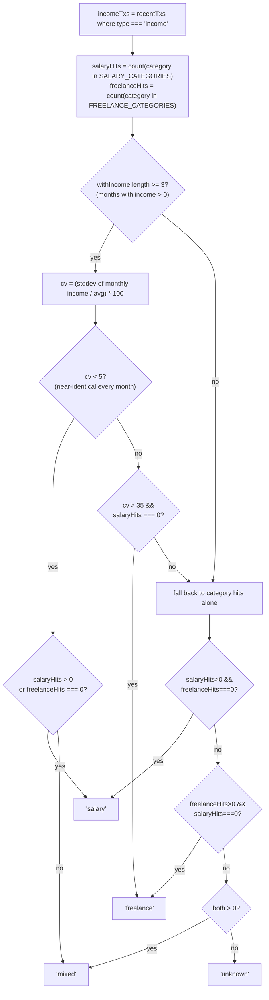

`cv` is the **coefficient of variation** of monthly income (standard deviation ÷ mean × 100). A salaried employee's income is nearly identical every month (`cv < 5`); a freelancer's varies a lot month-to-month (`cv > 35`).

> **Why this matters**: `incomeType` is threaded into `phraseIncomeAboveAvg`, `phraseIncomeBelowAvg`, `phraseIncomeDecline`, and `phraseIncomeYoYDrop` as `values.incomeType` (either `"salary"` or `"other"`/the raw type). The translation messages use ICU `select` syntax to choose different wording — a salaried user reads "your salary was..." while a freelancer reads "your income from clients was..." — **without any branching in the engine itself**. See [TRANSLATIONS.md](./TRANSLATIONS.md) for the `{incomeType, select, ...}` message format.

---

## 5. `buildHistoricalInsights()` — the "Financial Story"

```ts
export function buildHistoricalInsights(
  history: MonthPoint[],
  categories: CategoryTrend[],
  yearlySnapshots: YearlySnapshot[],
  seasonality: MonthlySeasonality[],
  incomeConcentration: {...} | undefined,
  locale: Locale
): RankedInsight[]
```

Returns a flat list of `{ key, values, category }`, where `category` is one of `"growth" | "cashflow" | "spending" | "seasonality" | "clients"`. The final list is **stable-sorted** by `INSIGHT_CATEGORY_PRIORITY`:

```ts
const INSIGHT_CATEGORY_PRIORITY: Record<InsightCategory, number> = {
  growth: 1, cashflow: 2, spending: 3, seasonality: 4, clients: 5,
};
```

— so insights are grouped growth-first, but *within* each category they stay in the order they were generated (Node/V8's sort is stable since ES2019, and this is relied upon).

`active = history.filter(h => h.income > 0 || h.expenses > 0)`. Every insight below is conditional — most require a minimum amount of history before they're considered meaningful enough to show.

### 5.1 Historical highlights

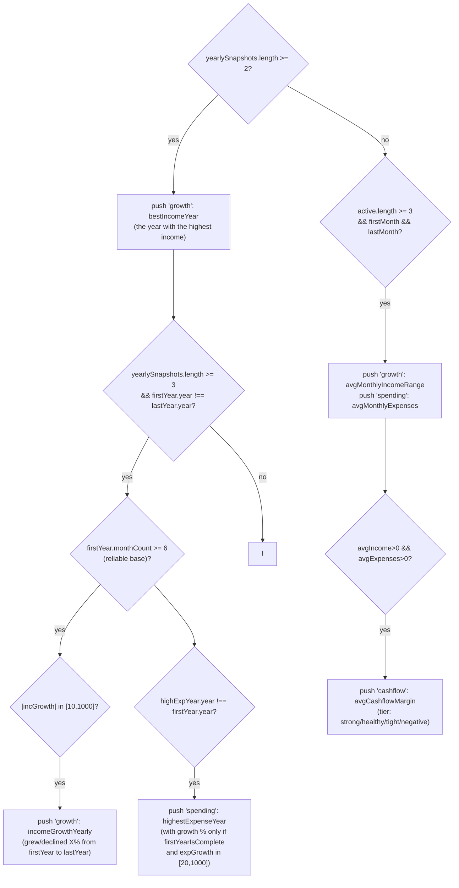

| Insight key | Category | Condition |
|---|---|---|
| `insights.bestIncomeYear` | growth | `yearlySnapshots.length >= 2`. The year with the highest `income`. |
| `insights.incomeGrowthYearly` | growth | `yearlySnapshots.length >= 3`, `firstYear.year !== lastYear.year`, `firstYear.monthCount >= 6` (a partial first year would produce absurd %s), and `10 <= |incGrowth| <= 1000`. `firstYear`/`lastYear` are the first/last entries of `yearlySnapshots`. |
| `insights.highestExpenseYear` | spending | Same outer conditions as above, plus `highExpYear.year !== firstYear.year` (the year with the highest `expenses` differs from the base year). `withGrowth: "yes"` only if `firstYearIsComplete && 20 <= expGrowth <= 1000`, else `"no"` (still shows the amount, just not the %). |
| `insights.overallCashflowMargin` | cashflow | `yearlySnapshots.length >= 2` and `totalInc > 0` (sum of all yearly incomes). `margin = round((totalInc - totalExp) / totalInc * 100)`. `tier`: `≥20` strong, `≥10` healthy, `≥0` tight, `<0` negative. |
| `insights.longestPositiveStreak` | cashflow | `yearlySnapshots.length >= 2` and `longestPositiveStreakWithDates(active)` returns non-null (streak ≥ 3 months). |
| `insights.avgMonthlyIncomeRange` | growth | *Only if `yearlySnapshots.length < 2`*: `active.length >= 3`. Shows `avgIncome` across the full `firstMonth`–`lastMonth` range. |
| `insights.avgMonthlyExpenses` | spending | Same branch as above — always paired with `avgMonthlyIncomeRange`. |
| `insights.avgCashflowMargin` | cashflow | Same branch, plus `avgIncome > 0 && avgExpenses > 0`. `avgCfMargin = round((avgIncome - avgExpenses) / avgIncome * 100)`, same tier thresholds as `overallCashflowMargin`. |

### 5.2 Best income month

| Insight key | Category | Condition |
|---|---|---|
| `insights.bestIncomeMonth` | growth | `active.length >= 3` and the best month's `income > 0`. The single highest-income month across **all** history (not just the current year). |

### 5.3 Cashflow consistency checks

| Insight key | Category | Condition |
|---|---|---|
| `insights.negativeCashflowRecent` | cashflow | `active.length >= 6` and `≥3` of the **last 6 active months** had `cashflow < 0`. |
| `insights.cashflowMarginDeclined` | cashflow | `yearlySnapshots.length >= 2`. Compares the last two years' cashflow margins (`cashflow / income`). Triggers if `prevMargin > 0.1` (previous year was healthy, >10% margin) **and** `lastMargin < prevMargin * 0.5` (margin at least halved). |

### 5.4 Income gap detection

| Insight key | Category | Condition |
|---|---|---|
| `insights.incomeGapsDetected` | cashflow | At least one month in **all of history** has `income === 0 && expenses > 0` (`incomeGaps`), `active.length >= 6`, **and** at least one such gap falls within the last 12 months relative to `lastMonth` (`recentGaps.length >= 1`). Shows `totalGaps` (all-time count) and the average expenses during gap months. |

> Note: this is a different (broader, all-time `totalGaps` with a recency *gate*) calculation from the "Biggest Risk" income-gaps check in §6.8, which counts only gaps within the last 12 months and uses that count directly.

### 5.5 Seasonal insights

```ts
const activeSeason = seasonality.filter((s) => s.sampleCount >= 2 && s.avgIncome > 0);
```

Requires `activeSeason.length >= 4` (at least 4 calendar months with ≥2 years of data each and non-zero income) before any seasonal insight is generated.

| Insight key | Category | Condition |
|---|---|---|
| `insights.seasonalIncomePeak` | seasonality | `quarterData.length >= 2` (at least 2 quarters with `income > 0` via `quarterAvg`), the peak and lowest quarters differ, and `pct(peakQ.income, lowestQ.income) > 10`. |
| `insights.seasonalExpensePeak` | seasonality | The quarter with the highest average expenses has `expenses > 0` and is `>15%` above the average of all quarters' expenses. |
| `insights.seasonalStrongestWeakestMonth` | seasonality | The single calendar month (1–12) with the highest `avgIncome` differs from the one with the lowest, across `activeSeason`. |

### 5.6 Category insights

For each of the **first 6** `categories` (already sorted by `getCategoryInsights`, see [ANALYTICS_ENGINE.md](./ANALYTICS_ENGINE.md)), `categoryYearRange(c)` must return non-null and `from !== to` (the category has spending in at least 2 distinct years).

```ts
const totalGrowth = pct(toAmt, fromAmt);
const years = to - from;
```

| Insight key | Category | Condition |
|---|---|---|
| `insights.categoryGrew` | spending | `c.yearOverYearTrend === "growing"` and `20 <= totalGrowth <= 1000`. |
| `insights.categoryFell` | spending | `c.yearOverYearTrend === "declining"` and `totalGrowth <= -20`. |
| `insights.categoryDoubled` | spending | Neither of the above, but `toAmt > fromAmt * 2` (more than doubled, regardless of the `yearOverYearTrend` label). |

Each of these three is **mutually exclusive** per category (`else if` chain) — a category contributes at most one of these insights.

> **Why `categoryGrew` is capped at 1000%**: `fromAmt` (the earliest year's total) can be tiny for a category that barely existed back then — e.g. one €20 bank fee in 2022. If `toAmt` later grows to €340, `pct(340, 20)` = **1600%**, producing a technically-correct but absurd-sounding *"Banking fees spending grew 1600% over 4 years"*. Capping at `<= 1000` (matching the same cap used for `incomeGrowthYearly`/`highestExpenseYear` in §5.1) excludes these cases from `categoryGrew`; they fall through to `categoryDoubled` instead, which conveys "more than doubled" without citing the inflated percentage. `categoryFell` doesn't need a symmetric cap — a percentage decrease is mathematically bounded at -100%.

| Insight key | Category | Condition |
|---|---|---|
| `insights.categorySubscriptionsGrewEveryYear` | spending | The `"subscriptions"` or `"software"` category has `≥3` years of data **and** its yearly total never decreased year-over-year (`growingEveryYear`). |

### 5.7 Client / income concentration

| Insight key | Category | Condition |
|---|---|---|
| `insights.clientConcentration` | clients | `incomeConcentration.totalSources > 0 && incomeConcentration.isHighConcentration`. Shows `topSourcePct` and, if known, `topSourceDesc`. |
| `insights.incomeReasonablyDiversified` | clients | `incomeConcentration.totalSources > 0 && !isHighConcentration`. Shows `topSourcePct` and `totalSources`. |

These two are mutually exclusive. See [ANALYTICS_ENGINE.md §`getIncomeConcentration`](./ANALYTICS_ENGINE.md) for `isHighConcentration`'s definition (`topPct >= 50 && sources <= 4`).

---

## 6. `generateDashboardIntelligence()` — the main intelligence object

```ts
export function generateDashboardIntelligence(
  current: {totalIncome, totalExpenses, totalSavings, netCashflow} | null,
  previous: {...} | null,
  changes: {income, expenses, savings, cashflow} | null,
  history: MonthPoint[],
  recentTxs: RecentTx[],
  forecast: {projectedIncome, projectedExpenses, projectedSavings, projectedCashflow, basedOnMonths} | null,
  categories: CategoryTrend[],
  yearlySnapshots: YearlySnapshot[],
  seasonality: MonthlySeasonality[],
  incomeConcentration: {...} | undefined,
  locale: Locale,
  intentBreakdown?: {        // Optional — from getIntentBreakdown(). null when coverage < 80%.
    businessProfit: number;
    businessRevenue: number;
    profitMarginPct: number | null;
    familySupport: number;
    savingsMovement: number;
    savingsWithdrawal: number;
    trueNetCashflow: number;
    intentCoveragePct: number;
  } | null,
  financialLife?: FinancialLifeIntelligence | null,
  clientConcentrationTrend?: {   // Computed in dashboard/page.tsx from clientData.clients[].monthlyRevenue[]
    currentPct: number;           // Top client's % of income this month
    rollingAvgPct: number;        // Top client's avg % across the prior 5 months
    topClientName: string | null;
  } | null
): DashboardIntelligence
```

### `DashboardIntelligence` field reference

| Field | Type | Populated by | Consumed by |
|---|---|---|---|
| `snapshotSummary` | `Insight \| null` | §6.1 | `SummaryCards` (Dashboard), `FirstUploadBanner` |
| `snapshotContext` | `Insight[]` | §6.2 | `SummaryCards` (Dashboard) |
| `comparisonInterpretation` | `Insight \| null` | §6.3 | `MonthlyComparison` (Dashboard) |
| `trajectoryInsight` | `Insight \| null` | §6.4 | `TrendsChart` (Dashboard), Forecast page "Business Direction" card |
| `trajectoryDetails` | `Insight[]` | §6.4 | `TrendsChart` (Dashboard) |
| `forecastReasons` | `Insight[]` | §6.6 | `ForecastWidget` (Dashboard) |
| `forecastImprovements` | `Insight[]` | §6.6 | `ForecastWidget` (Dashboard), Forecast page "Recommended Actions" |
| `cashflowDeficitReason` | `Insight \| null` | §6.6 | `ForecastWidget` (Dashboard) |
| `healthStatus` | `"healthy" \| "watch" \| "at-risk"` | §6.5 | Dashboard header badge, Forecast page Health Score `statusScore` (see [FORECAST_ENGINE.md §8](./FORECAST_ENGINE.md)) |
| `healthStatusExplanation` | `Insight \| null` | §6.5 | Forecast page health narrative banner |
| `intentInsights` | `Insight[]` | §6.12 | `<BusinessIntelligence />` on the Dashboard (intent KPI bullet list) |
| `lifeInsights` | `Insight[]` | §6.13 | `<BusinessIntelligence />` on the Dashboard (financial life bullet list, below intent insights) |
| `businessTrendDirection` | `"improving" \| "stable" \| "weakening"` | §6.7 | Forecast page "Business Direction" card |
| `biggestRisk` | `Insight \| null` | §6.8 | Forecast page "Biggest Risk" card |
| `biggestOpportunity` | `Insight \| null` | §6.9 | Forecast page "Biggest Opportunity" card |
| `seasonalInsights` | `Insight[]` | §6.10 (derived from `buildHistoricalInsights`) | Forecast page "Seasonal Insights" |
| `notableTransactions` | `Insight[]` | §6.11 | `RecentTransactions` (Dashboard) |

### Early exit — no data

```ts
if (!current) return empty; // healthStatus: "watch", everything else null/[]
```

`empty.snapshotSummary = { key: "insights.snapshot.uploadPrompt" }` — this is what a brand-new account sees before any CSV is uploaded.

### Setup

```ts
const active = history.filter((h) => h.income > 0 || h.expenses > 0);
const avgIncome = avg(active.map((h) => h.income));
const avgExpenses = avg(active.map((h) => h.expenses));
const incomeType = detectIncomeType(recentTxs, active);
const firstMonth = active[0] ?? null;
const lastMonth = active[active.length - 1] ?? null;
```

---

### 6.1 Snapshot Summary

```ts
const incUp   = changes && changes.income > 2;
const expDown = changes && changes.expenses < -2;
const incDown = changes && changes.income < -5;
const expUp   = changes && changes.expenses > 5;
const cashflowOk = current.netCashflow >= 0;
```

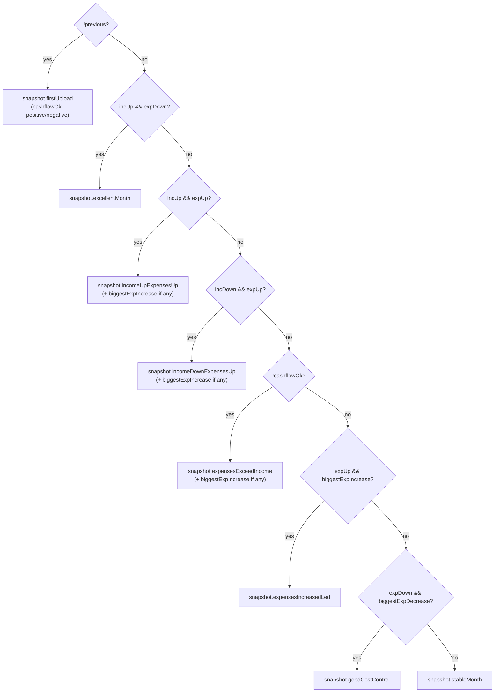

`biggestExpIncrease = topChangedCategories(categories, "up", 1)[0]` (the single category with the largest `changeAmount > 5`); `biggestExpDecrease` is the equivalent for `"down"`.

> **Why the asymmetric thresholds** (`incUp > 2%` but `incDown < -5%`; `expDown < -2%` but `expUp > 5%`)? A small income *increase* (>2%) is worth acknowledging as good news, but a small income *decrease* needs a higher bar (>5%) before it's framed negatively — normal month-to-month noise shouldn't read as "your income dropped." The same asymmetry applies to expenses: small expense *reductions* are flagged readily (good news, low bar), but expense *increases* need to be more than noise (>5%) before they're called out.

---

### 6.2 Snapshot Context

Up to 3 entries, pushed in order:

1. **`insights.context.analysisCovers`** — if `firstMonth && lastMonth && active.length > 1`. States the full date range and month count being analyzed.
2. **Income vs. average** — if `avgIncome > 0`, compares `current.totalIncome` to `avgIncome` via `pct()`:
   - `diff > 5` → `phraseIncomeAboveAvg(incomeType, ...)` (`insights.context.incomeAboveAvg`)
   - `diff < -5` → `phraseIncomeBelowAvg(incomeType, ...)` (`insights.context.incomeBelowAvg`)
   - else → `insights.context.incomeInLine`
3. **Expenses vs. average** — if `avgExpenses > 0`, compares `current.totalExpenses` to `avgExpenses`:
   - `diff > 10 && topCat` (top category exists) → `insights.context.expensesAboveAvgTopCat` (names `categories[0]` and its `currentMonthTotal`)
   - `diff < -10` → `insights.context.expensesBelowAvg`
   - else → nothing pushed (only "notably" above/below average is worth mentioning here)

After the 3 main entries above, 4 additional financial-life context insights are appended (each only fires if the relevant condition is met and earlier overlapping insights haven't already been shown):

4. **Cashflow drop** — if `previous.netCashflow > 0` and this month's cashflow fell by both >€100 and >15%:
   - If a single expense category (`biggestExpIncrease`) accounts for >30% of the drop → `insights.context.cashflowDropWithDriver` (names the category and its increase amount)
   - Otherwise → `insights.context.cashflowDrop` (shows the amount)
5. **Savings drop** — skipped if a cashflow-drop insight was already pushed. Fires if `previous.totalSavings > 200` and current savings dropped below 50% of last month's → `insights.context.savingsDrop`.
6. **Expenses rising trend** — skipped if an expense or cashflow insight was already pushed. Fires if the last 3 consecutive active months each had higher expenses than the one before, and the month-over-month rise is ≥15% → `insights.context.expensesRisingTrend`.
7. **Client concentration rising** — if `clientConcentrationTrend` is provided and the top client's share this month is ≥50% *and* is ≥15 percentage points above their rolling average → `insights.context.clientConcentrationRising`. `clientConcentrationTrend` is computed in `dashboard/page.tsx` from `clientData.clients[].monthlyRevenue[]` (already fetched for the client center) and passed as the last argument to this function.

---

### 6.3 Comparison Interpretation

```ts
const { income: ic, expenses: ec } = changes;
const driversUp = topChangedCategories(categories, "up", 2);
const driversDown = topChangedCategories(categories, "down", 2);
```

`driverValues(cats, useAbs)` builds `{ driverCount: "0"|"1"|"2", cat1, amt1, cat2, amt2 }` from up to 2 `CategoryTrend`s — `useAbs` controls whether `changeAmount` is wrapped in `Math.abs()` before formatting (used when the message phrases the change as a reduction, e.g. "thanks to cutting back on X by €Y").

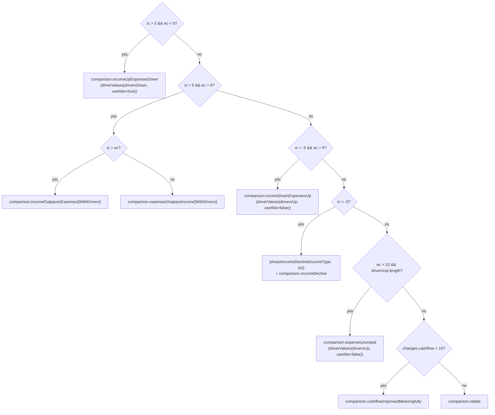

`[WithDrivers]` variants are only used `if (driversUp.length)` — otherwise the plain `incomeOutpacesExpenses`/`expensesOutpaceIncome` keys are used (no category names to show).

---

### 6.4 Trajectory — analyses the **complete** uploaded history

```ts
const spanMonths = active.length;
const firstPoint = active[0];
const lastPoint = active[active.length - 1];
const growingExpCats = categories.filter(c => c.yearOverYearTrend === "growing").slice(0, 2);
```

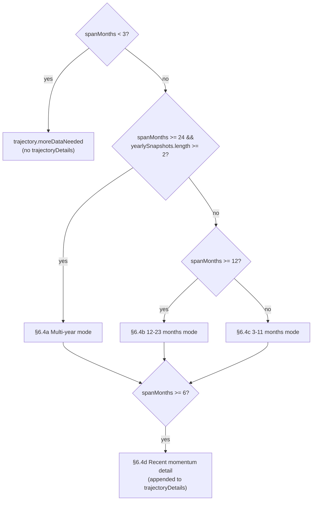

#### 6.4a Multi-year mode (`spanMonths >= 24 && yearlySnapshots.length >= 2`)

```ts
const lastYear = yearlySnapshots[yearlySnapshots.length - 1];
const reliableBase = yearlySnapshots.find(y => y.monthCount >= 6) ?? yearlySnapshots[0];
const yearSpan = lastYear.year - reliableBase.year;
const totalIncGrowth = pct(lastYear.income, reliableBase.income);
```

- **`trajectoryInsight`** = `insights.trajectory.multiYear` — `direction`: `"grew"` if `totalIncGrowth > 10`, `"declined"` if `< -10`, else `"stable"`. Spans from `reliableBase.year` to `lastYear.year`.
- **`trajectoryDetails`** — one entry **per year after the first** in `yearlySnapshots`:
  - If the *previous* year had `monthCount < 6` (partial year — % would be meaningless) → `insights.trajectory.yearSummaryPartial` (just states totals, no comparison).
  - Otherwise → `insights.trajectory.yearOverYear`:
    - `direction`: `"up"` if `yoyInc > 5`, `"down"` if `< -5`, else `"stable"`.
    - `expNote`: `"faster"` if `yoyExp > yoyInc + 5 && yoyExp <= 1000` (expenses grew faster than income); `"fell"` if `yoyExp < -5`; else `"none"`.

#### 6.4b 12–23 months mode

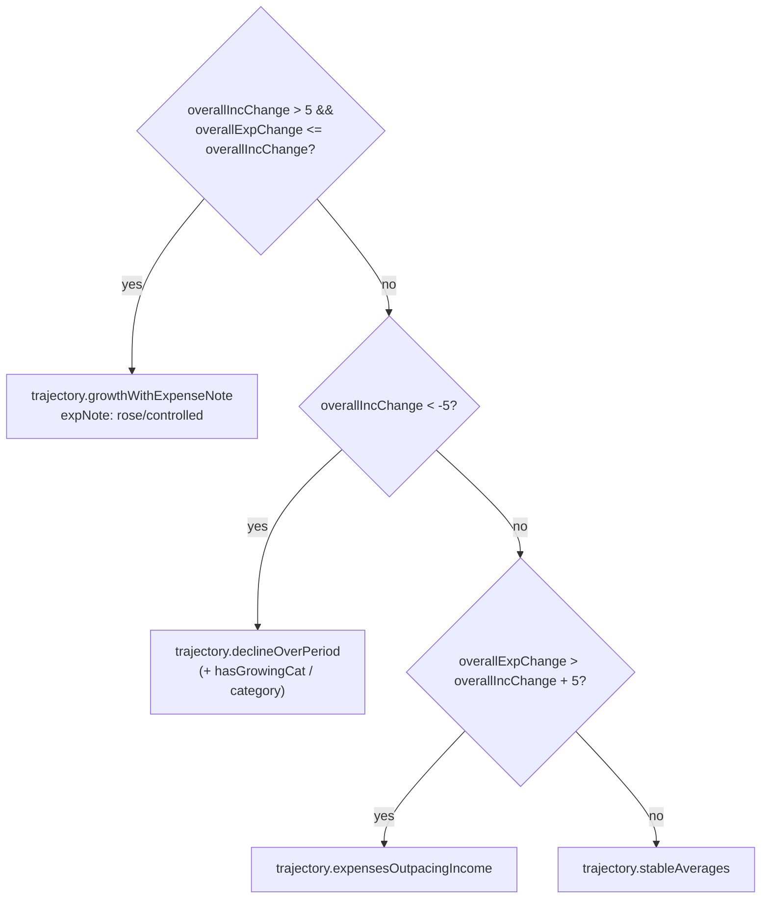

`overallIncChange = pct(lastPoint.income, firstPoint.income)`, `overallExpChange = pct(lastPoint.expenses, firstPoint.expenses)` — i.e. the change from the **first** active month to the **last**, over the whole span.

Additionally, **always** (regardless of which branch above fired), the span is split into first/second halves (`mid = floor(spanMonths/2)`) and two `trajectoryDetails` entries are pushed:
- `insights.trajectory.firstHalf` — average income/expenses for the first half.
- `insights.trajectory.secondHalf` — average income/expenses for the second half, plus `incSign`/`incChange` (vs. first half) and `expNote: "higher"` if `halfExpChange > 5`.

#### 6.4c 3–11 months mode

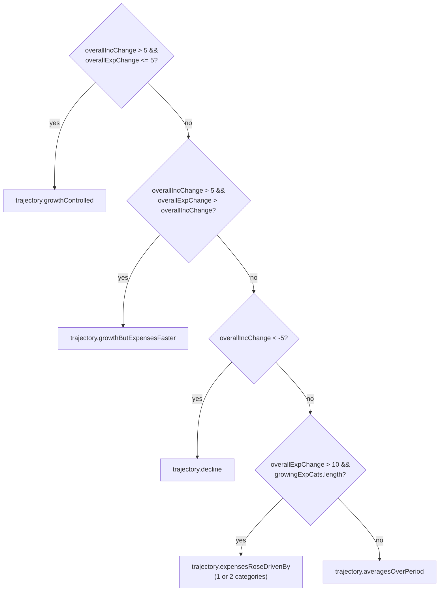

`trajectoryDetails` (each only if the threshold is met):
- `insights.trajectory.incomeChange` — if `|overallIncChange| >= 5`. `sign: "pos"|"neg"`.
- `insights.trajectory.expenseChange` — if `|overallExpChange| >= 5`. `sign: "pos"|"neg"`.

#### 6.4d Recent momentum (all spans ≥ 6 months)

```ts
const recent3 = active.slice(-3);
const prior3  = active.slice(-6, -3);
const momentum = pct(avg(recent3.income), avg(prior3.income));
```

If `|momentum| >= 10`, push `insights.trajectory.recentMomentum` — `sign: "pos"|"neg"`, with both 3-month windows' date ranges and average incomes. This is appended **in addition to** whatever `trajectoryDetails` the size-based branch above produced.

---

### 6.5 Health Status

Health status uses **dual-axis scoring** when intent data is available (coverage ≥ 80%), and falls back to cashflow-based logic otherwise.

#### Dual-axis path (`intentBreakdown && intentCoveragePct >= 80`)

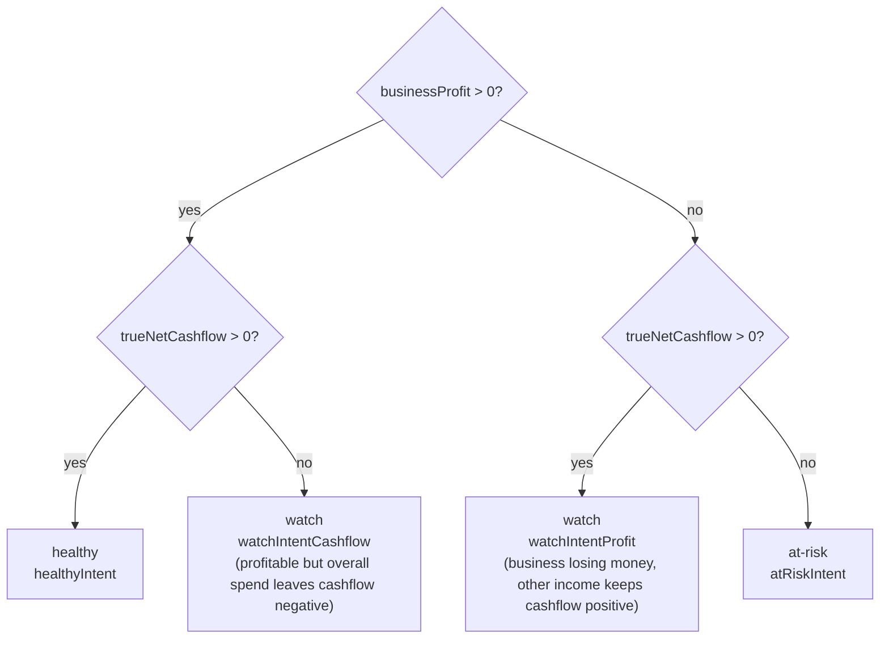

| `healthStatus` | Condition | `healthStatusExplanation` key |
|---|---|---|
| `"healthy"` | `businessProfit > 0` **and** `trueNetCashflow > 0` | `insights.health.healthyIntent` |
| `"watch"` | `businessProfit > 0` but `trueNetCashflow <= 0` | `insights.health.watchIntentCashflow` |
| `"watch"` | `businessProfit <= 0` but `trueNetCashflow > 0` | `insights.health.watchIntentProfit` |
| `"at-risk"` | `businessProfit <= 0` **and** `trueNetCashflow <= 0` | `insights.health.atRiskIntent` |

#### Cashflow-based fallback (`intentCoveragePct < 80` or no intentBreakdown)

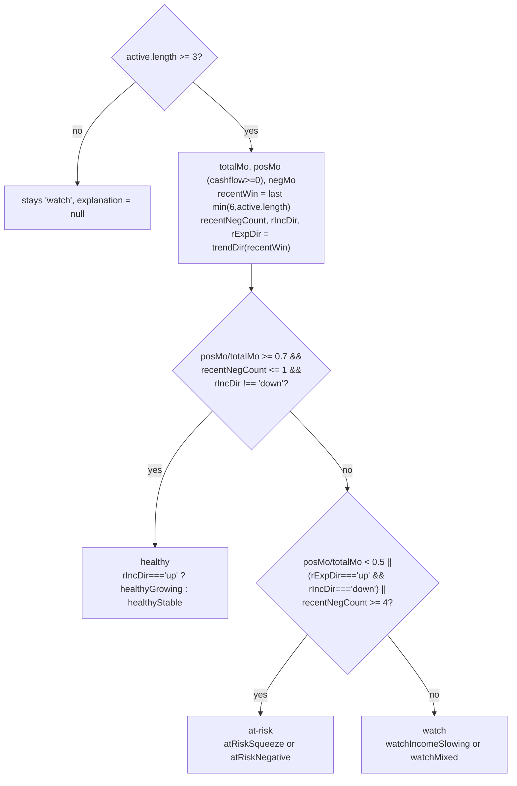

`recentWin = active.slice(-Math.min(6, active.length))`. `rIncDir`/`rExpDir` are `trendDir()` over that window.

> With `active.length < 3`, `healthStatus` stays `"watch"` and `healthStatusExplanation` stays `null` — `trajectoryInsight` (`moreDataNeeded`) already covers that case.

---

### 6.6 Business Trend Direction

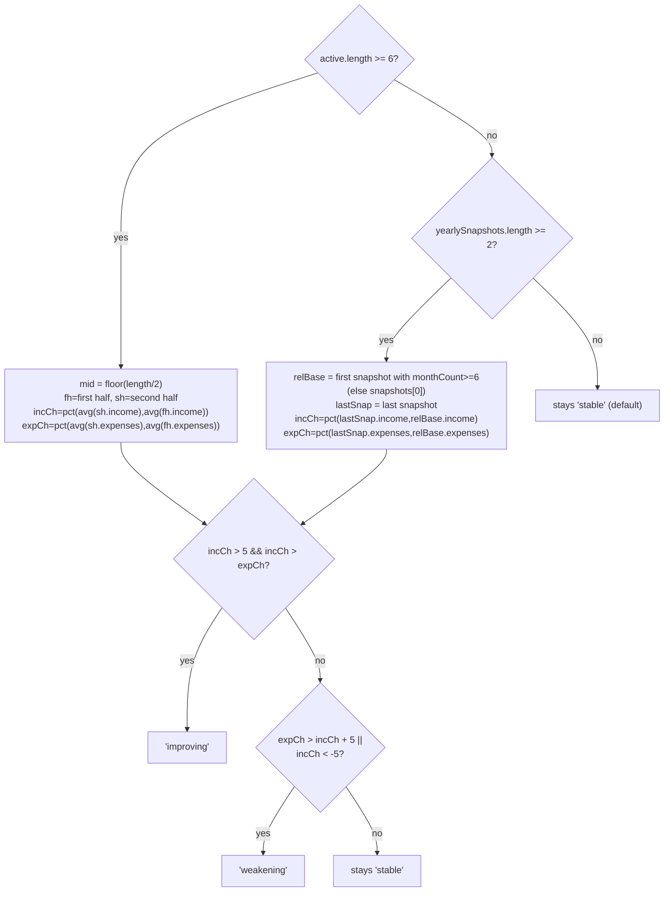

This is the field shown in the Forecast page's "Business Direction" card (label + `trajectoryInsight` text underneath) and feeds `statusScore` indirectly via `healthStatus` is **not** the same thing — `businessTrendDirection` and `healthStatus` are computed independently and can disagree (see [FORECAST_ENGINE.md §8](./FORECAST_ENGINE.md) for why that's intentional).

---

### 6.7 Forecast Reasons, Cashflow Deficit Reason, Forecast Improvements

All three are computed together, only `if (forecast && active.length >= 2)`:

```ts
const totalMonths = active.length;
const posMonths = active.filter(h => h.cashflow >= 0).length;
const negMonths = totalMonths - posMonths;
const posPct = Math.round((posMonths / totalMonths) * 100);

const recent3 = active.slice(-3);
const prior3  = active.length >= 6 ? active.slice(-6, -3) : [];
const incTrendRecent = prior3.length ? trendDir([...prior3.income, ...recent3.income]) : "stable";
const expTrendRecent = prior3.length ? trendDir([...prior3.expenses, ...recent3.expenses]) : "stable";
```

#### `forecastReasons` (ordered, rendered as a small list by `ForecastWidget`)

| # | Key | Always pushed? | Condition |
|---|---|---|---|
| 1 | `insights.forecast.basis` | yes | header subtext — "based on N months" |
| 2 | `cashflowPositiveHigh` / `cashflowPositiveMedium` / `cashflowNegative` | yes | `posPct >= 75` / `posPct >= 50` / else |
| 3 | `incomeTrendingUp` / `incomeDipWithinGrowth` / `incomeDeclining` / `incomeStable` | yes | `incTrendRecent === "up"` → up; `=== "down"` → `incomeDipWithinGrowth` if `businessTrendDirection === "improving"` (a recent 3-month dip doesn't contradict an overall "Improving" trend — framed as a pullback, not a decline), else `incomeDeclining`; else `incomeStable` |
| 4 | `expensesRisingLed` / `expensesRisingGeneral` | only if `expTrendRecent === "up"` | `expensesRisingLed` if a growing expense category exists, else `expensesRisingGeneral` |

#### `cashflowDeficitReason` — only if `forecast.projectedCashflow < 0`

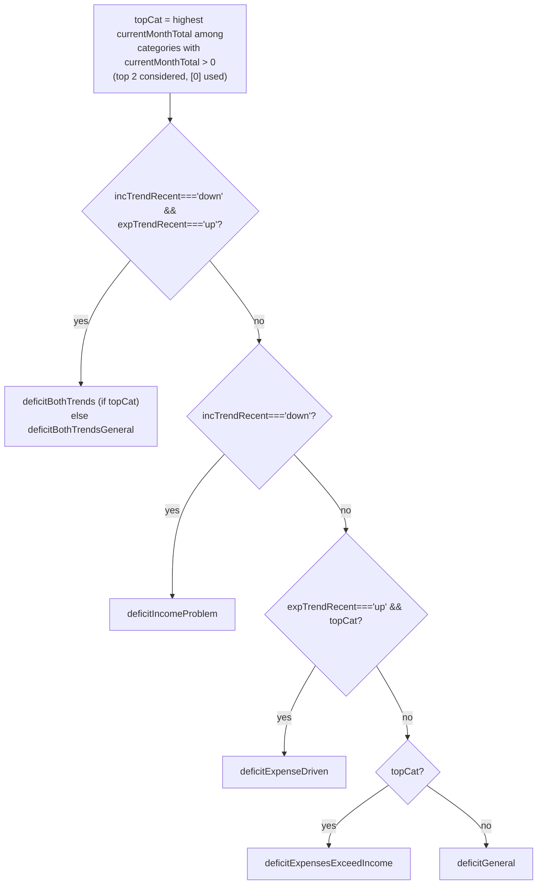

`topCatPct = round(topCat.currentMonthTotal / recentExpAvg * 100)` — what fraction of recent average monthly expenses this one category represents. `isGrowing = topCat?.yearOverYearTrend === "growing"`, passed as `growing: "yes"|"no"` to the `deficitExpenseDriven`/`deficitExpensesExceedIncome` messages.

#### `forecastImprovements` (ordered, up to 4 shown via `.slice(0, 4)` on the Forecast page)

```ts
const cashflowMargin = forecast.projectedIncome > 0
  ? Math.round((forecast.projectedCashflow / forecast.projectedIncome) * 100) : 0;
```

1. **`reduceSubscriptions`** — if a `"subscriptions"`/`"software"` category exists with `currentMonthTotal > 50` **and** `cashflowMargin < 30`. `reduction = round(currentMonthTotal * 0.3)`, `annual = reduction * 12`.
   > Gated on `cashflowMargin < 30` deliberately — "cut your subscriptions" reads as generic noise when cashflow is already comfortable.
2. **`restoreCashflow`** — if `forecast.projectedCashflow < 0`. Shows the deficit amount.
3. **`phraseIncomeYoYDrop`** (→ `insights.forecast.incomeYoYDrop`) — if `incTrendRecent !== "up"` and `yearlySnapshots.length >= 2` and the most recent year's income declined YoY (`yoy < 0`).
4. **`marginLow` / `marginHealthy`** — only if `forecast.projectedCashflow >= 0` **and** `forecastImprovements.length < 2` (i.e. fewer than 2 improvements have been added so far — don't pile on more advice than needed). `marginLow` if `cashflowMargin < 20`, else `marginHealthy`.

---

### 6.8 Biggest Risk

Computed **unconditionally** (not gated on `forecast`), using its own 6-month window:

```ts
const riskWin = active.slice(-Math.min(6, active.length));
const riskIncDir = trendDir(riskWin.map(h => h.income));
const riskExpDir = trendDir(riskWin.map(h => h.expenses));
const topGrowingRisk = categories
  .filter(c => c.yearOverYearTrend === "growing" && c.category !== "uncategorized")
  .sort((a, b) => b.totalAllTime - a.totalAllTime)[0];
const uncatForRisk = categories.find(c => c.category === "uncategorized");
const uncatPctVal = uncatForRisk && totalExpAllTime > 0
  ? Math.round(uncatForRisk.totalAllTime / totalExpAllTime * 100) : 0;

// Anchored to lastMonth, NOT wall-clock today
const lastOrdinal = lastMonth ? lastMonth.year * 12 + lastMonth.monthNum : 0;
const recentIncomeGaps = lastMonth ? history.filter(h =>
  h.income === 0 && h.expenses > 0 && (h.year * 12 + h.monthNum) >= lastOrdinal - 11
) : [];
```

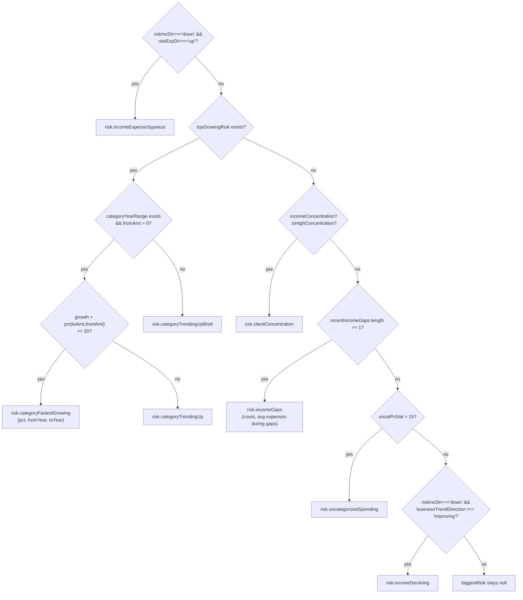

The priority order is deliberate — **structural problems first** (income declining while expenses rise), then **the single fastest-growing expense category**, then **client concentration** (the most dangerous freelancer-specific structural risk), then **income coverage gaps**, then **categorization quality**, and only last a **plain income decline** — and even then, only `if businessTrendDirection !== "improving"`:

> A recent 3–6 month dip shouldn't be flagged as "the biggest risk" when the broader multi-month/multi-year trend (`businessTrendDirection`) is still "improving" — that would contradict the headline "your business is growing" message elsewhere on the same page.

---

### 6.9 Biggest Opportunity

Computed **inside the same `if (forecast && active.length >= 2)` block** as §6.7 — if that condition is false, `biggestOpportunity` stays `null`.

```ts
const oppSubCat = categories.find(c =>
  c.category === "subscriptions" || c.category === "software" || c.category === "ai tools"
);
```

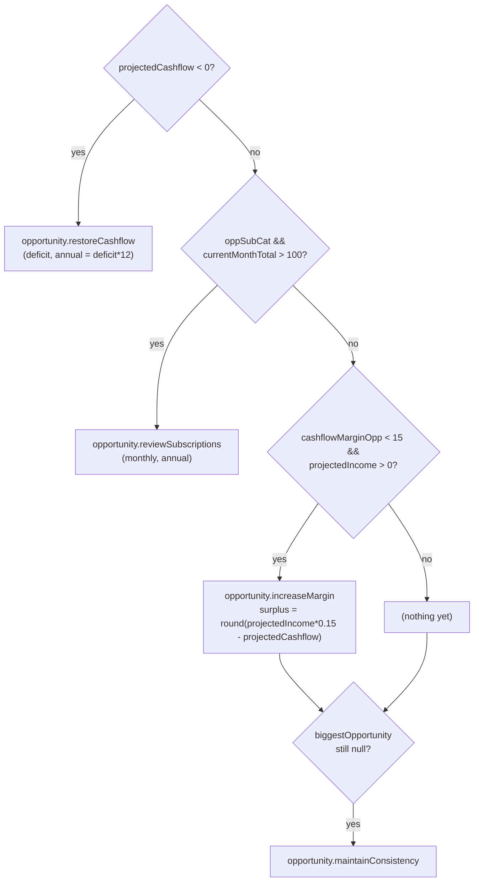

`opportunity.increaseMargin`'s `surplus` is "how much more cashflow you'd have at a 15% margin" — i.e. it frames the gap between the current projected margin and a 15% target as a concrete euro figure (and its annualized equivalent).

---

### 6.10 Seasonal Insights

```ts
const rankedInsights = buildHistoricalInsights(history, categories, yearlySnapshots, seasonality, incomeConcentration, locale);
const seasonalInsights = rankedInsights.filter(r => r.category === "seasonality").map(({key, values}) => ({key, values}));
```

This is **not** independently computed — it's the `"seasonality"`-tagged subset of §5's output, with the `category` tag stripped back off (since `DashboardIntelligence.seasonalInsights` is `Insight[]`, not `RankedInsight[]`).

> **Note**: because `buildHistoricalInsights()` is called again here, and the Dashboard page *also* calls it separately for `<HistoricalInsights />`, it runs **twice per Dashboard page render**. This is intentional (each call site needs a different shape — full ranked list vs. just the seasonality slice) and cheap (pure JS over already-small arrays), but worth knowing if you ever add expensive work inside `buildHistoricalInsights()`.

---

### 6.11 Notable Transactions

Only `if (recentTxs.length > 0)`:

| # | Key | Condition |
|---|---|---|
| 1 | `insights.notable.largestIncome` | if any `recentTxs` have `type === "income"` — the single largest by `amount`. |
| 2 | `insights.notable.largestExpense` | if any have `type === "expense"` — the single largest by `amount`. |
| 3 | `insights.notable.recurringCharges` | if any expense tx has `category` in `{"subscriptions","software"}` **or** its `description` (lowercased) includes `"subscription"`. Shows `count` and the **sum** of all matching amounts. |
| 4 | `insights.notable.highValueExpense` | only if `avgExpenses > 0`. Finds expenses where `amount > avgExpenses * 0.4 AND amount > 200` — both a *relative* (40% of typical monthly spend) and *absolute* (€200) bar, so this doesn't fire for someone with very low average expenses. Only the **first** match (`high[0]`) is shown. |

---

### 6.12 Intent Insights — `intentInsights`

Only populated when `intentBreakdown && intentCoveragePct >= 80`. Returned as `intentInsights: Insight[]` on `DashboardIntelligence` and rendered by `<BusinessIntelligence />` on the Dashboard as a bullet list (regular insights) plus an amber warning box (`incompleteDataWarning`).

| Insight key | Condition |
|---|---|
| `insights.intent.businessProfitHealthy` | `businessRevenue > 0 && businessProfit > 0` — shows profit amount and margin % |
| `insights.intent.businessProfitNegative` | `businessRevenue > 0 && businessProfit <= 0` — shows the loss amount |
| `insights.intent.profitMarginStrong` | Added after `businessProfitHealthy` when `margin >= 60` |
| `insights.intent.profitMarginLow` | Added after `businessProfitHealthy` when `margin < 30` |
| `insights.intent.familySupportCost` | `familySupport > 0 && active.length >= 3` — shows all-time total and per-month average |
| `insights.intent.savingsNetPosition` | `savingsMovement > 0` — shows deployed, withdrawn, and net (`net_saved` or `net_withdrawn` via ICU select) |
| `insights.intent.incompleteDataWarning` | `active.length >= 6` and last-3-month average income < 25% of prior historical average — signals a missing bank account CSV |

`incompleteDataWarning` is deliberately **not** rendered as a regular bullet — `<BusinessIntelligence />` filters it out of the main list and renders it separately as an amber warning box below the other insights.

### 6.13 Life Insights — `lifeInsights`

Populated from the optional `financialLife?: FinancialLifeIntelligence | null` parameter (from `src/lib/financial-life-engine.ts`). Only generates insights when `financialLife.hasEnoughData === true` (requires ≥5 intent-classified transactions spanning ≥2 months). Rendered by `<BusinessIntelligence />` in a separate section below `intentInsights`, using a `◦` bullet (vs `·` for intent insights) to visually distinguish temporal patterns from all-time metrics.

| Insight key | Condition |
|---|---|
| `insights.life.savingsStreak` | `consecutiveSavingsMonths >= 3` — rewards sustained savings habit |
| `insights.life.savingsWithdrawals` | `withdrawalsInLast6Months >= 3` — liquidity pressure signal |
| `insights.life.personalSpendUp` | `spending.trend === "increasing" && trendPct !== null` |
| `insights.life.personalSpendDown` | `spending.trend === "declining" && trendPct !== null` |
| `insights.life.revenueUp` | `business.revenueTrend === "increasing" && revenueTrendPct !== null` |
| `insights.life.revenueDown` | `business.revenueTrend === "declining" && revenueTrendPct !== null` |
| `insights.life.avgIncome12m` | `memory.avgMonthlyIncome12m > 0 && active.length >= 12` |

Trend direction (increasing / stable / declining) uses a ±10% threshold over last-3 vs prev-3 month windows. See `src/lib/financial-life-engine.ts` → `computeTrend()`.

---

## How to modify safely

### Add a new insight

1. Decide which function it belongs in:
   - **A historical fact about the whole dataset** (best year, longest streak, category trends) → `buildHistoricalInsights()`, tag it with the right `InsightCategory`.
   - **Something about "this month" vs. context, or feeding the Forecast page's risk/opportunity/health cards** → `generateDashboardIntelligence()`.
2. Add the translation key + message to **both** `messages/en.json` and `messages/fr.json` first (see [TRANSLATIONS.md](./TRANSLATIONS.md)) — `next-intl` will throw at render time if a key is missing, and it's easier to write the `values` object when you already know the placeholders the message needs.
3. Use `fmtAmt(n, locale)` for any currency amount (never format manually — it must stay locale-aware and always-positive). Use `monthYearLabel(year, month, locale, style)` for any month name. Use `cat(categoryId)` for any category name — **never** hardcode a category's display name or call a translation function for it inside this file.
4. If the insight should appear in the "Financial Story" / "Historical Insights" lists, give it an `InsightCategory` and add it via `push(category, {...})` inside `buildHistoricalInsights()`. If it's a one-off for a specific UI slot (risk, opportunity, snapshot, etc.), assign it directly to the relevant `DashboardIntelligence` field.

### Change a threshold (e.g. the `>5%`/`<-5%` "stable" band, the `0.7`/`0.5` health ratios, the `20%`/`10%` margin tiers)

- Search for the literal number — most thresholds are local `if` conditions, not named constants. When changing one, check whether the **same threshold appears in multiple places** that are meant to stay in sync:
  - The `trendDir()` ±5% band is reused by Health Status, Business Trend Direction, and the Forecast Reasons income/expense trend checks — changing it changes the meaning of "up/down/stable" everywhere.
  - The cashflow-margin tiers (`strong/healthy/tight/negative` at 20/10/0%) appear in `overallCashflowMargin` and `avgCashflowMargin` in `buildHistoricalInsights()` — keep them identical, or users will see inconsistent "tier" language for what should be the same concept.
  - `posMo/totalMo` and `posRatio` (Forecast page, [FORECAST_ENGINE.md §8–9](./FORECAST_ENGINE.md)) are **different but related** ratios — `healthStatus` here uses `active.length`-based ratios with a `>=3` minimum, while the Forecast page's `activeMonths`/`posRatio` has no such minimum. Don't assume they're interchangeable.

### Change the Biggest Risk / Biggest Opportunity priority order

- These are `if`/`else if` chains — **order is the priority**. Adding a new check means deciding where in the chain it belongs (it only fires if everything above it didn't match). Document *why* it goes where it does, the way the existing chain is commented (structural risks before category-level risks before a plain "income is down").
- Remember `biggestOpportunity` is `null` whenever `forecast` is `null` or `active.length < 2` — if you add a check that doesn't depend on `forecast`, you may need to move it outside that `if` block (and decide what should happen for brand-new accounts with <2 months of data).

### Things to be careful about

- **`intelligence-engine.ts` has zero database/network access and zero `next-intl` server calls** — it's a pure function, fully unit-testable with plain objects. Keep it that way; any DB lookups belong in the calling `page.tsx` (or in `analytics-engine.ts` / `forecast-engine.ts`), passed in as arguments.
- **`locale` is used only for number/date formatting** (`fmtAmt`, `monthYearLabel`) — category names are **never** translated here (`cat()` defers that to render time). If you find yourself wanting to call a translation function inside `intelligence-engine.ts`, that's a sign the value should be a `cat(...)` sentinel (or a new sentinel type, if it's not a category) instead.
- **`active = history.filter(h => h.income > 0 || h.expenses > 0)`** is recomputed in *both* exported functions, and similar `activeMonths` filters exist independently on the Forecast and Dashboard pages (see [FORECAST_ENGINE.md §8](./FORECAST_ENGINE.md)). They're meant to describe the same concept ("months where the user actually had financial activity") — if you change this filter's definition, grep for `income > 0 || .*expenses > 0` across `src/` and update all of them together, or the Dashboard/Forecast pages can disagree about how many "active months" the user has.
- **Income-gap and "recent" calculations are anchored to `lastMonth` (the user's last data point), not `new Date()`** — consistent with the analytics engine's "anchor to the data" principle (see [ANALYTICS_ENGINE.md](./ANALYTICS_ENGINE.md)). Keep new "recent N months" logic anchored the same way.
- **`ForecastWidget`, `SummaryCards`, `RecentTransactions`, `MonthlyComparison`, `TrendsChart`, `HistoricalInsights`, and `FinancialStory`** are the components that actually render these insights — if a new `Insight` field is added to `DashboardIntelligence`, it needs to be threaded through to one of these (or a new component) in the relevant `page.tsx`, or it will be computed but never shown.
