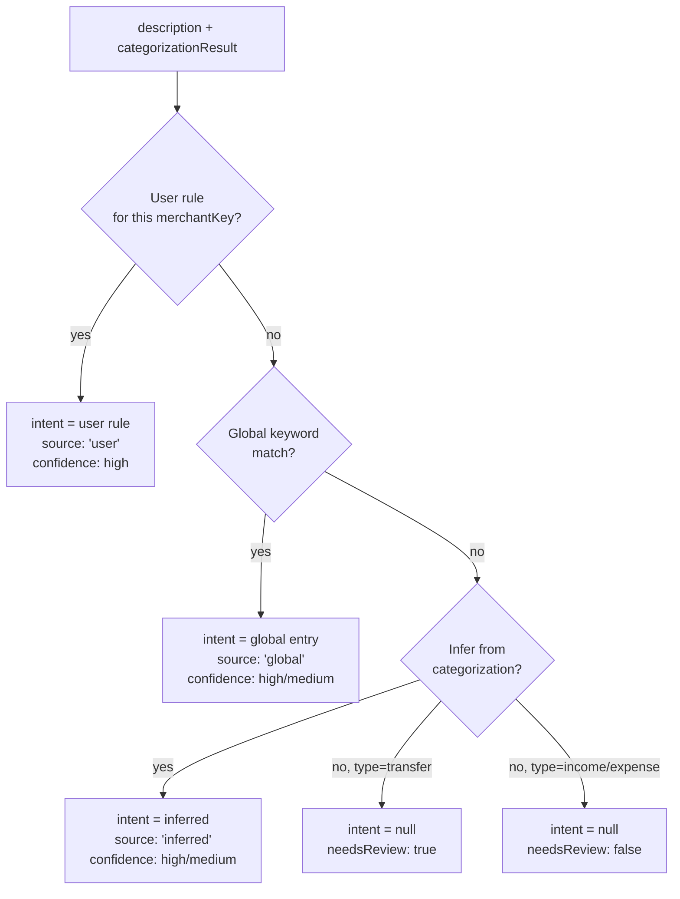

# Transaction Understanding

- **What it does**: Adds a financial *intent* layer on top of the existing categorization system, answering "WHY did money move?" where the existing system only answers "HOW is it counted?".
- **Why it exists**: Bank labels like "Transfer" and "Payment" are banking actions, not financial meanings. A transfer to WorldRemit is family support; a transfer to a brokerage is an investment; a transfer to the owner's personal account is an owner draw. Treating all three as a generic "transfer" obscures the user's real financial behaviour.
- **Where the code is**: `src/lib/intent-engine.ts` (classification logic); `prisma/schema.prisma` (`IntentRule`, `UserIntentRule` models + four new fields on `Transaction`); `src/app/api/transactions/[id]/intent/route.ts` (user classification endpoint).

---

## 1. The three-layer model

Every transaction now carries three orthogonal dimensions:

| Dimension | Field | Answers | Example |
|---|---|---|---|
| **Transaction Type** | `transactionType` | How is it counted in analytics? | `transfer` |
| **Category** | `category` | What kind of thing is it? | `transfer` |
| **Financial Intent** | `intent` | Why did money move? | `family_support` |

`transactionType` is the only field that affects `MonthlyAnalytics` aggregation — it is unchanged by the intent system. Intent is a parallel signal, never a replacement for the existing analytics-bucketing.

---

## 2. Financial intent taxonomy

```
internal_transfer   — Own-account movement (Monzo → Revolut, pot transfer)
savings_transfer    — Moving money to a dedicated savings account
investment          — Stocks, ETFs, crypto (Trading212, DeGiro, Coinbase…)
family_support      — Remittance to family (WorldRemit, TaptapSend…)
owner_draw          — Business → personal withdrawal
loan_repayment      — Mortgage, personal loan, student debt
freelance_income    — Client/platform payments (Stripe, Upwork…)
salary              — Regular employment payroll
passive_income      — Dividends, interest, rental income
refund              — Money returned by a vendor or service
business_expense    — Work-related cost (software, equipment, marketing…)
personal_expense    — Personal spending (food, health, transport…)
tax_payment         — Payment to a tax authority (HMRC, URSSAF, IRS…)
subscription        — Recurring software / service subscription
```

---

## 3. `classifyIntent(description, catResult, userRules)` — how intent is assigned



**Layer 1 — User rule** (highest priority): the user has previously classified a merchant via `POST /api/transactions/[id]/intent`. This is ground truth and is never overridden by any other layer.

**Layer 2 — Global keywords**: 70+ well-known merchants and phrases mapped to intents at module load time (e.g. `"worldremit"` → `family_support`, `"trading 212"` → `investment`). Longest-match wins — `"to my isa"` shadows `"isa"`.

**Layer 3 — Categorization inference**: when no keyword matches, the existing categorization result gives enough signal for common cases (income sub-types, expense categories, savings type).

**Layer 4 — Flag for review**: if we still cannot determine intent AND the transaction is a `transfer`, it is flagged `needsReview: true`. Income and expense transactions without an explicit intent are still readable from their category, so they are NOT flagged.

### Confidence interpretation

| Confidence | Source | Meaning |
|---|---|---|
| `high` | user or global | We are certain — matches a known merchant or confirmed by the user |
| `medium` | global or inferred | Strongly likely but could occasionally be wrong |
| `low` | — | Not currently assigned — would indicate a very weak heuristic if added in future |
| `null` | — | No intent determined; check `needsReview` |

---

## 4. The learning system

### Per-user rules (`UserIntentRule`)

When a user classifies a transaction:

```
POST /api/transactions/{id}/intent
{ "intent": "family_support", "applyToSimilar": true }
```

The engine:
1. Validates `intent` is a known `FinancialIntent`.
2. Upserts a `UserIntentRule` row keyed on `normalizeMerchantKey(description)`.
3. Updates the target transaction (`intentSource: "user"`, `needsReview: false`).
4. If `applyToSimilar: true`, propagates to all transactions sharing the same normalized description (sets `intentSource: "user"`, `needsReview: false`).

On every subsequent CSV import (or recategorize-all pass), user intent rules are loaded first and injected into `classifyIntent` — so `Taptap Send → family_support` is applied automatically from the first import after the user classifies it once.

### Global rules vs user-specific overrides

Priority order (highest first):

1. **`UserIntentRule`** — user-confirmed, survives re-imports
2. **Static global entries** in `src/lib/intent-engine.ts` — covers 70+ well-known merchants out of the box
3. **`IntentRule` DB table** — runtime additions by maintainers without a code deploy
4. **Categorization inference** — fallback for everything else

User rules always win. A user who classifies `Vanguard → savings_transfer` (instead of the default `investment`) will keep that classification even when the global rules say `investment`.

### `intentSource` audit trail

| Value | Meaning |
|---|---|
| `"user"` | Directly confirmed by this user |
| `"global"` | Applied by a global keyword rule |
| `"inferred"` | Derived from the categorization result |
| `null` | No intent determined |

---

## 5. Database schema

### New fields on `Transaction`

```prisma
intent            String?   // e.g. "family_support"
intentConfidence  String?   // "high" | "medium" | "low"
intentSource      String?   // "user" | "global" | "inferred"
needsReview       Boolean   @default(false)
```

`intent`, `intentConfidence`, and `intentSource` are nullable — existing rows without intent are valid. `needsReview` defaults to `false`; only unrecognised transfers are flipped to `true` at import time.

### `IntentRule` (global defaults)

Maintainer-seeded entries for merchants not covered by the static module. Same purpose as the `Merchant` table — allows runtime additions without a code deploy.

```prisma
model IntentRule {
  merchantKey  String  @unique  // normalized keyword
  intent       String           // FinancialIntent value
  confidence   String           // "high" | "medium"
  isActive     Boolean
}
```

### `UserIntentRule` (per-user learned rules)

```prisma
model UserIntentRule {
  userId       String
  merchantKey  String  // normalizeMerchantKey(description)
  intent       String  // FinancialIntent value
  source       String  // "user" | "propagated"
  hitCount     Int
  @@unique([userId, merchantKey])
}
```

`source: "propagated"` is set when the rule was created by the `applyToSimilar` back-fill rather than a direct user action.

---

## 6. `getCategorizationHealth` additions

The existing `CategorizationHealth` type now includes:

```ts
needsReviewCount:        number;   // transfers with intent = null
topNeedsReviewMerchants: { description: string; count: number }[];
```

Use `needsReviewCount` to drive an in-app "X transfers need clarification" prompt. `topNeedsReviewMerchants` gives the worklist so the user can batch-classify the most common unrecognised merchants first.

---

## 7. Examples

| Description | transactionType | category | intent | confidence |
|---|---|---|---|---|
| `TAPTAP SEND REF 928374` | transfer | transfer | family_support | 95% |
| `WORLDREMIT TO ACCRA` | transfer | transfer | family_support | 95% |
| `TRADING 212 DEPOSIT` | savings | savings | investment | 95% |
| `REVOLUT TO HELLO BANK` | savings | savings | savings_transfer | 95% |
| `HMRC SELF ASSESSMENT` | expense | taxes | tax_payment | 95% |
| `STRIPE PAYOUT` | income | stripe | freelance_income | 95% |
| `REVOLUT TO PERSONAL ACCT` | transfer | transfer | *null — needs review* | — |

The last row is flagged `needsReview: true` because it is a transfer to an unrecognised destination. Once the user classifies it as `owner_draw`, all future transactions to the same account are automatically classified the same way.

---

## 8. How to extend

### Add a new intent keyword (global)

Open `src/lib/intent-engine.ts` and add an entry to `GLOBAL_INTENT_RAW`:

```ts
{ keyword: "wise business", intent: "business_expense", confidence: "medium" },
```

No DB migration required. Takes effect on the next import or recategorize-all pass.

### Add a new intent type

1. Add the value to the `FinancialIntent` union in `src/lib/intent-engine.ts`.
2. Add a label to `INTENT_LABELS`.
3. Add appropriate inference logic in `inferFromCategorization()` if the type can be derived from categorization.
4. Add global keywords if applicable.
5. Update this document.

### Run intent classification on existing transactions

Call `POST /api/transactions/recategorize-all`. It re-runs both categorization and intent classification in a single pass, skipping any transaction where `intentSource === "user"` so user-confirmed intents are never overwritten.
