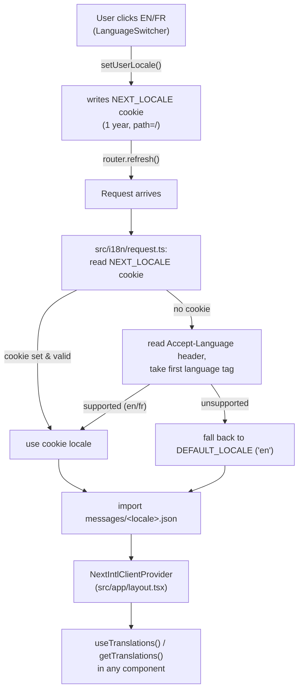

# Translations (i18n)

- **What it does**: Explains where every piece of user-facing text lives, how the app picks English vs. French, and the conventions for adding or editing translated content — including the `Insight {key, values}` pattern used by the analytics/forecast/intelligence engines.
- **Why it exists**: All UI copy is centralized in two JSON files (`messages/en.json`, `messages/fr.json`) via [next-intl](https://next-intl.dev/). Nothing should ever be hardcoded in English inside a component — this doc explains the conventions that keep that true, and how to extend them.
- **Where the code is**:
  - `messages/en.json`, `messages/fr.json` — **all** translatable strings (1,110 lines each, kept in parallel)
  - `src/i18n/locales.ts` — supported locales, labels, `Intl` locale tags
  - `src/i18n/request.ts` — resolves which locale to load for a request
  - `src/lib/locale-actions.ts` — server action to persist a locale choice
  - `src/components/ui/LanguageSwitcher.tsx` — the EN/FR toggle
  - `src/lib/insight-types.ts` — the `Insight`/`InsightValue`/`cat()` types used for dynamically-generated copy
  - `src/components/ui/InsightText.tsx` — renders an `Insight` via `t.rich()`
- **How to modify it safely**: see [How to modify](#how-to-modify-safely) at the bottom.

---

## 1. Overview



Two distinct mechanisms work together:
1. **Static UI copy** — every label, button, heading, error message, etc. — is a plain string (or ICU MessageFormat string) looked up by key. This is "normal" i18n.
2. **Dynamically-generated copy** — the sentences produced by the analytics/forecast/intelligence engines (e.g. *"Your best income month was **March 2024**, with **€4,200** received"*) — is generated as data (`{ key, values }`), and only *translated* at render time. This is the `Insight` pattern (§6).

---

## 2. The message files

`messages/en.json` and `messages/fr.json` are flat-ish nested JSON objects, each exactly **1,110 lines**, with the same top-level namespaces in the same order:

| Namespace | Covers |
|---|---|
| `common` | App name, tagline, shared buttons (`signIn`, `signOut`, `getStarted`, etc.), nav labels, language switcher |
| `landing` | The entire `/` marketing page — see [PRODUCT.md](./PRODUCT.md) for how this maps to product messaging |
| `auth` | Login, signup, reset-password — all 3 auth pages (`auth.login.*`, `auth.signup.*`, `auth.resetPassword.*`), including `errors.*` sub-namespaces for `friendlyError()` mappings ([AUTHENTICATION.md](./AUTHENTICATION.md)) |
| `settings` | `/settings` page (account, sign out, delete account) |
| `upload` | `/upload` page + `<CsvUploader>` (all 5 states, error taxonomy) |
| `history` | `/history` page (filters, pagination, recategorize) |
| `metrics` | Shared metric labels (income, expenses, cashflow, etc.) reused across Dashboard/Analytics/Forecast |
| `dashboard` | `/dashboard` page, `<SummaryCards>`, `<FirstUploadBanner>`, empty state |
| `forecast` | `/forecast` page — health score, risk, key drivers, projections |
| `analytics` | `/analytics` page — YTD summary, cashflow chart, client insights |
| `categories` | **Category display names** — keyed by the *lowercase category id* (e.g. `"client payment"`, `"software"`, `"taxes"`) → display string (e.g. `"Client payment"`, `"Software"`, `"Taxes"`). Used by `cat()` sentinels (§6) and anywhere a raw category id needs to become user-facing text. |
| `insightCategories` | Display names for the 5 `InsightCategory` groupings (`growth`, `cashflow`, `spending`, `seasonality`, `clients`) — used to group `<HistoricalInsights>`/`<FinancialStory>` sections. See [INTELLIGENCE_ENGINE.md](./INTELLIGENCE_ENGINE.md). |
| `insights` | **All ICU MessageFormat templates** for `Insight.key` values — every sentence `buildHistoricalInsights()` and `generateDashboardIntelligence()` can produce. See §6/§7. |

Both files must have **identical key structure** — next-intl will throw at build/runtime if a key used by `t("...")` is missing from the active locale's file. There is no automatic fallback to English for a missing French key.

---

## 3. Locale resolution (`src/i18n/request.ts`)

```ts
export const LOCALE_COOKIE = "NEXT_LOCALE";

export default getRequestConfig(async () => {
  const cookieLocale = (await cookies()).get(LOCALE_COOKIE)?.value;
  let locale: Locale;
  if (isLocale(cookieLocale)) {
    locale = cookieLocale;
  } else {
    const preferred = (await headers()).get("accept-language")?.split(",")[0]?.split("-")[0];
    locale = isLocale(preferred) ? preferred : DEFAULT_LOCALE;
  }
  return { locale, messages: (await import(`../../messages/${locale}.json`)).default };
});
```

Resolution order, per request:
1. **`NEXT_LOCALE` cookie** — if present and is `"en"` or `"fr"` (`isLocale()` from `src/i18n/locales.ts`), use it.
2. **`Accept-Language` header** — take the first language tag, strip any region (`fr-CA` → `fr`), use it if supported.
3. **`DEFAULT_LOCALE`** (`"en"`) — final fallback.

`src/i18n/locales.ts` defines:
```ts
export const LOCALES = ["en", "fr"] as const;
export const DEFAULT_LOCALE: Locale = "en";
export const LOCALE_LABELS = { en: "English", fr: "Français" };
export const LOCALE_LABELS_SHORT = { en: "EN", fr: "FR" };       // for narrow viewports
export const INTL_LOCALES = { en: "en-IE", fr: "fr-FR" };        // for Intl.NumberFormat / DateTimeFormat
```

> **`INTL_LOCALES` is separate from the app locale on purpose**: `en-IE` (English, Ireland) gives `€` currency formatting and DD/MM/YYYY-style dates appropriate for the app's Euro-denominated, Ireland-based target user (see [PRODUCT.md](./PRODUCT.md)), without forcing the *UI language* to be tied to a specific country. If the app ever needs a `en-US` variant (commas/periods swapped in numbers, `$`), add it here without touching `LOCALES`.

---

## 4. Switching language (`LanguageSwitcher`)

`src/components/ui/LanguageSwitcher.tsx`, `"use client"`. Renders `EN | FR` (or full "English"/"Français" on wider screens, via `LOCALE_LABELS` vs `LOCALE_LABELS_SHORT`).

```ts
function handleChange(next: Locale) {
  if (next === locale || isPending) return;
  startTransition(async () => {
    await setUserLocale(next);   // server action — writes NEXT_LOCALE cookie
    router.refresh();            // re-render Server Components with new locale's messages
  });
}
```

`src/lib/locale-actions.ts`:
```ts
"use server";
export async function setUserLocale(locale: Locale) {
  if (!LOCALES.includes(locale)) return;
  cookieStore.set(LOCALE_COOKIE, locale, { maxAge: 60 * 60 * 24 * 365, path: "/", sameSite: "lax" });
}
```

The cookie persists for **1 year**, scoped to the whole site (`path: "/"`) — once a user picks a language, every future visit (including the landing page, before login) uses it. `<LanguageSwitcher>` appears in: the landing page navbar, the `(dashboard)` `<Navbar>`, and the auth pages' `<BrandHeader>` area (only on landing currently — check each page if adding more).

---

## 5. Using translations in components

| API | Where | Example |
|---|---|---|
| `useTranslations(namespace)` | `"use client"` components | `const t = useTranslations("auth.login"); t("heading")` |
| `getTranslations(namespace)` | Server Components (`async`) | `const t = await getTranslations("dashboard"); t("title")` |
| `t("key")` | Simple string lookup | — |
| `t("key", { var: value })` | ICU placeholder substitution (`"Hello {name}"`) | — |
| `t.rich("key", { ...vars, b: (chunks) => <strong>{chunks}</strong> })` | String containing `<b>...</b>` (or other tags) that need to become **React elements**, not plain text | Used by `<InsightText>` (§6) and `<FirstUploadBanner>` |
| `t.raw("key")` | Returns the **raw JSON value** (array/object), not a formatted string — used for landing page card/list data (`t.raw("understand.cards")` → `{title, body}[]`) | See [PRODUCT.md](./PRODUCT.md) |

Two translation instances are commonly used together in one component — e.g. `t = useTranslations("auth.signup")` for the form, plus `tc = useTranslations("common")` for shared button labels, plus `tErrors = useTranslations("auth.signup.errors")` for `friendlyError()`. This namespacing keeps error-message lists colocated with the page that uses them, while still sharing `common.*` strings.

---

## 6. The `Insight { key, values }` pattern

**This is the most important convention for anyone extending the analytics/forecast/intelligence engines.** Full engine-side details are in [INTELLIGENCE_ENGINE.md §1](./INTELLIGENCE_ENGINE.md) — this section covers the **translation half**.

### The problem it solves

`buildHistoricalInsights()` and `generateDashboardIntelligence()` run on the **server**, before any locale is known to them as a concept that matters — they're pure data functions ([INTELLIGENCE_ENGINE.md](./INTELLIGENCE_ENGINE.md) "Things to be careful about": *locale is used only for number/date formatting, not for category names*). But the *sentences* describing the data ("Your best income month was **March 2024**...") must be in the user's language, and category names (`"client payment"` → `"Client payment"` / `"Paiement client"`) must also be translated.

The solution: engines never produce final strings. They produce:
```ts
interface Insight {
  key: string;                              // e.g. "insights.bestIncomeMonth"
  values?: Record<string, InsightValue>;    // e.g. { month: "March 2024", amount: "€4,200" }
}
type InsightValue = string | number | { categoryId: string };
```

- `key` is a path into the `insights` namespace (an ICU MessageFormat template — see §7).
- `values` are the *already-formatted* numbers/dates/strings to interpolate (formatted using `INTL_LOCALES`, so numbers/currency are locale-correct even though the sentence template isn't chosen yet) — **plus** any category references wrapped in `cat()`.

### `cat()` — the category-id sentinel

```ts
// src/lib/insight-types.ts
export const cat = (categoryId: string): InsightValue => ({ categoryId });
```

When an engine needs to reference a category by name (e.g. *"**Software** spending grew 14%"*), it does **not** look up the translated name itself (it doesn't have a `t` function). Instead it puts `{ category: cat("software") }` into `values`. The `{ categoryId: "software" }` object is a **sentinel** — a marker saying "resolve this against the `categories` namespace at render time."

### `resolveInsightValues()` + `<InsightText>`

```ts
// src/lib/insight-types.ts
export function resolveInsightValues(values, tCategories) {
  // for each value: if it's a { categoryId } sentinel, call tCategories(categoryId);
  // otherwise pass the string/number through unchanged.
}
```

```tsx
// src/components/ui/InsightText.tsx
export default function InsightText({ insight, accent }: Props) {
  const t = useTranslations();                    // root — so insight.key can be any namespace path
  const tCategories = useTranslations("categories");
  return <>{t.rich(insight.key, {
    ...resolveInsightValues(insight.values, tCategories),
    b: (chunks) => <strong style={accent && { color: accent }}>{chunks}</strong>,
  })}</>;
}
```

Every place an `Insight` is displayed — `<HistoricalInsights>`, `<FinancialStory>`, `<FirstUploadBanner>`'s summary line, `<SummaryCards>`'s context line, forecast's risk/opportunity cards — renders it via `<InsightText insight={...} />` (or the same `t.rich()` + `resolveInsightValues()` pattern inline). **Never** render `insight.key` or `insight.values` directly as text — they are not user-facing strings on their own.

---

## 7. ICU MessageFormat in the `insights` namespace

The `insights` namespace (and others) use full [ICU MessageFormat](https://formatjs.io/docs/core-concepts/icu-syntax/) syntax, which next-intl supports natively. Patterns seen throughout:

| Syntax | Example (from `messages/en.json`) | Purpose |
|---|---|---|
| Simple placeholder | `"Your best income month was <b>{month}</b>, with <b>{amount}</b> received."` | Direct substitution from `values` |
| `select` | `"Income {direction, select, grew {grew} declined {declined} other {changed}} <b>{pct}%</b>..."` | Branches on a string value (here `direction: "grew" \| "declined"`) |
| `plural` | `"<b>{count, plural, one {# month} other {# months}}</b> had no income at all..."` | Pluralization — `#` is replaced by the number itself |
| `number` | `"<b>{count, number}</b> of the last 6 months had negative cashflow."` | Explicit number formatting (locale-aware) |
| Nested `select` (quarter/month enums) | `"Income peaks in <b>{peakQuarter, select, q1 {Q1 (Jan–Mar)} q2 {Q2 (Apr–Jun)} ... other {}}</b>..."` | The engine passes a short code (`"q1"`, or month number `1`–`12`) and the *translation* spells out the label — so "Q1 (Jan–Mar)" / "T1 (Jan–Mar)" can differ per locale without the engine knowing |
| `<b>...</b>` | (used throughout) | Becomes a React element via `t.rich()`'s `b` renderer (§5/§6) — **always** bold, used to highlight the key figures in a sentence |

> **Every `select`/`plural` branch needs an `other {}` fallback** — ICU MessageFormat (and next-intl) will throw if a value doesn't match any branch and there's no `other`. When adding a new `select`-based insight, always include `other {}` (even if empty) as a safety net for values you haven't enumerated.

---

## 8. `categories` and `insightCategories` namespaces

- **`categories`** — one entry per category id used anywhere in the app (`Transaction.category`, `CategoryRule.category`, etc.), **keyed by the lowercase id string** (`"client payment"`, `"ai tools"`, `"banking fees"`, ... `"uncategorized"`, `"savings"`, `"transfer"`). This is the *only* place category display names exist — components never hardcode `"Software"` or `"Client payment"`. See [CATEGORIZATION_ENGINE.md](./CATEGORIZATION_ENGINE.md) for the full list of category ids the engine can produce.
- **`insightCategories`** — the 5 `InsightCategory` enum values (`growth`, `cashflow`, `spending`, `seasonality`, `clients`) → section headings used to group insights in `<HistoricalInsights>`/`<FinancialStory>`. See [INTELLIGENCE_ENGINE.md §5](./INTELLIGENCE_ENGINE.md).

---

## How to modify safely

### Editing existing copy (either language)

1. Find the key — search for the **English** string in `messages/en.json` (or the component's `t("...")` call to find the key path).
2. Edit the value in `messages/en.json`.
3. Edit the **same key** in `messages/fr.json` with the French translation. Keep ICU placeholders (`{var}`, `<b>...</b>`, `{x, select, ...}`) structurally identical — only the surrounding text and the *text inside* `select`/`plural` branches should change.
4. No build step is required — `src/i18n/request.ts` imports the JSON dynamically per-request.

### Adding a brand-new translatable string

1. Add the key to **both** `messages/en.json` and `messages/fr.json`, in the same namespace, same position (keeping the files structurally parallel makes future diffs/reviews easier, though it's not technically required).
2. Use `t("namespace.key")` (or `t.rich(...)` if it contains `<b>`/other tags) in the component. If the component doesn't already have a `useTranslations`/`getTranslations` call for that namespace, add one.
3. For arrays/objects of repeating content (cards, lists) — follow the `landing` namespace's pattern: `t.raw("section.items")` typed as `{ title: string; body: string }[]`, with any positional icons/styling kept in a separate array in the component (see [PRODUCT.md](./PRODUCT.md) "Editing landing-page copy").

### Adding a new `Insight` (engine-generated sentence)

1. Add the ICU template to `insights` in **both** `en.json` and `fr.json` — e.g. `"myNewInsight": "..."`.
2. In the engine code ([INTELLIGENCE_ENGINE.md](./INTELLIGENCE_ENGINE.md)), return `{ key: "insights.myNewInsight", values: { ... } }`. Format numbers/dates using `INTL_LOCALES[locale]` *before* putting them in `values` (they arrive at the template pre-formatted strings, e.g. `"€4,200"`, not raw numbers — except where the template itself uses `{x, number}` or `{x, plural}`, which need the raw number).
3. If referencing a category, use `cat(categoryId)` — never hand-format a category name in the engine.
4. Include `other {}` in every `select`/`plural` branch (§7).
5. Render it via `<InsightText insight={...} />` — don't write a one-off `t.rich()` call unless you also need `resolveInsightValues()` for `cat()` sentinels (in which case, just use `<InsightText>`).

### Adding a third locale

1. Add it to `LOCALES` in `src/i18n/locales.ts`, plus `LOCALE_LABELS`, `LOCALE_LABELS_SHORT`, and `INTL_LOCALES` (pick an appropriate BCP-47 region tag for currency/date formatting).
2. Create `messages/<locale>.json` with **every key** that exists in `messages/en.json` — there is no partial-fallback mechanism; a missing key throws.
3. `LanguageSwitcher` automatically picks up new entries in `LOCALES` (it maps over the array) — no component changes needed there.

### Things to be careful about

- **`en.json` and `fr.json` must stay the same shape.** A key present in one but not the other will throw at runtime (not just produce a fallback) the moment that locale renders the missing key. If you're unsure after an edit, a quick structural diff (e.g. comparing key paths) catches this before it ships.
- **Don't translate inside the engines.** If you find yourself wanting to pass a `Locale` or a `t` function into `buildHistoricalInsights()`/`generateDashboardIntelligence()`/`generateForecast()`, stop — the `{ key, values }` pattern exists specifically so these stay pure, locale-agnostic functions. Format numbers with `INTL_LOCALES` at the point where the `Insight` is constructed, and let the *template* (chosen at render time, by the user's current locale) handle language-specific phrasing.
- **`t.raw()` returns unvalidated JSON** — if a component does `t.raw("landing.understand.cards") as { title: string; body: string }[]` and you change the *shape* of that array in the JSON (e.g. add a field, change `body` to `description`), TypeScript won't catch a mismatch between the JSON and the assumed type. Update both together.
- **ICU `select` branch keys are exact-match strings.** If an engine passes `direction: "increased"` but the template only has `grew`/`declined`/`other`, it silently falls through to `other` — not an error, but possibly the wrong wording. When adding a new `select`-based value in an engine, grep the corresponding template in *both* `en.json` and `fr.json` to confirm the branch keys match exactly.
