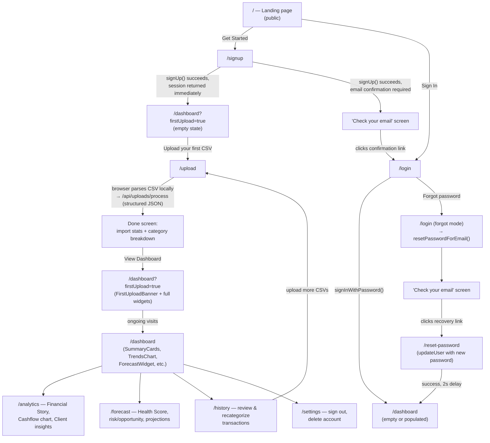
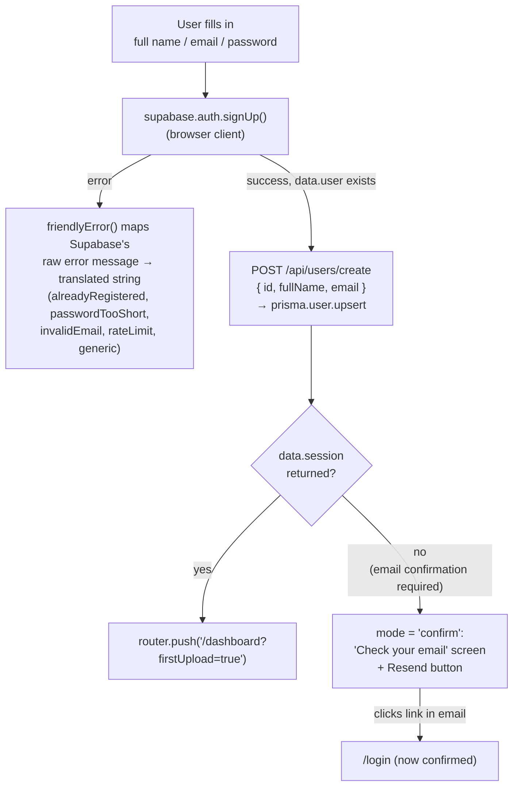
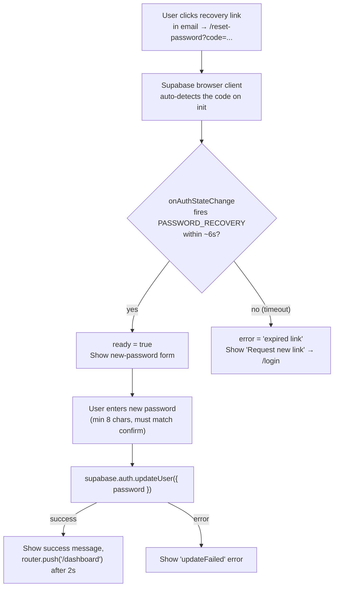
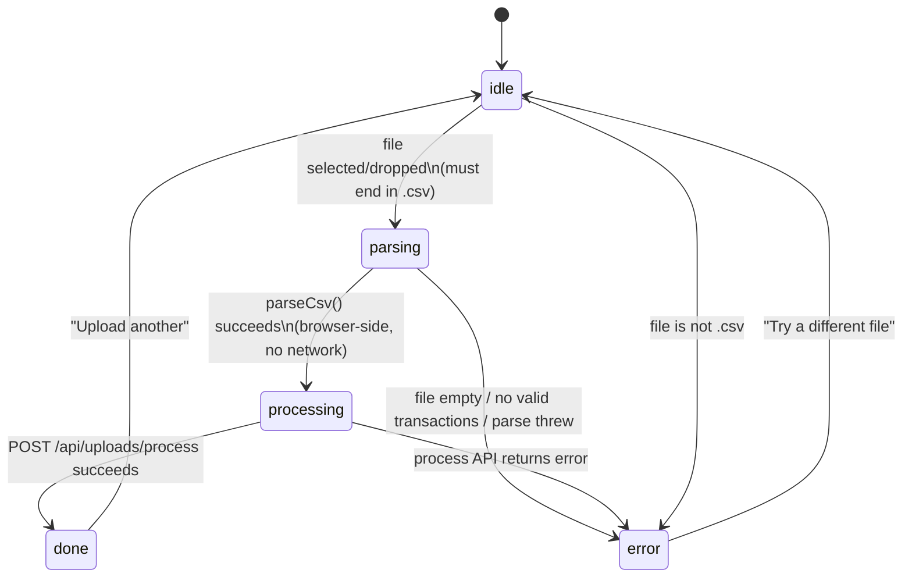

# User Journey

- **What it does**: Walks through every screen a user sees, in order — from the public landing page, through signup/login, the first (empty) dashboard, uploading a CSV, and on to the analytics/forecast/history pages and account settings.
- **Why it exists**: The engine docs ([ANALYTICS_ENGINE.md](./ANALYTICS_ENGINE.md), [INTELLIGENCE_ENGINE.md](./INTELLIGENCE_ENGINE.md), etc.) explain *how the numbers are computed*. This doc explains *what the user actually experiences* — which page calls which engine, what each screen looks like in each state (empty vs. populated), and how the pieces connect end-to-end.
- **Where the code is**: `src/app/(auth)/*`, `src/app/(dashboard)/*`, `src/app/page.tsx` (landing), `src/components/{landing,upload,dashboard,history,settings}/`.
- **How to modify it safely**: see [How to modify](#how-to-modify-safely) at the bottom.

---

## 1. The whole journey at a glance

---

## 2. Landing page (`/`)

**File**: `src/app/page.tsx` (279 lines) + `src/components/landing/ProductWalkthrough.tsx`.

- A Server Component. If `supabase.auth.getUser()` returns a user, it immediately `redirect("/dashboard")` — logged-in users never see the marketing page (middleware also enforces this, see [ARCHITECTURE.md §3](./ARCHITECTURE.md)).
- For anonymous visitors, the page renders (in order): a sticky navbar (app name, language switcher, Sign In / Get Started), a hero section, an "Understand your finances" 4-card grid, a "recognition" list, an interactive `<ProductWalkthrough>` (sample CSV → categorized transactions demo), a "history" section with 3 tiers, a "philosophy" section, and a "privacy" section.
- All copy comes from the `landing` translation namespace via `t.raw(...)` for arrays of `{title, body}` / `string[]` objects — see [TRANSLATIONS.md](./TRANSLATIONS.md) for how to edit this content.
- Both CTAs (`Sign In`, `Get Started`) link to `/login` and `/signup` respectively.
- The product narrative ("what Freelancer OS is for") is covered in [PRODUCT.md](./PRODUCT.md) — this doc only covers the page's role in the navigation flow.

---

## 3. Sign up (`/signup`)

**File**: `src/app/(auth)/signup/page.tsx` (253 lines), `"use client"`.

- **Two outcomes after a successful `signUp()`** depend entirely on the Supabase project's email-confirmation setting: if confirmation is **off**, Supabase returns a session immediately and the user lands straight on the dashboard. If confirmation is **on**, no session is returned and the UI switches to `mode: "confirm"` — a "check your inbox" screen with a **Resend** button (`supabase.auth.resend({ type: "signup", email })`).
- **`POST /api/users/create`** is the only reason the app needs a dedicated route for this — the browser's `supabase.auth.signUp()` call creates the *auth* user but has no way to write to the app's own `User` table (Postgres via Prisma). This route does `prisma.user.upsert({ where: { id }, create: { id, fullName, email } })`. See [AUTHENTICATION.md](./AUTHENTICATION.md) for why `upsert` (not `create`) is used here.
- `?firstUpload=true` is appended to the dashboard redirect, but at this point `hasData` is `false` (no transactions yet) — so the dashboard shows its **empty state** (§8), not the `FirstUploadBanner`. The query param only takes effect *after* the first successful CSV import (§9–10).

---

## 4. Log in (`/login`)

**File**: `src/app/(auth)/login/page.tsx` (267 lines), `"use client"`. Three modes in one component:

| Mode | Trigger | What happens |
|---|---|---|
| `"signin"` (default) | — | Email + password form → `supabase.auth.signInWithPassword()`. On success: `router.push("/dashboard")` + `router.refresh()` (the refresh re-runs Server Components so the now-authenticated layout renders). On error, `friendlyError()` maps Supabase's message to one of: `invalidCredentials`, `emailNotConfirmed`, `tooManyRequests`, `userNotFound`, `invalidEmail`, `network`, `generic`. |
| `"forgot"` | User clicks "Forgot password?" | Email-only form → `supabase.auth.resetPasswordForEmail(email, { redirectTo: "<origin>/reset-password" })`. |
| `"sent"` | After `resetPasswordForEmail()` succeeds | "Check your email" confirmation screen, with a link back to `"forgot"` to try again. |

Full password-reset mechanics (the recovery-code exchange, the `PASSWORD_RECOVERY` auth event) are in [AUTHENTICATION.md](./AUTHENTICATION.md) and §5 below.

---

## 5. Reset password (`/reset-password`)

**File**: `src/app/(auth)/reset-password/page.tsx` (254 lines), `"use client"`, wrapped in `<Suspense>` (it reads `useSearchParams()`).

> **Why no `exchangeCodeForSession()` call here**: the Supabase browser client automatically consumes the recovery code/token in the URL on initialization and emits a `PASSWORD_RECOVERY` auth event once the session is established. Calling `exchangeCodeForSession()` again manually would consume the (single-use) code a second time and always fail — so the page just **listens** for that event (`onAuthStateChange`) and also checks `getSession()` directly in case the event fired before the listener attached. A 6-second timeout shows an "expired link" state if neither fires.
- If the URL has neither a `?code=` param nor a `#...type=recovery` hash, the page immediately shows the "invalid link" state — it was opened directly, not via a real recovery email.
- This page is the one exception to middleware's "bounce authenticated users away from auth pages" rule — see [ARCHITECTURE.md §3](./ARCHITECTURE.md) for why.

---

## 6. The auth gate (middleware)

Every request — including all of the above — passes through `src/middleware.ts` first. Full mechanics: [ARCHITECTURE.md §3](./ARCHITECTURE.md) and [AUTHENTICATION.md](./AUTHENTICATION.md). Summary for this journey:

- Not signed in + visiting anything other than `/`, `/login`, `/signup`, `/reset-password` → bounced to `/login`.
- Signed in + visiting `/`, `/login`, or `/signup` → bounced to `/dashboard`.
- `/reset-password` is reachable either way (see §5).

---

## 7. `(dashboard)` layout — shared chrome

**File**: `src/app/(dashboard)/layout.tsx`. Every page from here on (`/dashboard`, `/upload`, `/history`, `/analytics`, `/forecast`, `/settings`) is wrapped in:

- `<Navbar />` (`src/components/ui/Navbar.tsx`) — a sticky top bar (desktop) with the 5 main nav links (Dashboard, Upload, History, Analytics, Forecast), a language switcher, a feedback button, a settings icon, and sign-out; plus a fixed bottom tab bar (mobile) with the same 5 links. `usePathname()` highlights the active link; a `pending` state highlights the link being navigated *to* before the route transition completes.
- A centered `<main>` container (`max-w-5xl`), with extra bottom padding on mobile (`pb-28`) to clear the fixed bottom nav.

---

## 8. First dashboard visit — empty state

**File**: `src/app/(dashboard)/dashboard/page.tsx` (281 lines).

Before any CSV has been uploaded, `totalTx === 0` → `hasData = false`. The page renders:
- The header (`"Welcome, {firstName}"` or generic title) — **without** the health-status badge or the `transactionsMonths` subtitle (both gated on `hasData`).
- **No** `DataCoverageBar`, **no** `FirstUploadBanner` (gated on `isFirstUpload = params.firstUpload === "true" && hasData` — false here since `hasData` is false).
- A single centered **empty-state card**: a 📊 emoji, `emptyState.heading`/`emptyState.body` text, and a primary button **"Upload your first CSV"** linking to `/upload`.

None of `SummaryCards`, `TrendsChart`, `ForecastWidget`, `MonthlyComparisonWidget`, `RecentTransactions`, or `HistoricalInsights` render in this state. `generateDashboardIntelligence(null, ...)` (called with `current = null`) returns the `empty` object described in [INTELLIGENCE_ENGINE.md §6](./INTELLIGENCE_ENGINE.md) — `snapshotSummary: { key: "insights.snapshot.uploadPrompt" }` — but this particular field isn't rendered in the empty-state branch (the empty-state card's copy is static, not insight-driven).

---

## 9. Upload a CSV (`/upload`)

**File**: `src/app/(dashboard)/upload/page.tsx` (Server Component) + `src/components/upload/CsvUploader.tsx` (`"use client"`).

The page shows: a heading and subtitle, the `<CsvUploader>` drop zone (with a privacy line and four trust chips below it), an "uploading again?" tip (only if the user has previous imports), an "Expected CSV Format" card (static Date/Description/Amount example), a **"How we handle your data →"** footer link to `/data-privacy`, and — if any imports exist — a **Recent Imports** list (last 5, with file name, date, imported/duplicate row counts, and a `<DeleteImportButton>` per row).

### `CsvUploader` state machine

- **idle**: a dashed drop zone (drag-and-drop or click to browse). Four trust chips below the zone: "Your file never leaves this tab", "Transaction data stored privately, never your raw file", "Delete everything in one click", "No bank login required". Only `.csv` files accepted (checked immediately before anything else runs).
- **parsing**: the file is read with `file.text()` entirely in the browser. `GET /api/uploads/rules` fetches the user's learned `CategoryRule` and `UserIntentRule` rows (small JSON, no file content). `parseCsv()` runs client-side with these rules and an empty merchant index. The raw CSV never leaves the browser tab.
- **processing**: `POST /api/uploads/process` sends the structured parsed rows as JSON (`{ transactions[], fileName, totalRows, skippedRows, currencies, ... }`). The server does a merchant-DB second pass, writes `Transaction` rows, recalculates analytics, and regenerates the forecast. See [ARCHITECTURE.md §8a](./ARCHITECTURE.md) for the full pipeline and [CSV_IMPORT.md](./CSV_IMPORT.md) / [CATEGORIZATION_ENGINE.md](./CATEGORIZATION_ENGINE.md) for parsing/categorization details.
- **done**: a results card —
  - 4 stat tiles: imported, duplicates, total rows, invalid/skipped rows.
  - An "Analysis range" + "Transactions imported" + "Categories detected" summary (if a date range was found).
  - A "What we found" breakdown by `transactionType` (income/expense/savings/transfer counts), with a note about transfers if any were detected, and a link to `/history` to review categorization.
  - A mixed-currencies warning if `hasMixedCurrencies` (see [CSV_IMPORT.md](./CSV_IMPORT.md) for currency detection).
  - Two buttons: **"Upload another"** (back to idle) and **"View Dashboard"** (`router.push("/dashboard?firstUpload=true")`).
- **error**: `parseUploadError()` maps the raw error string to one of 5 friendly error cards (`unsupportedFile`, `noTransactions`, `emptyFile`, `connectionProblem`, `generic`), each with a heading, reason, and a bulleted "What to try" list. A **"Try a different file"** button resets to idle; a `mailto:` link offers support contact for persistent issues.

### `/data-privacy` page

**File**: `src/app/data-privacy/page.tsx`. A standalone public page (no dashboard layout, no auth required conceptually — though it's linked from the authenticated upload page). Explains in plain language: what stays in the browser, what the server stores (dates, amounts, merchant descriptions, categories), what is never stored (raw CSV, bank account numbers, IBANs), the "delete everything" flow, who runs the service, and GDPR rights. Linked from the upload page footer via `upload.dataPrivacyLink`.

---

## 10. Back to the dashboard — `FirstUploadBanner`

After clicking **"View Dashboard"**, the user lands on `/dashboard?firstUpload=true`. Now `hasData = true` (the import just completed), so `isFirstUpload = true`, and — in addition to the full populated dashboard (§11) — `<FirstUploadBanner>` renders at the top:

- **File**: `src/components/dashboard/FirstUploadBanner.tsx` (80 lines), `"use client"`.
- Shows: a "Ready" label, a personalized welcome (`"Welcome, {firstName}"` or generic), the number of months of history and transactions analyzed (`t.rich(...)` with bold values), and — if `intel.snapshotSummary` is set — the first generated `<InsightText>` insight, displayed in a highlighted blockquote.
- Three actions: **"See Forecast"** (`/forecast`), **"Explore Analytics"** (`/analytics`), and **"Dismiss"**.
- Dismissing (either button or the X) calls `router.replace("/dashboard")` — this strips `?firstUpload=true` from the URL **without** a full reload, so the banner won't reappear on refresh but the rest of the dashboard stays mounted.

> This banner only ever appears once per upload — it's driven entirely by the `?firstUpload=true` query param set by the upload page's "View Dashboard" button, not by any persisted "is this the user's first upload ever" flag. Re-uploading more CSVs later and clicking "View Dashboard" again will show it again (by design — "uploadingAgain" tip on the upload page hints at this).

---

## 11. The populated dashboard (`/dashboard`, ongoing)

Once `hasData = true`, the full dashboard renders (data fetching covered in [ARCHITECTURE.md §7a](./ARCHITECTURE.md), insight generation in [INTELLIGENCE_ENGINE.md](./INTELLIGENCE_ENGINE.md)):

| Section | Component | Driven by |
|---|---|---|
| Header | inline JSX | `intel.healthStatus` badge (links to `/forecast`), `transactionsMonths` subtitle |
| Data coverage | `<DataCoverageBar>` | `getDataCoverage(userId)` |
| Summary cards | `<SummaryCards>` | `current`/`previous` totals, `riskLevel`, `intel.snapshotSummary`/`snapshotContext` |
| Trends chart | `<TrendsChart>` | `chartData` (12-month `MonthPoint[]`), `intel.trajectoryInsight`/`trajectoryDetails` — **clickable**: tapping a month opens `<MonthDrawer>` with a 2-level drill-down (month totals → category → transactions) |
| Forecast widget | `<ForecastWidget>` | `forecast` (`getLatestForecast`), `intel.forecastReasons`/`forecastImprovements`/`cashflowDeficitReason` |
| Monthly comparison | `<MonthlyComparisonWidget>` | `comparison` (`getMonthlyComparison`), `intel.comparisonInterpretation` |
| Recent transactions | `<RecentTransactions>` | `recent` (last transactions from `getDashboardSummary`, including `intent`/`intentConfidence`/`needsReview`), `intel.notableTransactions` — **clickable**: each row opens a `<TransactionDrawer>` with full intent context (no API call — data is passed from server at page load) |
| Historical insights | `<HistoricalInsights>` | `rankedInsights` (`buildHistoricalInsights`) — only rendered if non-empty |

`riskLevel` (low/medium/high/critical) is computed inline on this page using the **same formula** as the Forecast page's cashflow-risk calculation — see [FORECAST_ENGINE.md §9](./FORECAST_ENGINE.md) and [INTELLIGENCE_ENGINE.md](./INTELLIGENCE_ENGINE.md) for why these two pages are kept in lock-step.

A "stale data" flag (`dataIsStale`, >28 days since the last completed import) is computed but used for a freshness hint rather than blocking anything.

---

## 12. Analytics (`/analytics`)

**File**: `src/app/(dashboard)/analytics/page.tsx` (384 lines). Same auth-check + `force-dynamic` pattern. Fetches `getHistoricalData`, `getCategoryInsights`, `getClientInsights`, `getDataCoverage`, `getIncomeConcentration`, `getCategorizationHealth`, plus `buildHistoricalInsights()` for the **"Financial Story"** section.

Rendered sections (each a `<CollapsibleSection>`):
- **YTD summary** — anchored to the user's *last data month* (`latestDataRecord`), not wall-clock "today" — consistent with the "anchor to the data" principle (see [ANALYTICS_ENGINE.md](./ANALYTICS_ENGINE.md)).
- **Cashflow chart** (`<CashflowChart>`, Recharts) — income/expenses/cashflow over time. **Clickable**: tapping a bar opens `<MonthDrawer>` (shared with TrendsChart) with the same 2-level drill-down (month overview with Cashflow/Expenses/Income tabs → category → transactions).
- **Client insights** (`<ClientInsights>`) — from `getClientInsights()`, income concentration / top clients. The section footer links to the full **Client Trust & Risk Center** at `/clients`.
- **Financial Story** (`<FinancialStory>`) — renders `rankedInsights` (the same `buildHistoricalInsights()` output used on the Dashboard, see [INTELLIGENCE_ENGINE.md §5](./INTELLIGENCE_ENGINE.md)), grouped by `InsightCategory`.
- **Data coverage** (`<DataCoverageBar>`) and categorization health stats.

Analytics does **not** call `generateDashboardIntelligence()` — it only uses the historical "Financial Story" insights, not the dashboard narrative fields (snapshot/trajectory/health/risk).

---

## 12b. Client Trust & Risk Center (`/clients`, `/clients/[name]`)

**Files**: `src/app/(dashboard)/clients/page.tsx` (list), `src/app/(dashboard)/clients/[name]/page.tsx` (detail). Both are server components with `force-dynamic`. Data comes entirely from `getClientRiskProfiles(userId)` in `src/lib/client-risk-engine.ts`.

**List page** shows: total clients, reliable / watch / high-risk counts, alert bar for RED-status clients, full ranked client table with status badge, last payment date, revenue contribution bar, and total revenue. Each row links to the detail page via `/clients/[encodeURIComponent(name)]`.

**Detail page** shows (in order):
1. **Client overview** — total revenue, contribution %, payment count, avg/largest payment, relationship duration, first/last payment dates.
2. **Payment pattern** — avg interval between payments, current gap (real today, not data anchor), expected interval; status card (GREEN/YELLOW/RED) with description.
3. **Revenue trend** — 6-month CSS bar chart (no Recharts dependency); trend label (Increasing / Stable / Declining) with percentage change.
4. **Dependency risk** — progress bar showing 0–25% / 25–50% / 50%+ bands; plain-text explanation.
5. **Insights** — auto-generated from actual data only: reliable, delay warning, dependency, decline, single-payment.
6. **Recommended actions** — Follow up / Monitor / No action needed, derived from status + trend.
7. **Payment history** — full list of all payments, most recent first.

**Date anchoring exception**: `client-risk-engine.ts` uses `new Date()` (real wall-clock today) for `currentGapDays` and the 6-month trend window. Every other analytics engine anchors to the user's last data point — this page is the intentional exception because client risk questions are real-world ("is this client overdue *right now*?"), not historical.

---

## 13. Forecast (`/forecast`)

**File**: `src/app/(dashboard)/forecast/page.tsx` (466 lines). Calls `generateForecast(userId)` (regenerates on every page load — see [FORECAST_ENGINE.md §2](./FORECAST_ENGINE.md) for why this is cheap and idempotent) plus the same analytics-engine calls as the Dashboard, then `generateDashboardIntelligence()`.

Rendered sections:
- **Business Health Score** (0–100) — see [FORECAST_ENGINE.md §8](./FORECAST_ENGINE.md).
- **Cashflow Risk** badge — see [FORECAST_ENGINE.md §9](./FORECAST_ENGINE.md).
- **Business Direction** card — `intel.businessTrendDirection` + `intel.trajectoryInsight`.
- **Biggest Risk** / **Biggest Opportunity** cards — `intel.biggestRisk` / `intel.biggestOpportunity`.
- **Key Drivers** — see [FORECAST_ENGINE.md §10](./FORECAST_ENGINE.md).
- **Year-End Projection** — see [FORECAST_ENGINE.md §11](./FORECAST_ENGINE.md).
- **Seasonal Insights** — `intel.seasonalInsights`.
- **"How This Forecast Was Built"** panel — see [FORECAST_ENGINE.md §12](./FORECAST_ENGINE.md).

---

## 14. History (`/history`) — review and fix categorization

**File**: `src/app/(dashboard)/history/page.tsx` (149 lines) + `src/components/history/*`.

- **Filters** (`<HistoryFilters>`): transaction type, category, year, month, free-text search, and a "low confidence only" toggle — all via URL search params (`?type=&category=&year=&month=&q=&confidence=low`), so filtered views are shareable/bookmarkable links.
- **`<NeedsReviewBanner>`** — shown if `lowConfidenceCount > 0` (transactions where `categoryConfidence === "low"`), nudging the user toward the `confidence=low` filter.
- **`<DataCoverageBar>`** — same component as Dashboard/Analytics.
- **`<RecategorizeAllButton>`** — calls `POST /api/transactions/recategorize-all`, re-running categorization on every stored transaction (useful after the categorization engine or the user's learned rules have improved). See [ARCHITECTURE.md §8b](./ARCHITECTURE.md) and [CATEGORIZATION_ENGINE.md](./CATEGORIZATION_ENGINE.md).
- **`<TransactionList>`** — paginated (50/page) list of transactions. Each row has a **`<RecategorizeButton>`**: pick a new category, optionally **"apply to all transactions with this description"** (the learning-loop checkbox). Calls `PATCH /api/transactions/recategorize` — see [ARCHITECTURE.md §8b](./ARCHITECTURE.md) for the full flow (learned-rule upsert, audit log, analytics/forecast recalculation).
- **Month filtering caveat**: filtering by month *without* a year requires loading **all** matching transactions and filtering in-memory by `getUTCMonth()` (Prisma can't filter by month-of-year directly across arbitrary years) — `useMonthFilter` branch in the page. Filtering by year (with or without month) uses a proper `gte`/`lt` date-range query and is paginated server-side.

---

## 15. Settings (`/settings`)

**File**: `src/app/(dashboard)/settings/page.tsx` (46 lines) + `src/components/settings/{SignOutButton,DeleteAccountSection}.tsx`.

- **Account card** — shows the user's email + `<SignOutButton>` (`supabase.auth.signOut()` → redirect to `/login`).
- **Data notice** — a static reassurance banner about data handling.
- **`<DeleteAccountSection>`** — a confirmation-gated **"Delete account"** flow → `DELETE /api/account`. See [ARCHITECTURE.md §8c](./ARCHITECTURE.md) for the full cascade (Storage files → `User` row, cascading to all owned tables → Supabase Auth user → sign-out).

---

## How to modify safely

### Adding a new step to the signup/login flow

- Both `login/page.tsx` and `signup/page.tsx` use a local `Mode` union (`"signin" | "forgot" | "sent"` / `"signup" | "confirm"`) to switch between full-screen states **within the same component** — there's no separate route per state. If you need a new state (e.g. a "2FA" step), follow this pattern rather than creating a new page, so the shared `<BrandHeader>`/spinner/error styling stays consistent.
- Every `friendlyError()` function is a manual `string.includes()` mapping from Supabase's raw English error messages to translation keys. If Supabase changes its error wording, these mappings silently stop matching and fall through to `"generic"` — if users start seeing generic errors for what should be a specific case (e.g. "email already registered"), check these mappings first.

### Changing what happens after upload

- The "View Dashboard" button's `?firstUpload=true` query param is the **only** signal that drives `<FirstUploadBanner>`. If you change the upload-success screen's navigation, make sure this param (or an equivalent) is preserved, or the banner will never show.
- `recalculateMonthlyAnalytics` + `generateForecast` run **inside** `POST /api/uploads/process`, so the "Done" screen's stats reflect the *full* updated dataset, not just the new file — don't move these calls to be async/fire-and-forget without also updating what the done-screen can show immediately.

### Adding a new `(dashboard)` page

- Follow the pattern in any existing page: `createClient()` → `getUser()` → `redirect("/login")` if absent, `export const dynamic = "force-dynamic"`, fetch via `Promise.all([...lib calls])`. It automatically gets `<Navbar />` from the layout.
- Add an entry to `NAV_LINKS` in `src/components/ui/Navbar.tsx` (both the desktop list and — since it's the same array — the mobile bottom bar), plus `common.nav.<key>` and `common.nav.<key>Mobile` translation keys.

### Things to be careful about

- **The empty-state dashboard (§8) and the populated dashboard (§11) are two almost entirely different render trees** inside the same `if (!hasData) {...} else {...}` block — if you add a widget that should also show useful information with zero data (e.g. an onboarding checklist), it needs to be added to *both* branches deliberately, not just the populated one.
- **`/reset-password` and middleware**: if you ever add new auth-related pages, double check the `authOnlyPaths`/`publicPaths` lists in `middleware.ts` — a new auth page that's missing from `publicPaths` will bounce unauthenticated users to `/login` before they can use it (as happened historically with `/reset-password`, which is why it has its own carve-out — see [AUTHENTICATION.md](./AUTHENTICATION.md)).
- **History's month-only filter loads all matching rows into memory** (§14) — if a user has tens of thousands of transactions, filtering "March, any year" is `O(all transactions)`, not `O(50)`. This is a known, deliberate trade-off (Prisma/Postgres can't easily express "month of year across all years" without raw SQL) — if it becomes a performance problem, the fix is a raw SQL query with `EXTRACT(MONTH FROM "transactionDate")`, not a quick tweak to the existing Prisma query.
